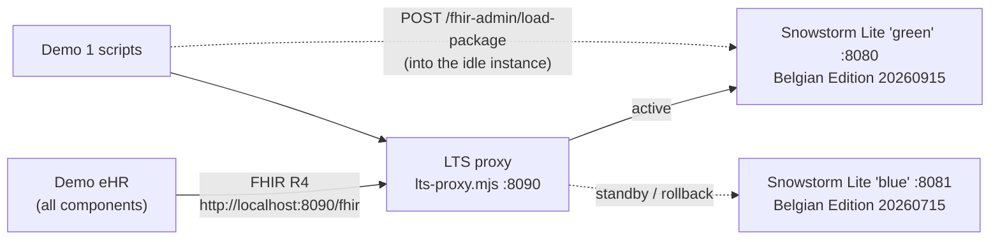

# 00 · Local terminology server (LTS)

> The one-page quick start for all three demos is [`../RUNNING.md`](../RUNNING.md). This page has the detail.

> **Example set-up used by the demos.** It is not a recommendation of a product or an architecture.

The demo eHR talks to **one** FHIR terminology endpoint: the LTS proxy (`http://localhost:8090/fhir`).
Behind the proxy run two instances of [Snowstorm Lite](https://github.com/IHTSDO/snowstorm-lite) 2.7.0, called "blue" and "green". Each instance holds one version of the SNOMED CT Belgian Edition.

- The proxy sends every request to the **active** instance.
- The **idle** instance is where the next release is loaded and checked.
- After the checks pass, the proxy switches to the idle instance (TSP4).
- The previous instance keeps running, so you can switch back (rollback).



**Docker is not needed.** The recorded demo run used Java and Node.js directly (see below). `docker-compose.yml` is an optional alternative for people who do use Docker.

| Component | Port in the demo | Role |
|---|---|---|
| `lts-proxy.mjs` | 8090 | The one endpoint the eHR uses. It also has a small admin API: `GET /admin/status`, `POST /admin/switch?to=…&expectVersion=…`, `GET /admin/events` |
| Snowstorm Lite "blue" | 8081 | Belgian Edition **20260715**: production at the start of the scenario, rollback instance after the upgrade |
| Snowstorm Lite "green" | 8080 | Belgian Edition **20260915**: loaded and checked during the demo, production after the switch |

## If you cannot install Java 17

Snowstorm Lite needs Java 17 or later; it does not start on Java 8. There are three ways around that.

1. **Use a portable JDK 17 next to the Java you already have.** Unpack a JDK 17 archive (for example Eclipse Temurin) somewhere in your own folder and start the server with its full path:
   `C:\jdk-17\bin\java.exe -Xmx4g -jar snowstorm-lite-2.7.0.jar …`.
   Nothing else on the machine changes: `JAVA_HOME` and the Java on your `PATH` stay as they are. Node.js also has a plain zip, so both can be used without an installer.
2. **Use a FHIR terminology server that already runs** (for example the Belgian national terminology server) and skip the local server. The eHR and the Demo 1 scripts are Node.js only: they need no Java at all. See the next section.
3. **Read the recorded results instead of running them.** The reports of the recorded run are in `01-terminology-services/reports/*.html`, and every screenshot is in `screenshots/`. Nothing has to run to review what the demos do.

Without Node.js either, the **Python version** in [`../python`](../python/README.md) runs the TSP1/TSP2/TSP3/TSP6 checks *and* Demo 2 in the browser against any FHIR terminology server. It needs Python 3.8 and no packages.

## Pointing the demos at an existing terminology server (no Java at all)

Everything in the demos talks to one FHIR R4 terminology endpoint, so that endpoint can be any FHIR terminology server instead of the local pair.

```bash
# the eHR: every component uses this endpoint
LTS_BASE_URL=https://<server>/fhir node server.mjs
# Demo 1 checks
node conformance-check.mjs --fhir https://<server>/fhir
```

If the server needs authentication, the credentials come from the environment. Nothing is stored in this repository:

```bash
TS_BEARER_TOKEN=<token you already have>
# or the OAuth2 client credentials grant; the token is fetched and cached by the demo:
TS_TOKEN_URL=<token endpoint>  TS_CLIENT_ID=<id>  TS_CLIENT_SECRET=<secret>  [TS_SCOPE=<scope>]
```

```powershell
# PowerShell
$env:LTS_BASE_URL = 'https://<server>/fhir'
$env:TS_TOKEN_URL = '<token endpoint>'; $env:TS_CLIENT_ID = '<id>'; $env:TS_CLIENT_SECRET = '<secret>'
node server.mjs
```

What that gives you:

| Demo / requirement | Against a terminology server you do not control |
|---|---|
| Demo 2 and Demo 3 (U01–U08, S01–S06, I01, I02) | Work, as long as that server serves the Belgian Edition, evaluates ECL in implicit value sets and knows the Belgian language reference sets. |
| TSP1, TSP2, TSP6 | Work. Run `conformance-check.mjs --fhir <url>` first: its report says per request which operations, ECL constructs and languages the server supports. |
| TSP3 | Works. The list of published versions can come from the same server (`--upstream`). |
| TSP4 | Needs a server you control: it uploads a package and switches between two instances. The recorded report stays as the example. |
| TSP5 | Partly. The version pinning and the per-component check work; the "two components on different versions" part needs a second endpoint. |

**Not tested against the Belgian NTS.** The environment where these demos were built has no network access to it, so the authentication and the exact language behaviour against that server are untested. `conformance-check.mjs` is the quickest way to find out: it writes one row per request, with the result.

### Without Node.js either: the Python version

If the machine has neither Java 17 nor Node.js, [`../python`](../python/README.md) runs the Demo 1 checks *and* Demo 2 with the Python standard library only (Python 3.8 or later, no `pip install`):

```bash
cd "05_Demo implementations/python"
python3 ts_check.py --fhir https://<server>/fhir                  # TSP1, TSP2, TSP6 - HTML + JSON report
python3 release_currency_check.py --fhir https://<server>/fhir --upstream https://<server>/fhir   # TSP3
python3 build_lexicon.py /data/rf2/<edition>/Snapshot             # U01, U02 - once per edition, ~30 s
python3 serve_demo2.py --fhir https://<server>/fhir               # Demo 2 -> http://localhost:3100/search.html
python3 ts_search.py --fhir https://<server>/fhir --lang fr-BE "asthme"    # the same search on the command line
```

They read the same credentials (`TS_BEARER_TOKEN`, or `TS_TOKEN_URL` + `TS_CLIENT_ID` + `TS_CLIENT_SECRET` + `TS_SCOPE`), honour `HTTPS_PROXY`, accept a corporate CA bundle (`--ca-bundle` / `TS_CA_BUNDLE`), and write their reports in the same layout as the Demo 1 reports. `serve_demo2.py` serves the pages of the Node demo eHR unchanged and was checked against it: the same searches return the same concepts in the same order. What is not covered — Demo 3, TSP4 and the two-endpoint part of TSP5 — is listed in the [Python README](../python/README.md).

## Why Snowstorm Lite in this demo

- It is an open-source FHIR R4 terminology server for SNOMED CT, published by SNOMED International (Apache 2.0).
- It supports `$lookup`, `$validate-code`, `$expand` and `$translate`.
- It supports implicit SNOMED CT value sets (`?fhir_vs=ecl/…`, `isa/…`, `refset/…`) and implicit concept maps (`?fhir_cm=…`).
- Each instance holds exactly one edition version, and it needs little memory once the index is built. That makes a blue/green pair cheap to run.
- Its own README lists the limits:
  - it supports the "ECL Core" subset of ECL, and unsupported ECL features return HTTP 501;
  - it holds only one edition version at a time;
  - it is "not suitable as a national terminology server".

Any FHIR R4 terminology server could replace it. The demos only use standard FHIR operations and implicit SNOMED CT value sets. The one server-specific call is the package upload in `deploy-release.mjs` (`POST /fhir-admin/load-package`).

## Configuration: `application.properties`

| Setting | Why |
|---|---|
| `admin.password` | Protects the package upload. The built-in default password is public, so always set your own. Use the `ADMIN_PASSWORD` environment variable rather than committing a password to the file. |
| `search.dialect.config.nl-be` (31000172101), `fr-be` (21000172104), `de-be` (120961000172108), `nl-be-gp` (701000172104), `fr-be-gp` (711000172101) | Lets `displayLanguage` / `Accept-Language` select the Belgian language reference sets (TSP6). The refset IDs come from `release_package_information.json` of the Belgian Edition. |
| `fhir.conceptmap.snomed-implicit.10861000172102` | Exposes the Belgian addition to the ICD-10 extended map as `?fhir_cm=10861000172102` (S05). |
| `fhir.conceptmap.snomed-implicit.1186921001` / `1186924009` | Exposes the POSSIBLY REPLACED BY and PARTIALLY EQUIVALENT TO historical associations to `$translate` (S04). |

Implicit concept maps are built when a package is imported. **Re-import after you change them.**

## Running it with Java 17 and Node.js (as in the demo, no Docker)

You need:

- **Java 17 or later** (for example Eclipse Temurin) and the `snowstorm-lite-2.7.0.jar` from the [Snowstorm Lite releases](https://github.com/IHTSDO/snowstorm-lite/releases);
- **Node.js 22.13 or later** for the proxy, the eHR and the Demo 1 scripts;
- the **release packages** of the Belgian Edition as **zip files**. Snowstorm Lite reads the Snapshot files out of the archive itself, so the package as published works; it does not need to be unpacked. If you only have an unpacked release folder, zip it (or just its `Snapshot` folder) first. In the recorded run the packages were zips of the `Snapshot` folders (`BE_20260715_snapshot.zip`, `BE_20260915_snapshot.zip`).

### Linux and macOS

```bash
# One folder per instance. Snowstorm Lite reads application.properties from its working directory.
mkdir -p lts/blue lts/green
cp application.properties lts/blue/ && cp application.properties lts/green/
JAR=/path/to/snowstorm-lite-2.7.0.jar            # downloaded from the Snowstorm Lite releases
export ADMIN_PASSWORD='choose-your-own'          # overrides admin.password

# blue: build the index of the July 2026 edition once, with a large heap ...
cd lts/blue
java -Xmx4g -jar "$JAR" --server.port=8081 --index.path=lucene-index \
     --load=/data/BE_20260715_snapshot.zip \
     --version-uri=http://snomed.info/sct/11000172109/version/20260715
# ... wait for "Import complete", stop it, and run it from then on with a small heap:
java -Xmx1200m -jar "$JAR" --server.port=8081 --index.path=lucene-index

# green: the idle instance. Demo 1 (deploy-release.mjs) loads the next release into it.
cd ../green
java -Xmx4g -jar "$JAR" --server.port=8080 --index.path=lucene-index

# the proxy (Node.js 18 or later, no dependencies)
cd ../..
PROXY_PORT=8090 BLUE_URL=http://localhost:8081 GREEN_URL=http://localhost:8080 ACTIVE=blue \
ADMIN_TOKEN='choose-a-token' STATE_FILE=./lts-proxy-state.json node lts-proxy.mjs
```

### Windows (PowerShell)

The same three components, one PowerShell window each. `$env:NAME = 'value'` sets a variable for the commands started from that window, and a backtick at the end of a line continues it.

```powershell
# window 1 - "blue": build the index of the July 2026 edition once, with a large heap
New-Item -ItemType Directory -Force C:\snomed-demo\lts\blue, C:\snomed-demo\lts\green
Copy-Item .\application.properties C:\snomed-demo\lts\blue\
Copy-Item .\application.properties C:\snomed-demo\lts\green\
cd C:\snomed-demo\lts\blue
$env:ADMIN_PASSWORD = 'choose-your-own'
java -Xmx4g -jar C:\snomed-demo\snowstorm-lite-2.7.0.jar --server.port=8081 --index.path=lucene-index `
     --load=C:\snomed-demo\BE_20260715_snapshot.zip `
     --version-uri=http://snomed.info/sct/11000172109/version/20260715
# after "Import complete": Ctrl+C, then start it again without --load and with a small heap
java -Xmx1200m -jar C:\snomed-demo\snowstorm-lite-2.7.0.jar --server.port=8081 --index.path=lucene-index

# window 2 - "green": the idle instance (Demo 1 loads the next release into it)
cd C:\snomed-demo\lts\green
$env:ADMIN_PASSWORD = 'choose-your-own'
java -Xmx4g -jar C:\snomed-demo\snowstorm-lite-2.7.0.jar --server.port=8080 --index.path=lucene-index

# window 3 - the proxy
cd 'C:\snomed-demo\05_Demo implementations\00-terminology-server'
$env:PROXY_PORT = '8090'; $env:BLUE_URL = 'http://localhost:8081'; $env:GREEN_URL = 'http://localhost:8080'
$env:ACTIVE = 'blue'; $env:ADMIN_TOKEN = 'choose-a-token'; $env:STATE_FILE = 'C:\snomed-demo\lts-proxy-state.json'
node lts-proxy.mjs
```

To zip an unpacked release folder first:

```powershell
Compress-Archive -Path 'C:\...\SnomedCT_ManagedServiceBE_PRODUCTION_BE1000172_20260915T120000Z\Snapshot' `
                 -DestinationPath 'C:\snomed-demo\BE_20260915_snapshot.zip'
```

Windows notes:

- Windows 10 and 11 include `curl.exe`. In PowerShell, write `curl.exe` (plain `curl` is an alias for `Invoke-WebRequest`, which takes other options), or use `Invoke-RestMethod`.
- In JSON bodies, write Windows paths with forward slashes (`C:/snomed-demo/...`) or double backslashes.
- Java needs to be on the `PATH`: `java -version` should print 17 or higher.

Memory in the demo:
- Importing the Belgian Edition (20260915: 535,627 concepts and 2.77 million active descriptions in English, Dutch, French and German) took **about 8 minutes** (485 s) with `-Xmx3500m` on an 8 GB machine.
- Serving it ran with `-Xmx1200m`.
- Do not run other memory-heavy jobs during an import. The first import attempt was killed by the operating system because another large process was running at the same time.

### Docker (optional)

`docker-compose.yml` describes the same three components for Docker, using the `snomedinternational/snowstorm-lite:2.7.0` image and `node:22-alpine`. It is an optional starting point: nothing in the demos needs Docker, and the recorded run used Java and Node.js directly.

## The proxy

`lts-proxy.mjs` has no dependencies. It illustrates the pattern; it is not a production component. Its behaviour:

- It chooses the backend **once per request**, so a switch never moves a request that is already in flight.
- **Version-aware routing.** A request that asks for a specific SNOMED CT version (the `system-version`, `systemVersion` or `version` parameter that the pinned eHR clients send) goes to the instance that serves exactly that version. So between the switch and the moment all eHR components use the new version, a component that still asks for the previous version gets it from the previous instance instead of a mismatch. Requests without a version go to the active instance.
  - This routing was added after the recorded deployment run. That run had no eHR traffic during the hand-over, which took less than a second.
  - It was tested separately with green active: `$expand` of `<< 84757009` pinned to 20260715 was answered by blue (202 concepts); pinned to 20260915 or without a version it was answered by green (208 concepts).
- It adds the header `x-lts-backend: blue|green` to every response. The availability probe in Demo 1 uses this header to show which instance answered each request.
- `POST /admin/switch?to=green&expectVersion=<version URI>` checks that the target is healthy and serves the expected version. It then switches with a single assignment and logs the event in `STATE_FILE`.
- Rollback is the same call in the other direction: `POST /admin/switch?to=blue`.
- It has no TLS, no authentication on the FHIR path and no load balancing. A real deployment would put this logic in its existing gateway or load balancer, for example with a weighted or blue/green target group.

## National terminology server (NTS)

The demos do not contain any credentials for the Belgian national terminology server.

`01-terminology-services/release-currency-check.mjs --upstream <FHIR base> --token <bearer token>` shows how the list of published Belgian Edition versions *could* be read from a FHIR terminology server such as the NTS. Instead of `--token`, the credentials can come from the environment (`TS_BEARER_TOKEN`, or `TS_TOKEN_URL` + `TS_CLIENT_ID` + `TS_CLIENT_SECRET`; use the prefix `UPSTREAM_` for the upstream server when it differs from the local one). This was not tested against the NTS, because the NTS cannot be reached from the environment where the demos were recorded.

The recorded run used the `release_package_information.json` files of the downloaded packages instead.

## Licence

SNOMED CT content is **not** included in this repository. The Belgian Edition is used under the SNOMED CT Affiliate Licence. The screenshots and reports contain SNOMED CT content, © SNOMED International; the Belgian Edition is maintained by the Belgian NRC.
