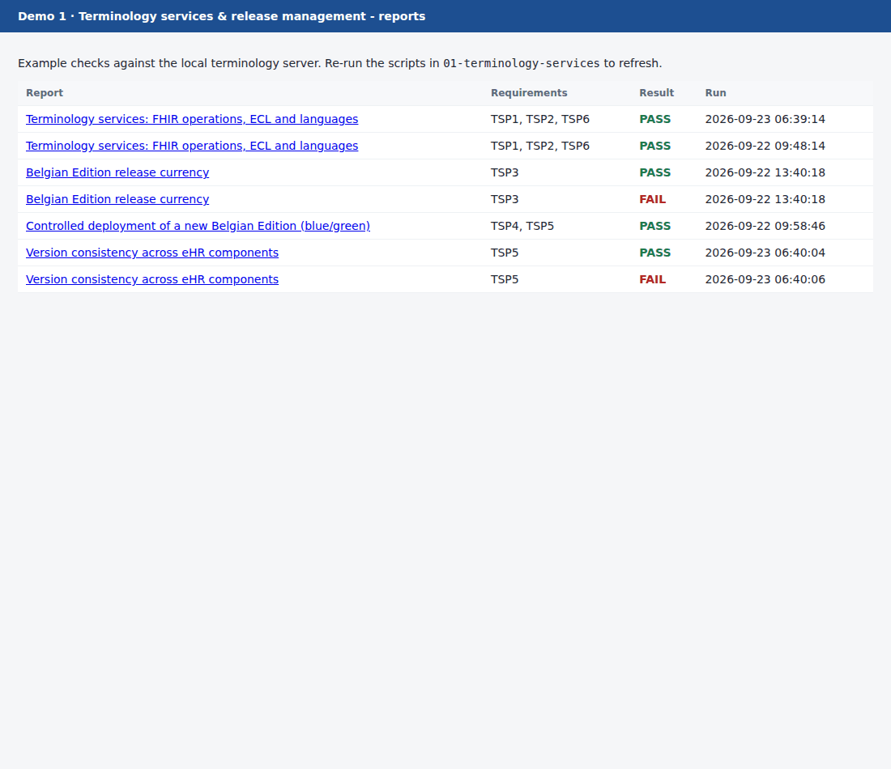
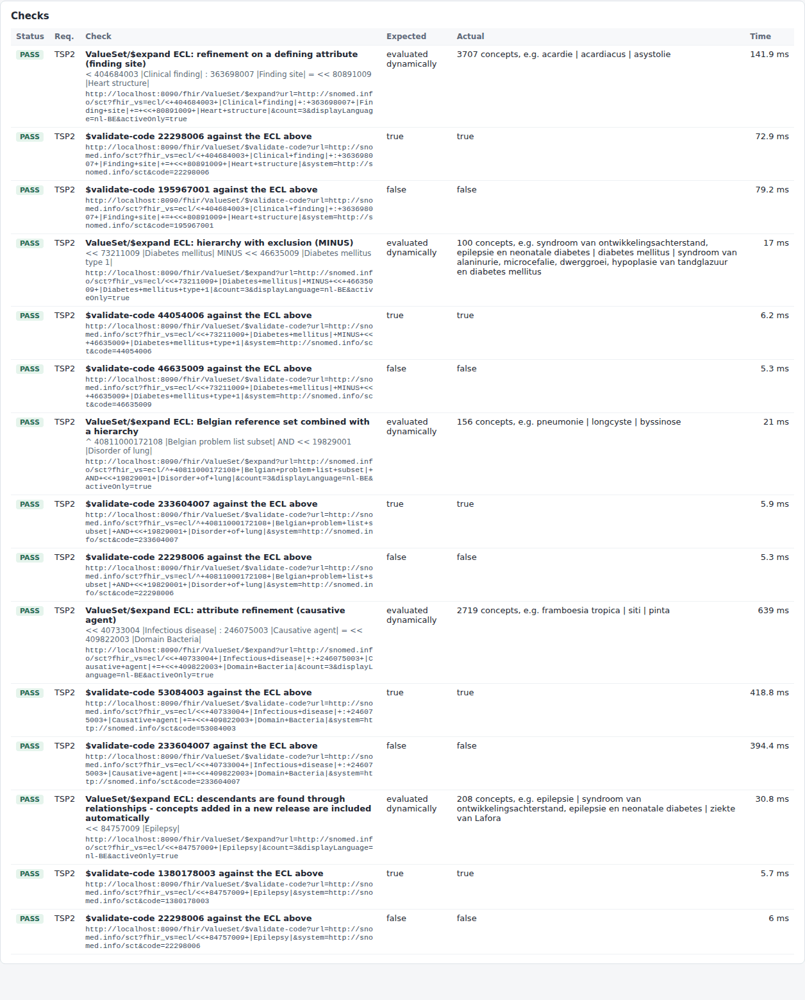
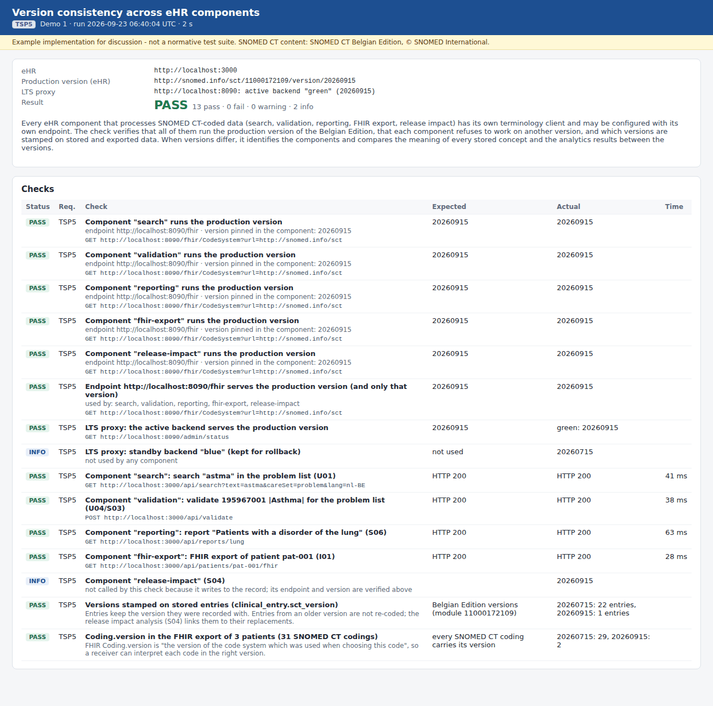

# Demo 1 · Terminology services and release management

> **Example only.** These scripts show one way to make TSP1–TSP6 visible and testable. They are not a conformance test suite: passing them does not mean that a product meets the requirements.

> **Without Node.js.** The TSP1/TSP2/TSP6 conformance check and the TSP3 release currency check also exist as Python scripts that need nothing but the Python standard library, and write the same reports: [`../python/README.md`](../python/README.md). TSP4 and the two-endpoint part of TSP5 drive the terminology servers and the eHR, so they stay Node.js only.

Demo 1 is a set of command-line scripts that talk to the local terminology server (LTS) with standard FHIR R4 requests. They need Node.js 22 or later and nothing else.

- Each script writes a JSON file and a self-contained HTML page to `reports/`.
- The HTML pages are the "screenshots" of this demo. The demo eHR also serves them at `http://localhost:3000/demo1/`.
- Any script can run on a schedule (cron, CI). The exit code is non-zero when a check fails.

| Script | Requirements | What it does | Reports in this repository |
|---|---|---|---|
| `conformance-check.mjs` | TSP1, TSP2, TSP6 | `$lookup`, `$validate-code` and `$expand` for the five care sets, ECL concept sets and the Belgian language reference sets | `tsp1-tsp2-tsp6-conformance` (20260915), `tsp1-tsp2-tsp6-conformance-20260715` |
| `release-currency-check.mjs` | TSP3 | Compares the production version with the most recent published Belgian Edition | `tsp3-release-currency-before-upgrade`, `tsp3-release-currency-after-upgrade` |
| `deploy-release.mjs` | TSP4 (+ TSP5 hand-over) | Blue/green deployment of a new edition. The content is verified before the switch, and an availability probe runs during the whole procedure | `tsp4-controlled-deployment` |
| `verify-integrity.mjs` | TSP4 | Compares the RF2 package with the loaded terminology server. `deploy-release.mjs` uses it; it can also run on its own | part of `tsp4-controlled-deployment` |
| `version-consistency-check.mjs` | TSP5 | Checks which SNOMED CT version every eHR component uses. When versions differ, it compares the meaning and the analytics results across versions | `tsp5-version-consistency`, `tsp5-version-consistency-mismatch` |



## The scenario that produced the reports (22 September 2026)

| Step | What happened | Result |
|---|---|---|
| 1 | Blue serves the **July 2026** Belgian Edition (20260715) in production. The eHR holds three fictitious patients (22 coded entries and 1 free-text entry, all recorded with 20260715). | |
| 2 | `conformance-check.mjs` against 20260715 | PASS: 73 checks and 1 info. The info check shows that concept 1380178003 does not exist yet in 20260715. |
| 3 | `release-currency-check.mjs`. The September 2026 edition (20260915) has been published. | **FAIL**: production is 2 months behind. |
| 4 | `deploy-release.mjs`: import 20260915 into green, verify, smoke tests, switch | PASS: 22 checks, 1 warning, 1 info. **0 failed requests out of 1,856** during the 526-second procedure, p95 62 ms. |
| 5 | `release-currency-check.mjs` again | PASS: 0 months behind. |
| 6 | `conformance-check.mjs` against 20260915 | PASS: 74 checks. 1380178003 is now found by `<< 84757009 \|Epilepsy\|` without any change to the ECL. |
| 7 | `version-consistency-check.mjs` on the eHR | PASS: all five components run 20260915. |
| 8 | Same check on a second eHR instance whose reporting component still points to blue (20260715) | **FAIL, as intended**: the check names the component and the versions, and shows what would differ. |

## TSP1 / TSP2 / TSP6: `conformance-check.mjs`

```bash
node conformance-check.mjs --fhir http://localhost:8090/fhir            # report id: tsp1-tsp2-tsp6-conformance
```

**Server and version.** `GET /metadata` must declare `CodeSystem/$lookup`, `ValueSet/$expand` and `ValueSet/$validate-code`. `GET /CodeSystem?url=http://snomed.info/sct` shows the loaded edition version.

**The five care sets of TSP1** (problems, allergy & intolerance, vaccination, procedures, clinical observation). For each one, the check does the following against the binding in `ehr-demo-app/config/bindings.json`:

- `$expand` of the whole binding;
- `$expand` with a filter in nl-BE, fr-BE, de-BE and en-US;
- `$validate-code` for a member (result `true`) and for a concept from another hierarchy (result `false`).

**Other checks:**

- An inactive concept is rejected by `$validate-code`.
- `$lookup` with the properties `parent`, `child`, `normalFormTerse` and `inactive`.

**ECL (TSP2).** Five intensional concept sets, each checked with `$expand` and with `$validate-code` for a member and a non-member:

| ECL | Shows |
|---|---|
| `< 404684003 \|Clinical finding\| : 363698007 \|Finding site\| = << 80891009 \|Heart structure\|` | refinement on a defining attribute |
| `<< 73211009 \|Diabetes mellitus\| MINUS << 46635009 \|Diabetes mellitus type 1\|` | exclusion (122 − 22 = 100 concepts) |
| `^ 40811000172108 \|Belgian problem list subset\| AND << 19829001 \|Disorder of lung\|` | Belgian reference set combined with the hierarchy |
| `<< 40733004 \|Infectious disease\| : 246075003 \|Causative agent\| = << 409822003 \|Domain Bacteria\|` | attribute refinement |
| `<< 84757009 \|Epilepsy\|` | concepts added in a new release are included automatically (1380178003 in 20260915) |

**Languages (TSP6).** `$lookup` of three concepts with `displayLanguage` set to each Belgian language reference set: nl-BE (31000172101), fr-BE (21000172104), de-BE (120961000172108), nl-BE GP (701000172104), fr-BE GP (711000172101) and en-US. Example: 22298006 → *myocardinfarct* / *infarctus myocardique* / *Myokardinfarkt* / GP: *myocard infarct* / *infarctus du myocarde*.

The HTML report lists every request. The TSP2 part:



## TSP3: `release-currency-check.mjs`

```bash
# published versions taken from the release_package_information.json of the downloaded packages
node release-currency-check.mjs --release-info <20260915 package>/release_package_information.json,<20260715 package>/release_package_information.json
# or from a FHIR terminology server that lists the Belgian Edition versions (not tested against the NTS)
NTS_TOKEN=... node release-currency-check.mjs --upstream https://apps.health.belgium.be/ontoserver/fhir
# or a manual value
node release-currency-check.mjs --latest 20260915
```

**How it works:**

- The production version is read from the LTS (`CodeSystem?url=http://snomed.info/sct`).
- The published versions come from one of the three sources above. `effectiveTime` and `previousPublishedPackage` of each `release_package_information.json` give the publication chain 20260615 → 20260715 → 20260915.
- The result is based on the distance in months between the two effective times (`--max-lag-months`, default 1).

**Interpretation point for the NRC.** The September 2026 package lists July 2026 as its previous package: there was no August release. So on 22 September the July edition was:

- **2 months** behind by effective time, which gives FAIL in this check, and it was already non-compliant on the day the September edition was published;
- only **1 release** behind;
- behind a release that had been available for **7 days**.

The report shows all three measures. The requirement could say which one applies, and how much time a supplier has after a publication.

| Before the upgrade | After the upgrade |
|---|---|
|  |  |

## TSP4: `deploy-release.mjs` (with `verify-integrity.mjs`)

```bash
SNOWSTORM_ADMIN_PASSWORD=... PROXY_ADMIN_TOKEN=... \
node deploy-release.mjs --package BE_20260915_snapshot.zip \
     --version-uri http://snomed.info/sct/11000172109/version/20260915 \
     --rf2 <Snapshot folder of the same release> \
     [--proxy http://localhost:8090] [--standby green --standby-url http://localhost:8080] [--ehr http://localhost:3000] [--sample 300]
```

| Step | In the recorded run |
|---|---|
| 1. Check that the standby instance (green) is not the active one | active = blue |
| 2. Stream the package to green (`POST /fhir-admin/load-package`, multipart, basic auth) | 502.6 s; blue keeps serving the eHR |
| 3. Green serves the expected version URI | `…/11000172109/version/20260915` |
| 4. Content integrity, RF2 vs green (`verify-integrity.mjs`) | 18.9 s, 0 differences (details below) |
| 5. Smoke tests: search in 4 languages, `$validate-code` on a Belgian reference set | OK |
| 6. `POST /admin/switch?to=green&expectVersion=…` on the proxy | switched at 10:07:28 UTC |
| 7. Tell the eHR the new production version (`POST /api/admin/production-version`) | all components on 20260915 |

The proxy only switches if every check in steps 1–5 passes. Otherwise the active instance simply keeps serving.

Between step 6 and step 7, eHR components are still pinned to the previous version. The proxy routes requests that ask for a specific version to the instance that serves it, so those components keep working on the previous version until the hand-over (see [`../00-terminology-server`](../00-terminology-server/README.md#the-proxy)). This version-aware routing was added after the recorded run and tested separately.

**Availability probe.** During the whole procedure the script sends an eHR-like search (`$expand` with a filter) through the proxy every 250 ms and records the status, the response time and the `x-lts-backend` header. Result: 1,856 requests (1,842 answered by blue, 14 by green), **0 failed**, p95 62 ms. The slowest request took 856 ms, at the start of the import.

**What "without loss or unintended modification" is checked against.** The RF2 Snapshot of the same package is the reference:

| TSP4 content item | Check | Coverage |
|---|---|---|
| concepts and their status | number of active concepts (`$expand << 138875005`, total) | complete: 384,162 = 384,162 |
| | status of sampled active and inactive concepts (`$lookup … inactive`) | seeded sample: 300 + 100 |
| descriptions and their properties | the FSN, and every active description of the sampled concepts in nl/fr/de/en is served | 300 FSNs, 1,524 descriptions |
| | preferred term per language reference set (nl-BE, fr-BE, de-BE, both GP sets, en-US) | 874 preferred terms |
| inferred relationships | parents, and defining attributes including concrete values (`normalFormTerse`) of the sampled concepts | 300 concepts |
| stated relationships | **not checked: Snowstorm Lite serves only the inferred form** (reported as a warning) | – |
| reference sets and members | member count of every simple reference set | complete: 36 reference sets |
| | REPLACED BY associations and ICD-10 extended map rows (`$translate`) | samples: 80 and 60 |

The run also reports, as information, that **70 members of Belgian simple reference sets refer to inactive concepts** (for example 698767004 *epilepsie na CVA* is still a member of the problem list subset 40811000172108). The Belgian release notes list this as a known issue (ISRS-7703). The eHR filters these members out at data entry (S03).


**Limits:**

- Descriptions are compared by language and term text: Snowstorm Lite's `$lookup` does not return description IDs.
- Acceptability is checked for preferred terms only.
- The concept checks use a sample; the counts are complete.
- A server that serves the stated form or description IDs allows a stricter comparison.

## TSP5: `version-consistency-check.mjs`

```bash
node version-consistency-check.mjs --ehr http://localhost:3000 [--proxy http://localhost:8090]
```

**What it checks:**

1. **Every component's version.** `GET /api/version` of the eHR lists each component (search, validation, reporting, fhir-export, release-impact) with its terminology endpoint, the version pinned in its client and the version the endpoint serves. The script then asks every endpoint directly, so it does not rely on the eHR's own answer.
2. **The LTS proxy.** The active backend must serve the production version. The standby backend is reported as "kept for rollback" as long as no component uses it.
3. **Each read-only component, once.** Every component pins the production version and refuses to process data (HTTP 409) when its server answers with another version.
4. **Version stamps.**
   - `clinical_entry.sct_version`: 22 entries recorded with 20260715 and 1 with 20260915.
   - `Coding.version` in the FHIR export: 29 codings with 20260715 and 2 with 20260915 (the new entry, and a body site read from the 20260915 definition, see S02).
5. **When versions differ.** The script names the components and versions. It then compares every stored concept between the versions (active status and fully specified name) and runs every analytics report (S06) on both versions.

**The mismatch run.** A second eHR instance was started with `REPORTING_LTS_BASE_URL=http://localhost:8081/fhir`, so its reporting component still used blue (20260715). The check found:

- The reporting component refused to run (HTTP 409).
- **4 of the 25 stored concepts differ** between the versions:
  - 111360009, 698767004 and 61947007 are inactive in 20260915;
  - 1401652004 does not exist in 20260715.
- **1 of the 7 reports differs**: "epilepsy" finds entry 698767004 only on 20260715.

This is the evidence that the second paragraph of TSP5 asks for: exchanging or processing data between the two versions would change results unless the differences are handled.

| Consistent (production) | Reporting component on another version |
|---|---|
|  |  |

## Files

```
01-terminology-services/
  conformance-check.mjs          TSP1 / TSP2 / TSP6
  release-currency-check.mjs     TSP3
  deploy-release.mjs             TSP4 (+ TSP5 hand-over to the eHR)
  verify-integrity.mjs           TSP4 content comparison (RF2 vs server)
  version-consistency-check.mjs  TSP5
  lib/report.mjs                 JSON + HTML report writer
  reports/                       the reports of the recorded run (index.html lists them)
../shared/fhir-ts-client.mjs     minimal FHIR terminology client used by all demos
```
