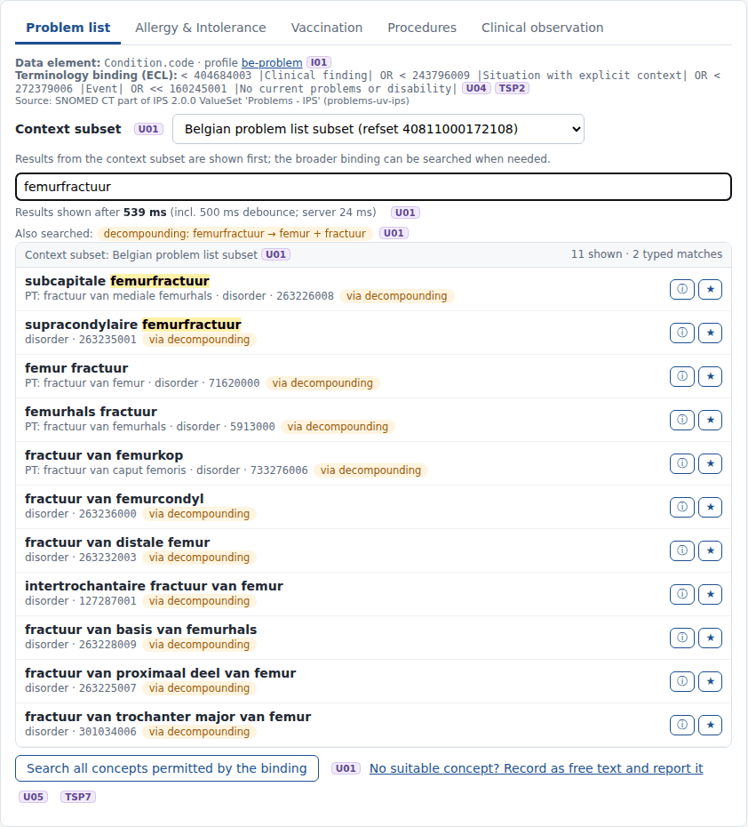
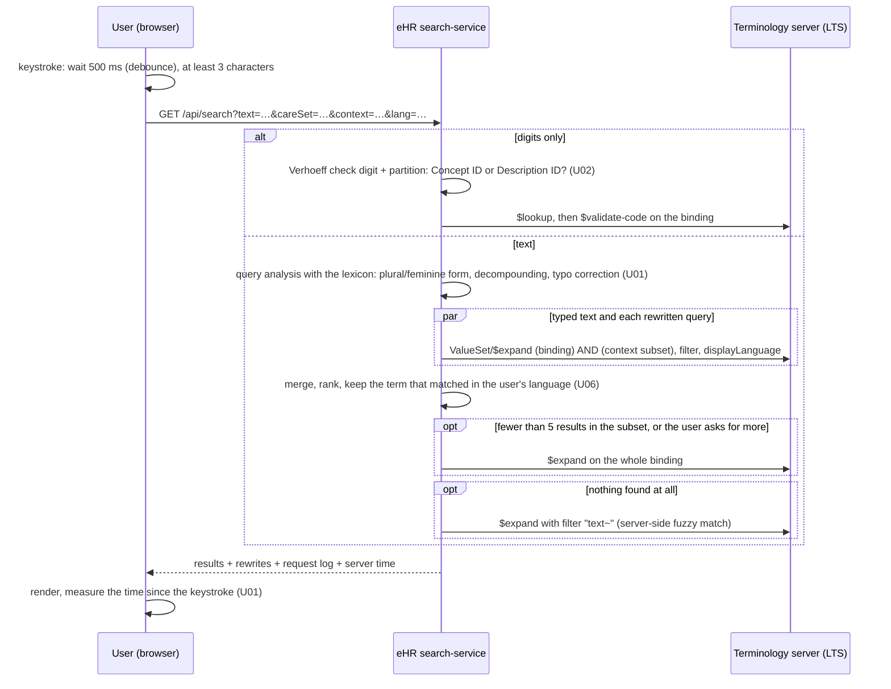

# Demo 2 · Search & select (structured data entry)

> **Example only.** This is one way to build a SNOMED CT search & select component that addresses U01–U08. It is not the way it must be done. The search behaviour depends partly on the terminology server (here Snowstorm Lite 2.7.0) and partly on the eHR. Both parts are described below, so it is clear what the server does and what the demo adds.

> **Without Node.js.** This whole demo also runs on Python: `python3 serve_demo2.py` in [`../python`](../python/README.md) serves these same pages with the Python standard library only, against any FHIR terminology server. The two were compared side by side and return the same concepts in the same order. There is a command-line version (`ts_search.py`) as well.

Page: `http://localhost:3000/search.html`. Code: `ehr-demo-app/public/js/concept-picker.js` (browser) and `ehr-demo-app/lib/search-service.mjs` (server). See [`../ehr-demo-app`](../ehr-demo-app) to run it.

## Data elements and their bindings (`ehr-demo-app/config/bindings.json`)

Each data element of the five care sets has a terminology binding written in ECL (U04, TSP2). Some also have **context subsets** (U01).

| Data element | Binding | Context subsets |
|---|---|---|
| Problem list `Condition.code` | SNOMED CT part of the IPS 2.0.0 "Problems" value set: `< 404684003 OR < 243796009 OR < 272379006 OR << 160245001` | Belgian problem list subset (40811000172108, default), GP subset (721000172106), and the cardiology, pulmonology, nephrology, rheumatology, haematology, infectious diseases, intensive care, neonatology and nursing subsets |
| Allergy & Intolerance `AllergyIntolerance.code` | IPS 2.0.0 "Allergies & Intolerances" | `^ 50841000172109 OR ^ 50851000172106 OR ^ 181061000172105` |
| Vaccination `Immunization.vaccineCode` | `^ 50831000172102` (Belgian vaccination subset, **required** binding) | – |
| Procedures `Procedure.code` | IPS 2.0.0 "Procedures" (with its MINUS exclusions) | procedures in the problem list subset or in the GP subset |
| Clinical observation `Observation.code` | `< 363787002 \|Observable entity\|` (demo choice) | – |
| Qualifiers | severity and laterality (be-vs-severity, be-vs-laterality), body site `<< 442083009` with context subset 211411000172101 | |

The IPS 2.0.0 value sets are used only where no Belgian binding was found. **Replace them with the official national bindings** (care sets / Belgian FHIR profiles) once those are published.

## What happens when the user types

| Behaviour | Done by | How |
|---|---|---|
| Progressive matching, min. 3 characters, 500 ms debounce | eHR (browser) | `concept-picker.js`. The measured time starts at the last keystroke, so it includes the debounce. |
| Word-prefix match, any word order ("pro hip" = "hip pro") | terminology server | The `filter` of `$expand`: every word must be the prefix of a word in a description. |
| Plural / feminine forms ("nierstenen" → "niersteen", "rénale" → "rénal") | eHR | Suffix rules per language, accepted only if the result is a word of the edition (`lib/lexicon.mjs`). |
| Decompounding ("femurfractuur" → "femur fractuur", "Darmentzündung" → "Darm entzündung") | eHR | Splits a word into words of the edition, with Dutch and German linking elements (s, e, en, n, es). |
| Minor spelling mistakes ("hypertensei" → "hypertensie") | eHR, then server | One edit (Damerau-Levenshtein) against the lexicon. If nothing is found, the server's fuzzy search (`~`, up to 2 edits). |
| Relevant ranking | eHR | Typed matches first; then terms that contain every search word; exact match; starts with the query; fewer words; shorter; server order as tie-breaker. |
| Context subset first, then the whole binding | eHR | ECL `(binding) AND (^ subset)`. Extends automatically when there are fewer than 5 results, or on the user's request. Nothing outside the binding is ever offered (U04). |
| Concept ID / Description ID | eHR | `shared/sctid.mjs` (check digit, partition, namespace). The Description ID → Concept ID index is built from RF2. |
| Language | terminology server | `displayLanguage` with the Belgian language reference sets (see `../00-terminology-server`). |
| Only active concepts | both | `activeOnly=true`. The eHR also removes results flagged `inactive` and validates again before storing (S03). |

**The lexicon.**

- `ehr-demo-app/build-lexicon.mjs` reads the active descriptions of active concepts from the RF2 Snapshot of the production edition. For 20260915 this is 2.36 million descriptions; the Dutch lexicon has 115,319 distinct words.
- The build takes about 18 seconds and writes a 57 MB cache.
- The lexicon never decides which concept is valid. It only proposes extra search strings, which go to the terminology server like the typed text.

## Requirements shown in this demo

Every requirement has its own page with the requirement text, screenshots, the code involved and the limitations:

| Req. | Topic | Example page |
|---|---|---|
| U01 | Search functionalities, response time, variants, decompounding, any order, context subsets | [REQ08 · U01](../../03_Technical%20Requirements/REQ08%20-%20U01%20-%20Overview%20of%20set%20of%20basic%20search%20functionalities/Examples/README.md) |
| U02 | Concept ID and Description ID | [REQ09 · U02](../../03_Technical%20Requirements/REQ09%20-%20U02%20-%20The%20system%20will%20enable%20searches%20using%20Concept%20ID/Examples/README.md) |
| U03 | Hierarchy and relationships | [REQ10 · U03](../../03_Technical%20Requirements/REQ10%20-%20U03%20-%20Following%20the%20return%20of%20search%20results%2C%20the%20system%20will%20permit%20users%20to%20%E2%80%8B%E2%80%8Bbrowse%20through%20nearby%20hierarchy/Examples/README.md) |
| U04 | Binding per data element | [REQ11 · U04](../../03_Technical%20Requirements/REQ11%20-%20U04%20-%20Limit%20searching%20and%20selection%20to%20only%20those%20concepts%20from%20SNOMED%20CT%20that%20have%20been%20specifically%20bound%20to%20that%20data%20element/Examples/README.md) |
| U05 | Free text + report to the NRC | [REQ12 · U05](../../03_Technical%20Requirements/REQ12%20-%20U05%20-%20Allow%20data%20capture%20via%20free%20text%20when%20concepts%20cannot%20be%20found/Examples/README.md) |
| U06 | The selected term is kept | [REQ13 · U06](../../03_Technical%20Requirements/REQ13%20-%20U06%20-%20Show%20user%20preferred%20display%20term%20for%20each%20SNOMED%20CT%20concept/Examples/README.md) |
| U07 | Favourites and recently used | [REQ14 · U07](../../03_Technical%20Requirements/REQ14%20-%20U07%20-%20The%20eHR%20system%20shall%20display%20the%20most%20relevant%20concepts/Examples/README.md) |
| U08 | Text-analysis suggestions | [REQ15 · U08](../../03_Technical%20Requirements/REQ15%20-%20U08%20-%20The%20eHR%20is%20capable%20of%20integrating%20tools%20solutions%20facilitating%20the%20search%20and%20capture%20of%20clinical%20data/Examples/README.md) |
| TSP6 | Languages | [REQ06 · TSP6](../../03_Technical%20Requirements/REQ06%20-%20TSP6%20-%20Multilanguage%20accommodation/Examples/README.md) |
| TSP7 | Feedback to the NRC | [REQ07 · TSP7](../../03_Technical%20Requirements/REQ07%20-%20TSP7%20-%20Provide%20a%20reportingfeedback%20mechanism/Examples/README.md) |
| S02 | Context stored in separate fields | [REQ17 · S02](../../03_Technical%20Requirements/REQ17%20-%20S02%20-%20Ensure%20that%20the%20context%20of%20each%20SNOMED%20CT%20concept%20identifier%20or%20expression%20is%20clearly%20represented/Examples/README.md) |
| S03 | Only active concepts | [REQ18 · S03](../../03_Technical%20Requirements/REQ18%20-%20S03%20-%20Active%20SNOMED%20CT%20concepts%20for%20data%20entry/Examples/README.md) |

## Screenshots

All screenshots are in [`../screenshots`](../screenshots). They were taken on 22 September 2026 with the Belgian Edition 20260915 in production (unless the name says `before-upgrade`).
