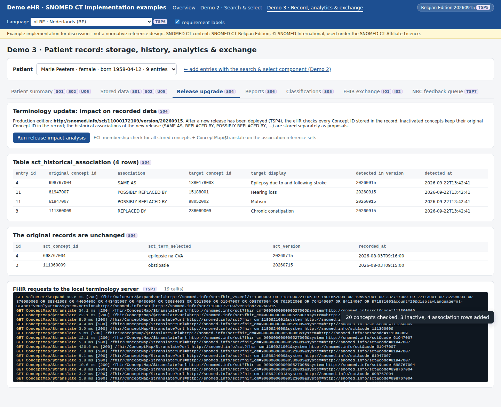
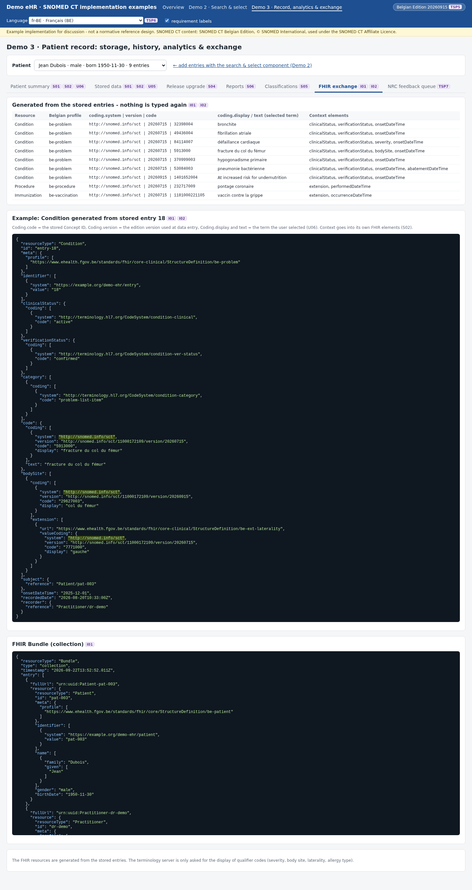

# Demo 3 · Record, history, analytics and exchange

> **Example only.** This is one way to store, analyse and exchange SNOMED CT-coded data so that S01–S06, I01 and I02 are met. The storage model, the reports and the FHIR mapping are examples meant for discussion. They are not a reference design.

Page: `http://localhost:3000/record.html`. See [`../ehr-demo-app`](../ehr-demo-app) to run it.

The record contains three **fictitious** patients. Their entries were recorded through the same API and validation as the search & select component (Demo 2):

| Patient | Entries | Scenario |
|---|---|---|
| Marie Peeters (F, 1958, nl-BE) | 9 coded | Includes 111360009 *obstipatie* and 698767004 *epilepsie na CVA*, which were inactivated in 20260915 |
| Lucas Janssens (M, 2016, nl-BE) | 5 coded + 1 free text | A child: the ICD-10 age rule applies. 61947007 *doofstomheid* was inactivated in 20260915. The free text shows U05. |
| Jean Dubois (M, 1950, fr-BE) | 8 coded + 1 recorded after the upgrade | French terms. A laterality without a body site. 1401652004, which is new in 20260915 and has no French term yet |

## The storage model (S01, S02, U05)

`ehr-demo-app/lib/store.mjs`, table `clinical_entry`:

| Column(s) | Requirement | Content |
|---|---|---|
| `sct_concept_id` | S01 | The Concept ID: the authoritative coded value |
| `sct_term_selected`, `term_language` | S01, U06 | The term the user saw and selected, and its language |
| `sct_description_id` | S01 | Optional and informative only; never a substitute for the Concept ID |
| `sct_version` | TSP5, S04 | The edition version used at data entry, e.g. `…/11000172109/version/20260715` |
| `free_text` | U05 | Text when no concept was found. It never has a code. |
| `clinical_status`, `verification_status`, `severity_sct`, `body_site_sct`, `laterality_sct`, `category`, `criticality`, `reaction_manifestation_*`, `onset_date`, `abatement_date`, `occurrence_date`, `value_quantity`, `value_unit` | S02 | The context, each in its own column. It maps onto its own FHIR element. |

The database itself enforces the rule "a coded value always has its Concept ID, and free text never has one":

```sql
CHECK ((sct_concept_id IS NOT NULL AND free_text IS NULL AND sct_term_selected IS NOT NULL)
    OR (sct_concept_id IS NULL AND free_text IS NOT NULL AND sct_description_id IS NULL))
```

`POST /api/entries` validates every coded value again on the server with the terminology server: the concept must be active and permitted by the binding of the data element (S03, U04). The entry is then stamped with the production version.

## The release upgrade (S04)

After the upgrade from 20260715 to 20260915 (Demo 1), **Run release impact analysis** (`lib/release-impact.mjs`) does four things:

1. It checks which stored Concept IDs are still active: one `$expand` with an ECL list of the IDs.
2. For every inactive concept, it reads the historical associations of the new release with `ConceptMap/$translate` on the implicit maps `?fhir_cm=<association refset>`. These are SAME AS, REPLACED BY, POSSIBLY REPLACED BY, POSSIBLY EQUIVALENT TO, PARTIALLY EQUIVALENT TO and ALTERNATIVE.
3. It stores them in the separate table `sct_historical_association`, together with the version in which they were found.
4. It **never** changes `clinical_entry`.

Result in the recorded run: 20 distinct concepts were checked and 3 were inactive, which gave 4 associations:

| Entry | Recorded (20260715) | Association (20260915) | Target |
|---|---|---|---|
| 3 | 111360009 *obstipatie* | REPLACED BY | 236069009 *chronische constipatie* |
| 4 | 698767004 *epilepsie na CVA* | SAME AS | 1380178003 *Epilepsy due to and following stroke* (no Dutch term yet) |
| 11 | 61947007 *doofstomheid* | POSSIBLY REPLACED BY | 15188001 *gehoorverlies* and 88052002 *mutisme* |

The patient summary shows the original term and Concept ID, with the status in the current edition and the proposed replacements next to them.

## Analytics with the SNOMED CT ontology (S06)

`lib/reports.mjs`: each report is **one ECL expression**. The eHR evaluates it only for the concepts stored in the record: `(report ECL) AND (id1 OR id2 …)`. The result therefore follows the hierarchy and the defining relationships of the edition that is in production, and no code list is maintained.

| Report | ECL | Uses |
|---|---|---|
| Disorder of the lung | `<< 19829001` | is-a |
| Diabetes mellitus | `<< 73211009` | is-a |
| Clinical findings located in the heart | `< 404684003 : 363698007 = << 80891009` | defining attribute *finding site* |
| Infections caused by bacteria | `<< 40733004 : 246075003 = << 409822003` | defining attribute *causative agent* |
| Procedures on the hip joint | `< 71388002 : << 363704007 = << 24136001` | *procedure site* and its sub-attributes |
| Epilepsy | `<< 84757009` | is-a. With **+ legacy codes**, the ECL 2.x history supplement `{{ +HISTORY-MIN }}` also finds codes that were inactivated after they were recorded |
| Penicillin allergy | `<< 764146007` (allergy entries only) | is-a on substances |

The **legacy data** case: after the upgrade, "epilepsy" finds **no** patient with current concepts only. With the history supplement it finds Marie Peeters through 698767004 → SAME AS 1380178003. The ECL covers 238 concepts instead of 208.

## Maps to classifications (S05)

`lib/maps.mjs`:

- **Import.** The extended map rows (`der2_iisssccRefset_ExtendedMapSnapshot`) of the International ICD-10 map (447562003) and of the Belgian addition (10861000172102) are imported into the eHR, with the file and the edition version.
- **Maintenance.** The import is repeated after every edition upgrade (`POST /api/admin/import-maps`); the artefact table records the version.
- **Rules.** The rules are evaluated per map group in priority order: `TRUE`, `OTHERWISE TRUE`, `IFA 248152002 | Female |` / `IFA 248153007 | Male |`, age at onset (`IFA 445518008 … <= 15.0 years`), and `IFA <concept>`, which checks whether the patient record contains that concept or a subtype.
- **Legacy data.** An inactivated concept has no row in the current map, so it is classified through the association stored by S04. The screen shows which association was followed.
- **Output.** The result is available in the patient summary (display), in the classification view, and in `GET /api/extract.csv` (data extraction).
- **Other targets.** ICPC-2, ICHI, NIHDI, LOINC and Orphanet are listed with "no map artefact in the loaded Belgian Edition". The same import mechanism applies once such maps are published.

Examples from the recorded run:

| Patient | Entry | Rule | ICD-10 |
|---|---|---|---|
| Lucas (9 years at onset) | bronchitis 32398004 | `IFA 445518008 \| Age at onset \| <= 15.0 years` | J20.9 |
| Jean (75 years at onset) | bronchite 32398004 | `OTHERWISE TRUE` | J40 |
| Marie (female) | 370999003 *primair hypogonadisme* | `IFA 248152002 \| Female \|` | E28.3 |
| Jean (male) | 370999003 *hypogonadisme primaire* | `IFA 248153007 \| Male \|` | E29.1 |
| Marie (legacy) | 111360009 *obstipatie* | derived via REPLACED BY 236069009 | K59.0 |
| Lucas (legacy) | 61947007 *doofstomheid* | derived via POSSIBLY REPLACED BY 15188001 / 88052002 | H91.9 / R47.0 (two candidates) |

## FHIR exchange (I01, I02)

`lib/fhir-export.mjs` generates the Belgian FHIR resources from the stored rows, so nothing is typed a second time:

| Care set | Resource | Profile |
|---|---|---|
| Problem list | Condition | `be-problem` |
| Allergy & Intolerance | AllergyIntolerance | `be-allergyintolerance` (type in `be-ext-allergy-type`) |
| Vaccination | Immunization | `be-vaccination` (recorder in `be-ext-recorder`) |
| Procedures | Procedure | `be-procedure` |
| Clinical observation | Observation | `be-clinical-observation` |

What goes where:

- **Coding.** `Coding.system`, `Coding.version`, `Coding.code` and `Coding.display` are the Belgian Edition URI, the version used at data entry, the stored Concept ID and the term the user selected. `CodeableConcept.text` is the same selected term. Free text travels as `text` only, without a coding.
- **Context.** Context goes into the FHIR elements for it (`clinicalStatus`, `verificationStatus`, `severity`, `bodySite` + `be-ext-laterality`, `onsetDateTime`, `reaction`, …).
- **Laterality without a body site.** The Belgian laterality extension sits on `bodySite`. When only a laterality was recorded (Jean Dubois: 5913000 + left), the body site is taken from the concept's **finding site** (29627003, read with `$lookup` / `normalFormTerse`), so the laterality is not lost.
- **Identifiers.** Patient and practitioner identifiers use a demo namespace (`https://example.org/demo-ehr/…`). No national numbers are used.

The resources were **not** validated with the HL7 FHIR validator against the Belgian packages, because the package registry could not be reached from the demo environment. Do that before reusing the mapping.

## Screenshots

| | |
|---|---|
|  |  |
| Patient summary after the upgrade (S01, S02, S04, S05, U06) | Release impact analysis (S04) |
|  |  |
| Epilepsy report with the history supplement (S06) | ICD-10 for current and legacy codes (S05) |
|  |  |
| Stored rows with free text (S01, U05) | FHIR resources generated from the stored data (I01, I02) |

Each requirement has its own example page in `03_Technical Requirements/<REQ>/Examples/` (see the traceability table in the [top-level README](../README.md)).
