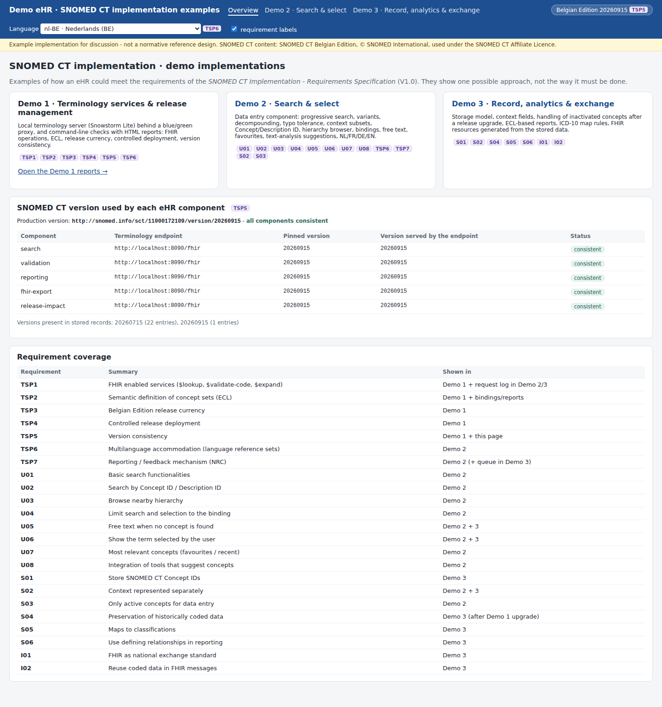
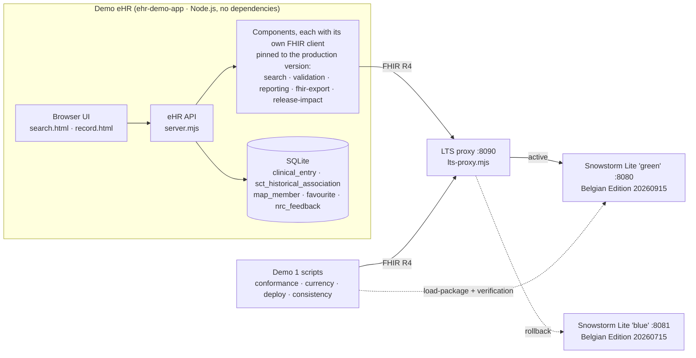

# 05 · Demo implementations

> **Examples, not a reference.** These demos show *one* possible way to address the technical requirements of the *Requirements Specification SNOMED CT Implementation* (V1.0, 10.09.2026). They are meant to make the requirements concrete and to support the discussion between suppliers and the Belgian NRC. They are **not** "the way it should be done", they are not certified, and passing their checks does not mean that a product meets the requirements.

Three demos cover the 23 technical requirements. Every requirement has its own example page in `03_Technical Requirements/<REQ…>/Examples/README.md`, with the requirement text, what the demo does, screenshots, example requests, pointers to the code, and the limitations.

| Demo | What it shows | Requirements |
|---|---|---|
| **[Demo 1 · Terminology services & release management](01-terminology-services/README.md)** | A local FHIR terminology server (blue/green) and scripted checks with HTML reports: FHIR operations, ECL, languages, release currency, a controlled release deployment, version consistency | TSP1–TSP6 |
| **[Demo 2 · Search & select](02-search-and-select/README.md)** | The data-entry component: progressive search, variants, typo tolerance, decompounding, any-order prefixes, context subsets, Concept/Description ID, hierarchy, bindings, free text, favourites, text-analysis suggestions, NRC feedback | U01–U08, TSP6, TSP7, S02, S03 |
| **[Demo 3 · Record, analytics & exchange](03-record-analytics-exchange/README.md)** | Storage model, context fields, a release upgrade with inactivated concepts, ECL-based reports, ICD-10 map rules for current and legacy data, Belgian FHIR resources generated from the stored data | S01–S06, I01, I02 |



## Architecture



## Requirement traceability

| Req. | Requirement | Demo | Example page |
|---|---|---|---|
| TSP1 | FHIR enabled services | 1 | [REQ01 · TSP1](../03_Technical%20Requirements/REQ01%20-%20TSP1%20-%20FHIR%20enabled%20services/Examples/README.md) |
| TSP2 | Semantic definition and evaluation of concept sets (ECL) | 1 (+2, 3) | [REQ02 · TSP2](../03_Technical%20Requirements/REQ02%20-%20TSP2%20-%20%E2%80%8B%E2%80%8B%E2%80%8BSemantic%20definition%20and%20evaluation%20of%20SNOMED%20CT%20concept%20sets/Examples/README.md) |
| TSP3 | Belgian Edition release currency | 1 | [REQ03 · TSP3](../03_Technical%20Requirements/REQ03%20-%20TSP3%20-%20Belgian%20Edition%20Release%20Currency/Examples/README.md) |
| TSP4 | Controlled release deployment | 1 | [REQ04 · TSP4](../03_Technical%20Requirements/REQ04%20-%20TSP4%20-%20Controlled%20SNOMED%20CT%20Release%20Deployment/Examples/README.md) |
| TSP5 | Version consistency | 1 (+ eHR) | [REQ05 · TSP5](../03_Technical%20Requirements/REQ05%20-%20TSP5%20-%20Version%20Consistency/Examples/README.md) |
| TSP6 | Multilanguage accommodation | 2 (+1) | [REQ06 · TSP6](../03_Technical%20Requirements/REQ06%20-%20TSP6%20-%20Multilanguage%20accommodation/Examples/README.md) |
| TSP7 | Reporting/feedback mechanism | 2, 3 | [REQ07 · TSP7](../03_Technical%20Requirements/REQ07%20-%20TSP7%20-%20Provide%20a%20reportingfeedback%20mechanism/Examples/README.md) |
| U01 | Basic search functionalities | 2 | [REQ08 · U01](../03_Technical%20Requirements/REQ08%20-%20U01%20-%20Overview%20of%20set%20of%20basic%20search%20functionalities/Examples/README.md) |
| U02 | Search by Concept ID (and Description ID) | 2 | [REQ09 · U02](../03_Technical%20Requirements/REQ09%20-%20U02%20-%20The%20system%20will%20enable%20searches%20using%20Concept%20ID/Examples/README.md) |
| U03 | Browse the nearby hierarchy | 2 | [REQ10 · U03](../03_Technical%20Requirements/REQ10%20-%20U03%20-%20Following%20the%20return%20of%20search%20results%2C%20the%20system%20will%20permit%20users%20to%20%E2%80%8B%E2%80%8Bbrowse%20through%20nearby%20hierarchy/Examples/README.md) |
| U04 | Limit search and selection to the binding | 2 | [REQ11 · U04](../03_Technical%20Requirements/REQ11%20-%20U04%20-%20Limit%20searching%20and%20selection%20to%20only%20those%20concepts%20from%20SNOMED%20CT%20that%20have%20been%20specifically%20bound%20to%20that%20data%20element/Examples/README.md) |
| U05 | Free text when no concept is found | 2, 3 | [REQ12 · U05](../03_Technical%20Requirements/REQ12%20-%20U05%20-%20Allow%20data%20capture%20via%20free%20text%20when%20concepts%20cannot%20be%20found/Examples/README.md) |
| U06 | Show the term the user selected | 2, 3 | [REQ13 · U06](../03_Technical%20Requirements/REQ13%20-%20U06%20-%20Show%20user%20preferred%20display%20term%20for%20each%20SNOMED%20CT%20concept/Examples/README.md) |
| U07 | Most relevant concepts (favourites, recent) | 2 | [REQ14 · U07](../03_Technical%20Requirements/REQ14%20-%20U07%20-%20The%20eHR%20system%20shall%20display%20the%20most%20relevant%20concepts/Examples/README.md) |
| U08 | Integration of text-analysis tools | 2 | [REQ15 · U08](../03_Technical%20Requirements/REQ15%20-%20U08%20-%20The%20eHR%20is%20capable%20of%20integrating%20tools%20solutions%20facilitating%20the%20search%20and%20capture%20of%20clinical%20data/Examples/README.md) |
| S01 | Store Concept IDs | 3 | [REQ16 · S01](../03_Technical%20Requirements/REQ16%20-%20S01%20-%20The%20eHR%20must%20store%20SNOMED%20CT%20concept%20identifiers%20in%20the%20health%20records/Examples/README.md) |
| S02 | Context clearly represented | 2, 3 | [REQ17 · S02](../03_Technical%20Requirements/REQ17%20-%20S02%20-%20Ensure%20that%20the%20context%20of%20each%20SNOMED%20CT%20concept%20identifier%20or%20expression%20is%20clearly%20represented/Examples/README.md) |
| S03 | Only active concepts for data entry | 2 | [REQ18 · S03](../03_Technical%20Requirements/REQ18%20-%20S03%20-%20Active%20SNOMED%20CT%20concepts%20for%20data%20entry/Examples/README.md) |
| S04 | Preservation of historically coded data | 3 (after 1) | [REQ19 · S04](../03_Technical%20Requirements/REQ19%20-%20S04%20-%20Preservation%20of%20historically%20coded%20data/Examples/README.md) |
| S05 | Maps to classifications, legacy and current data | 3 | [REQ20 · S05](../03_Technical%20Requirements/REQ20%20-%20S05%20-%20%E2%80%8B%E2%80%8B%E2%80%8BUse%20maps%20from%20SNOMED%20CT%20to%20national%20and%20international%20classifications%20including%20legacy%20and%20current%20data/Examples/README.md) |
| S06 | Defining relationships in results | 3 | [REQ21 · S06](../03_Technical%20Requirements/REQ21%20-%20S06%20-%20Use%20SNOMED%20CT%E2%80%99s%20defining%20relationships%20in%20the%20determination%20of%20the%20correct%20results%20or%20outcomes/Examples/README.md) |
| I01 | FHIR exchange of SNOMED CT-coded data | 3 | [REQ22 · I01](../03_Technical%20Requirements/REQ22%20-%20I01%20-%20Use%20the%20national%20%E2%80%8B%E2%80%8Bexchange%E2%80%8B%E2%80%8B%20standard%20FHIR%20to%20share%20data%20that%20are%20SNOMED%20CT%20coded%20in%20the%20eHR/Examples/README.md) |
| I02 | Reuse of coded data elements in exchanges | 3 | [REQ23 · I02](../03_Technical%20Requirements/REQ23%20-%20I02%20-%20Reuse%20SNOMED%20CT%20coded%20data%20elements%20for%20all%20relevant%20message%20exchanges/Examples/README.md) |

The folder `03_Technical Requirements/LOCAL TERMINOLOGY SERVER` also has an example page. It maps the points of its *Minimal Requirements* document to the demos.

## The scenario behind the screenshots

The screenshots and reports come from one recorded run on 22 September 2026:

1. **July 2026 in production.** Blue serves the Belgian Edition **20260715**. Three fictitious patients are recorded through the eHR (`ehr-demo-app/seed.mjs`): 22 coded entries and 1 free-text entry.
2. **A newer edition is published.** The September 2026 edition (**20260915**) is available. The release currency check fails, because production is 2 months behind (TSP3).
3. **Controlled deployment.** `deploy-release.mjs` imports 20260915 into green while blue keeps serving. It verifies the content against the RF2 package, switches the proxy and hands the new version to the eHR. 0 of 1,856 probe requests failed (TSP4, TSP5).
4. **After the upgrade.** The eHR maps are re-imported (S05). One entry is recorded with a concept that is new in 20260915, and one NRC feedback item is queued (`seed-after-upgrade.mjs`). The release impact analysis finds 3 inactivated concepts and stores 4 associations (S04).
5. **Version consistency.** Checked on the eHR (PASS), and on a second eHR instance whose reporting component still points to blue (FAIL, as intended) (TSP5).

## Running the demos

**[`RUNNING.md`](RUNNING.md) is the one-page quick start**: which route fits your machine, the commands per demo, and a troubleshooting table. The rest of this section is the sequence of the recorded run.

Requirements:

- **Node.js 22.13 or later** for everything in the demos. No npm packages are needed; Playwright is only used to re-create the screenshots.
- **Java 17 or later**, *only* for the local terminology server ([Snowstorm Lite](https://github.com/IHTSDO/snowstorm-lite) 2.7.0), and about **8 GB RAM**, because the import of the Belgian Edition needs a heap of about 4 GB.
- The **RF2 release packages** of the Belgian Edition (20260715 and 20260915 in the recorded run). They are **not** in this repository.

**Docker is not needed** anywhere; `00-terminology-server/docker-compose.yml` is an optional alternative. **No Java 17 either**, if you point the demos at a FHIR terminology server that already runs (for example a national server): the eHR and the Demo 1 scripts are Node.js only. Both cases, and the Windows (PowerShell) commands, are in [`00-terminology-server/README.md`](00-terminology-server/README.md).

**No Node.js either?** The [`python/`](python/README.md) folder runs **Demo 1 and Demo 2** with **Python 3.8 and no packages**: `serve_demo2.py` serves the search & select demo in the browser (the same pages, the same behaviour), `ts_check.py` and `release_currency_check.py` write the same HTML reports, and `build_lexicon.py` builds the same lexicon from the RF2 package. Demo 3, TSP4 and the two-endpoint part of TSP5 stay Node.js only; their screenshots and reports are in this repository.

```bash
# 1. terminology server + proxy: see 00-terminology-server/README.md (Java) or docker-compose.yml
#    blue = 20260715 on :8081, green = idle on :8080, proxy on :8090 (ACTIVE=blue)

# 2. eHR (see ehr-demo-app/README.md)
cd ehr-demo-app
node build-lexicon.mjs /data/rf2/<20260715>/Snapshot
RF2_SNAPSHOT_DIR=/data/rf2/<20260715>/Snapshot node server.mjs &     # http://localhost:3000
node seed.mjs

# 3. Demo 1 before the upgrade
cd ../01-terminology-services
node conformance-check.mjs --id tsp1-tsp2-tsp6-conformance-20260715
node release-currency-check.mjs --release-info <20260915>/release_package_information.json,<20260715>/release_package_information.json --id tsp3-release-currency-before-upgrade

# 4. controlled deployment of 20260915 (TSP4) + hand-over to the eHR (TSP5)
SNOWSTORM_ADMIN_PASSWORD=... PROXY_ADMIN_TOKEN=... node deploy-release.mjs --package BE_20260915_snapshot.zip \
     --version-uri http://snomed.info/sct/11000172109/version/20260915 --rf2 /data/rf2/<20260915>/Snapshot

# 5. after the upgrade
curl -X POST localhost:3000/api/admin/import-maps -H 'Content-Type: application/json' -d '{"snapshotDir":"/data/rf2/<20260915>/Snapshot"}'
(cd ../ehr-demo-app && node build-lexicon.mjs /data/rf2/<20260915>/Snapshot)      # then restart the eHR
(cd ../ehr-demo-app && node seed-after-upgrade.mjs)
node release-currency-check.mjs --release-info … --id tsp3-release-currency-after-upgrade
node conformance-check.mjs
node version-consistency-check.mjs
#    then in the eHR: record.html → Release upgrade → "Run release impact analysis" (S04)

# 6. optional: TSP5 mismatch, i.e. a second eHR whose reporting component uses blue
PORT=3001 REPORTING_LTS_BASE_URL=http://localhost:8081/fhir LEXICON_CACHE=/nonexistent node ../ehr-demo-app/server.mjs &
node version-consistency-check.mjs --ehr http://localhost:3001 --id tsp5-version-consistency-mismatch
```

With Python instead of Node.js (Demo 1 checks and Demo 2, against any FHIR terminology server):

```bash
cd "05_Demo implementations/python"
python3 ts_check.py --fhir http://localhost:8090/fhir                       # TSP1, TSP2, TSP6
python3 release_currency_check.py --fhir http://localhost:8090/fhir --latest 20260915   # TSP3
python3 build_lexicon.py /data/rf2/<20260915>/Snapshot                      # U01, U02 (~30 s, once)
python3 serve_demo2.py --fhir http://localhost:8090/fhir                    # -> http://localhost:3100/search.html
```

To re-create the screenshots: `cd tools && npm install && node capture-screenshots.mjs before|demo1|python|after`.

## Folder structure

```
05_Demo implementations/
  README.md                        this page
  RUNNING.md                       one-page quick start: how to run each demo
  00-terminology-server/           Snowstorm Lite configuration, LTS proxy (blue/green), docker-compose example
  01-terminology-services/         Demo 1: scripts + reports/ (HTML + JSON of the recorded run)
  02-search-and-select/            Demo 2: documentation
  03-record-analytics-exchange/    Demo 3: documentation
  ehr-demo-app/                    the demo eHR used by Demo 2 and 3 (server, UI, storage, FHIR export)
  python/                          Demo 1 checks and Demo 2 (browser + command line) in Python (no Node.js, no Java)
  shared/                          FHIR terminology client, optional OAuth2 token provider, SCTID check, RF2 reader
  screenshots/                     all screenshots used in the documentation
  tools/                           screenshot tool (Playwright), only needed to re-create screenshots
```

## Observations made while building the demos

These are observations, not conclusions. They may help the NRC when it refines the requirements and the content.

**About the requirements**

1. **TSP3: "one month behind" can be read in three ways.**
   - The September 2026 package follows the July 2026 package directly (no August release).
   - On 22 September the July edition was 2 months behind by effective time, but only 1 release behind, and behind a release that had been available for 7 days.
   - Under the effective-time reading, a supplier becomes non-compliant on the day a release is published.
   - The requirement could state the measure, and how much time is allowed after a publication.
2. **TSP7: two feedback channels are named.**
   - The requirement links to the terminology portal (`apps.health.belgium.be/terminology-portal/snomed_ct_requests`).
   - The release notes of 20260915 point to the SNOMED International Request Management Portal (rmp.ihtsdotools.org), and to the Belgian Health Terminology Portal for batch requests.
   - Suppliers need to know which channel to direct users to.
3. **S04 vs the *Minimal Requirements* document.** The document says systems should "automatically point old codes to their active replacements". S04 requires that the original Concept ID stays the record and that associations are kept separately. The demo follows S04: it proposes replacements next to the original code.
4. **S02 / I01: laterality needs a body site.** In the Belgian profiles the laterality extension sits on `bodySite`. A problem recorded with only a laterality (e.g. fracture of neck of femur + left) needs a body site before it can be exchanged. The demo takes it from the concept's finding site.

**About the content of the Belgian Edition (20260915)**

5. **Reference set members that refer to inactive concepts.** 70 members of Belgian simple reference sets refer to inactive concepts (known issue ISRS-7703 in the release notes). Examples:
   - 698767004 is still a member of the problem list subset;
   - 61947007 is still a member of the GP subset.
6. **Replacement concepts without a Dutch or French term yet.** 1380178003 *Epilepsy due to and following stroke* (the SAME AS target of the inactivated 698767004 *epilepsie na CVA*) and 1401652004 have no nl/fr terms in 20260915, so Dutch and French users see English.
7. **A misspelled preferred term.** The nl-BE preferred term of 764146007 is spelled *penicilinne*; the synonym *penicilline* is correct.
8. **A missing synonym.** 233604007 *pneumonie* has no nl-BE synonym *longontsteking*, while other concepts use that word (*longontsteking in anamnese*, …).
9. **A general concept missing from a specialty subset.** The cardiology subset 131001000172104 contains 13 subtypes of 84114007 *hartfalen* but not the concept itself.

**About the terminology server used (Snowstorm Lite 2.7.0).** These are relevant for suppliers who test with it:

10. Inactive reference set members are returned by `$expand` (flagged `inactive`) even with `activeOnly=true`, and `$validate-code` returns `result: true` + `inactive: true` for them.
11. `Accept-Language: *` gives HTTP 500.
12. `system-version` is not used on `$expand`, but the version used is reported in the expansion.
13. The POSSIBLY REPLACED BY and PARTIALLY EQUIVALENT TO association maps must be configured before they can be used with `$translate`.
14. Only "ECL Core" is supported.

## Security, privacy and licence

- **No credentials.** The demos contain no credentials for the Belgian national terminology server (NTS) or any other service. The only reference to the NTS is its FHIR base URL as an optional, configurable upstream of the TSP3 check; a token would come from the environment variable `NTS_TOKEN`. Passwords and tokens of the demo components are placeholders (`change-me`) or come from environment variables.
- **Fictitious data.** All patients are fictitious. Identifiers use a demo namespace (`https://example.org/demo-ehr/…`), and no national numbers are used.
- **No security features.** The demo eHR has no authentication, authorisation or audit logging. It is a local demo, not a template for production.
- **SNOMED CT content.** SNOMED CT is © SNOMED International; the Belgian Edition is maintained by the Belgian NRC and used under the SNOMED CT Affiliate Licence. **No RF2 files, indexes or derived caches are in this repository.** The screenshots and reports contain SNOMED CT content (terms and identifiers).
- **Licence of the code.** The demo code has no licence file. The repository owner decides on one before publication.

## Adding this folder to the repository

- **Where things go.** Copy `05_Demo implementations/` to the root of the repository, and the `Examples/` folders into the matching `03_Technical Requirements/REQ…` folders (the folder names match exactly, including invisible characters).
- **REQ01 conflict.** `REQ01 - TSP1 - FHIR enabled services` currently contains an empty placeholder **file** named `Examples`. A file and a folder cannot have the same name, so remove that file before adding the `Examples/` folder.

## References

- Snowstorm Lite (SNOMED International): <https://github.com/IHTSDO/snowstorm-lite>
- HL7 FHIR R4, Using SNOMED CT with FHIR (implicit value sets and concept maps): <https://hl7.org/fhir/R4/snomedct.html>
- HL7 FHIR R4 terminology service: <https://hl7.org/fhir/R4/terminology-service.html>
- SNOMED CT Expression Constraint Language: <http://snomed.org/ecl>
- HL7 Belgium FHIR implementation guides (core, core-clinical, allergy, vaccination): <https://github.com/hl7-be>
- International Patient Summary 2.0.0 (value sets used as example bindings): <https://hl7.org/fhir/uv/ips/>
- SNOMED CT search UI examples referenced by the requirements: <https://ihtsdo.github.io/snomed-ui-examples/>
