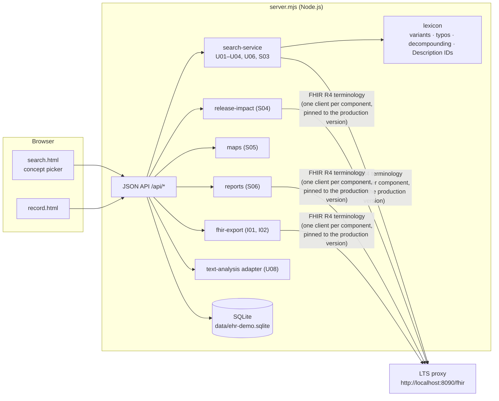

# Demo eHR (used by Demo 2 and Demo 3)

> The one-page quick start for all three demos is [`../RUNNING.md`](../RUNNING.md). This page has the detail.

> **Example only.** This is a small, deliberately simple eHR written for the demonstrations. It is not a reference architecture, it is not secure, and it must not be used with real patient data. The three patients in the demo are fictitious.

The demo eHR is a Node.js server with plain HTML and JavaScript pages. It has no framework, no build step and no npm dependencies. It needs **Node.js 22.13 or later**, because it uses the built-in `node:sqlite` module.

The pages:

| Page | Demo | Requirements |
|---|---|---|
| `/index.html` | Overview, the SNOMED CT version used by each component, requirement coverage | TSP5 |
| `/search.html` | Demo 2: search & select (the data-entry component) | U01–U08, TSP6, TSP7, S02, S03 |
| `/record.html` | Demo 3: patient record, release upgrade, reports, classifications, FHIR | S01–S06, I01, I02, U05, U06, TSP7 |
| `/demo1/` | The HTML reports of Demo 1 | TSP1–TSP6 |

Every page has these features:

- A **language selector**: nl-BE, fr-BE, de-BE, the nl-BE and fr-BE GP language reference sets, and en-US.
- Purple **requirement labels**, which you can switch off.

The search and record pages also have a **request log** that lists every FHIR request the server made to the terminology server for that screen (TSP1).

## Architecture



**One terminology client per component.** The components are search, validation, reporting, fhir-export and release-impact. Each client:

- is pinned to the production SNOMED CT version;
- can point to its own endpoint (`SEARCH_LTS_BASE_URL`, `VALIDATION_LTS_BASE_URL`, `REPORTING_LTS_BASE_URL`, `EXPORT_LTS_BASE_URL`, `IMPACT_LTS_BASE_URL`);
- refuses to process data (HTTP 409) when its server answers with another version than the pinned one.

`GET /api/version` lists all components with their endpoint and version (TSP5).

## Running it

Start the terminology server and the LTS proxy first (see [`../00-terminology-server`](../00-terminology-server/README.md)), **or** point `LTS_BASE_URL` at a FHIR terminology server that already runs — the eHR itself needs only Node.js, no Java and no Docker. Then:

```bash
cd ehr-demo-app
# once per edition: lexicon for the query rewriting + Description ID index
node build-lexicon.mjs /data/rf2/SnomedCT_ManagedServiceBE_PRODUCTION_BE1000172_20260715T120000Z/Snapshot
# start (http://localhost:3000). RF2_SNAPSHOT_DIR is also used to import the ICD-10 maps (S05) on first start.
RF2_SNAPSHOT_DIR=/data/rf2/SnomedCT_ManagedServiceBE_PRODUCTION_BE1000172_20260715T120000Z/Snapshot node server.mjs
# three fictitious patients, recorded while 20260715 is in production (needed for the S04 scenario)
node seed.mjs
```

The same on Windows (PowerShell), one variable per line:

```powershell
cd 'C:\snomed-demo\05_Demo implementations\ehr-demo-app'
node build-lexicon.mjs 'C:\snomed-demo\rf2\SnomedCT_ManagedServiceBE_PRODUCTION_BE1000172_20260715T120000Z\Snapshot'
$env:RF2_SNAPSHOT_DIR = 'C:\snomed-demo\rf2\SnomedCT_ManagedServiceBE_PRODUCTION_BE1000172_20260715T120000Z\Snapshot'
# $env:LTS_BASE_URL = 'https://<server>/fhir'      # only when not using the local terminology server
node server.mjs
# in a second window:
node seed.mjs
```

After the upgrade to 20260915 with `../01-terminology-services/deploy-release.mjs`, run these three steps:

```bash
# 1. maps of the new edition (S05)
curl -X POST localhost:3000/api/admin/import-maps -H 'Content-Type: application/json' \
     -d '{"snapshotDir":"/data/rf2/SnomedCT_ManagedServiceBE_PRODUCTION_BE1000172_20260915T120000Z/Snapshot"}'
# PowerShell: Invoke-RestMethod -Method Post -Uri http://localhost:3000/api/admin/import-maps -ContentType 'application/json' `
#               -Body '{"snapshotDir":"C:/snomed-demo/rf2/SnomedCT_ManagedServiceBE_PRODUCTION_BE1000172_20260915T120000Z/Snapshot"}'
# 2. rebuild the lexicon for the new edition, then restart the eHR
node build-lexicon.mjs /data/rf2/SnomedCT_ManagedServiceBE_PRODUCTION_BE1000172_20260915T120000Z/Snapshot
# 3. one entry with a concept that is new in 20260915, and one queued NRC feedback (TSP5, TSP6, TSP7)
node seed-after-upgrade.mjs
```

Then, in `record.html` → *Release upgrade*, click **Run release impact analysis** (S04).

### Configuration (environment variables)

| Variable | Default | Meaning |
|---|---|---|
| `PORT` | `3000` | HTTP port |
| `LTS_BASE_URL` | `http://localhost:8090/fhir` | FHIR terminology endpoint of all components (the LTS proxy) |
| `SEARCH_LTS_BASE_URL`, `VALIDATION_LTS_BASE_URL`, `REPORTING_LTS_BASE_URL`, `EXPORT_LTS_BASE_URL`, `IMPACT_LTS_BASE_URL` | – | Optional endpoint per component (TSP5 demo) |
| `SCT_PRODUCTION_VERSION` | read from `LTS_BASE_URL` at start-up | Production version URI, e.g. `http://snomed.info/sct/11000172109/version/20260915` |
| `RF2_SNAPSHOT_DIR` | – | RF2 Snapshot folder: lexicon build if there is no cache, and map import on first start |
| `LEXICON_CACHE` | `data/lexicon-cache.json` | Lexicon + Description ID cache |
| `DB_FILE` | `data/ehr-demo.sqlite` | SQLite database |
| `DEBOUNCE_MS` / `MIN_CHARS` | `500` / `3` | Search debounce and minimum characters (U01) |
| `DEFAULT_LANGUAGE` | `nl-BE` | Default display language |
| `DEMO_USER` | `dr-demo` | Practitioner ID used as recorder |
| `SUGGEST_SERVICE_URL` | `http://localhost:<PORT>/api/text-analysis` | Text-analysis service (U08) |
| `TS_BEARER_TOKEN` | – | Bearer token, when the terminology server needs one |
| `TS_TOKEN_URL`, `TS_CLIENT_ID`, `TS_CLIENT_SECRET`, `TS_SCOPE` | – | OAuth2 client credentials instead of a fixed token; the demo fetches and caches the token (`shared/oauth.mjs`) |

The bindings of the data elements are in `config/bindings.json` (see Demo 2).

## Files

```
server.mjs                 HTTP server: static pages + JSON API
config/bindings.json       terminology binding (ECL) and context subsets per data element
lib/search-service.mjs     search & select: tiers, query rewriting, ranking, ID search, validation (U01-U04, U06, S03)
lib/lexicon.mjs            word lexicon from RF2: variants, typo correction, decompounding; Description ID index
lib/store.mjs              SQLite schema and storage rules (S01, S02, S04, U05, U07, TSP7)
lib/release-impact.mjs     inactivated concepts + historical associations after an upgrade (S04)
lib/maps.mjs               ICD-10 extended map import and rule evaluation (S05)
lib/reports.mjs            ECL-based reports (S06)
lib/fhir-export.mjs        Belgian FHIR resources generated from the stored entries (I01, I02)
lib/nlp-suggest.mjs        text-analysis contract + a naive reference analyser (U08)
lib/feedback.mjs           NRC feedback: portal link or supplier queue (TSP7)
public/                    UI (search.html, record.html, index.html, js/, css/)
seed.mjs                   3 fictitious patients (run with 20260715 in production)
seed-after-upgrade.mjs     1 entry + 1 feedback after the upgrade to 20260915
build-lexicon.mjs          builds data/lexicon-cache.json from an RF2 Snapshot
../shared/                 FHIR terminology client, OAuth2 token provider (optional), SCTID check digit / partition, RF2 reader
```

## API (JSON)

| Method and path | Purpose |
|---|---|
| `GET /api/config` | Care sets, bindings, languages, reports, profiles |
| `GET /api/version` | Version per component and version stamps in the record (TSP5) |
| `POST /api/admin/production-version` | Deployment hook: switch every component to a new version (TSP4/TSP5) |
| `GET /api/search?text=&careSet=&context=&extend=&lang=` | Search & select (U01, U02, U04) |
| `GET /api/concept/{id}?careSet=&lang=` | Concept details: parents, children, defining relationships, terms (U03, TSP6) |
| `POST /api/validate` | Active + binding check of a selection (U04, S03) |
| `GET/POST/DELETE /api/favourites` | Favourites and recently used (U07) |
| `POST /api/suggest` | Suggestions from the text-analysis service (U08) |
| `POST /api/text-analysis` | The naive reference text analyser itself |
| `POST /api/feedback`, `GET /api/feedback` | NRC feedback: portal summary or supplier queue (TSP7) |
| `GET/POST /api/patients`, `GET /api/patients/{id}` | Patients and the patient summary |
| `POST /api/entries` | Record an entry. It is validated on the server and stamped with the version (S01, S03, U05) |
| `GET /api/db/{table}` | Read-only view of the stored rows (S01, S04) |
| `POST /api/release-impact` | Release impact analysis (S04) |
| `GET /api/reports`, `GET /api/reports/{id}?history=true` | ECL reports (S06) |
| `GET /api/maps`, `POST /api/admin/import-maps`, `GET /api/patients/{id}/classification`, `GET /api/extract.csv` | Maps and derived ICD-10 codes (S05) |
| `GET /api/patients/{id}/fhir`, `GET /api/entries/{id}/fhir` | FHIR Bundle / resource (I01, I02) |

## Known limitations

- **No security.** There is no authentication, no authorisation and no audit trail, and the admin routes are open. This is a local demo.
- **Lexicon version.** The lexicon cache is built from the RF2 files of one edition, and it must be rebuilt when the production edition changes. In the recorded run it was built from 20260915 before the upgrade. It is only used to rewrite queries and to look up Description IDs; every result and every recorded code is still checked by the terminology server.
- **Release impact scope.** The release impact analysis (S04) checks the recorded concepts (`sct_concept_id`), not the qualifier values.
- **Text analysis.** The text analyser is a dictionary look-up used only to show the integration contract. It is not an NLP engine.
- **FHIR profiles.** The FHIR resources follow the Belgian profiles but were not validated with the FHIR validator.
