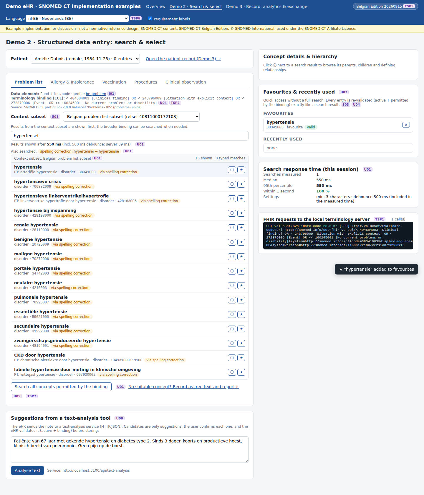

# Python version (no Node.js, no Java, no Docker)

> The one-page quick start for all three demos is [`../RUNNING.md`](../RUNNING.md); §5 covers this folder.

> **Examples, not a reference.** Same disclaimer as the rest of this folder: these scripts show *one* way to address the requirements, they are not a certification test suite, and passing them does not mean a product meets the requirements. The server below has no authentication, no authorisation and no audit trail: it is a local demo, never to be used with real patient data.

The demos are written in Node.js, and the local terminology server needs Java 17. On a workstation where none of that can be installed, this folder runs **Demo 1** and **Demo 2** with nothing but the Python standard library, against any FHIR R4 terminology server — the Belgian national terminology server, a server run by your own organisation, or a Snowstorm Lite on another machine.

**Needed:** Python **3.8 or later**. No `pip install`, no virtual environment, no build step. (3.8 is the floor; the recorded run used 3.11.)

| Script | What it does | Requirements |
|---|---|---|
| **`serve_demo2.py`** | Serves **Demo 2 in the browser** — the same pages as the Node demo eHR — and implements the JSON API they use | U01–U08, S01–S03, TSP1, TSP6, TSP7 |
| `build_lexicon.py` | Builds the word lexicon + Description ID index from an RF2 Snapshot (needed for typo tolerance, decompounding and Description ID search) | U01, U02 |
| `ts_check.py` | 74 standard FHIR requests: CapabilityStatement, edition version, the five Care Set bindings expanded and validated in 4 languages, an inactive concept, 6 language reference sets, 5 ECL patterns. HTML + JSON report. | TSP1, TSP2, TSP6 |
| `release_currency_check.py` | Compares the version in production with the most recent published Belgian Edition; exit code 1 when it is too old, so it can run from a scheduler. HTML + JSON report. | TSP3 |
| `ts_search.py` | The same search & select on the **command line**, when a browser is not wanted | U01–U04, S03, TSP6 |



## Which server do I point them at?

Any FHIR R4 endpoint that serves SNOMED CT. `--fhir` defaults to `http://localhost:8090/fhir`, the LTS proxy of Demo 1.

| Server | `--fhir` | Credentials |
|---|---|---|
| The local demo server (Demo 1) | `http://localhost:8090/fhir` | none |
| A FHIR terminology server in your own organisation | `https://<host>/fhir` | as configured there |
| The Belgian national terminology server | the FHIR base of that service | OAuth2 client credentials from the NRC |

Nothing in this repository contains credentials. They are read from environment variables:

| Variable | Meaning |
|---|---|
| `TS_BEARER_TOKEN` | a token you already have (simplest, but it expires) |
| `TS_TOKEN_URL`, `TS_CLIENT_ID`, `TS_CLIENT_SECRET`, `TS_SCOPE` | OAuth2 client credentials; the token is fetched and cached until shortly before it expires |
| `UPSTREAM_BEARER_TOKEN`, `UPSTREAM_TOKEN_URL`, … | the same, for the `--upstream` server of `release_currency_check.py` |
| `TS_CA_BUNDLE` | extra CA bundle (`.pem`) when a corporate TLS proxy re-signs certificates; `--ca-bundle` does the same |
| `HTTPS_PROXY`, `HTTP_PROXY`, `NO_PROXY` | honoured by Python itself, so a corporate proxy needs no extra setting |

## Demo 2 in the browser: `serve_demo2.py`

```bash
cd "05_Demo implementations/python"
# once per edition (optional, ~30 s, writes a 54 MB cache next to the script)
python3 build_lexicon.py /data/rf2/SnomedCT_ManagedServiceBE_PRODUCTION_BE1000172_20260915T120000Z/Snapshot
# start
python3 serve_demo2.py --fhir http://localhost:8090/fhir
# -> http://localhost:3100/search.html
```

Windows (PowerShell), with `py` instead of `python3` if that is how Python is installed:

```powershell
cd 'C:\snomed-demo\05_Demo implementations\python'
python build_lexicon.py 'C:\snomed-demo\rf2\SnomedCT_ManagedServiceBE_PRODUCTION_BE1000172_20260915T120000Z\Snapshot'
$env:TS_TOKEN_URL     = 'https://<token endpoint>'      # only for a server that needs authentication
$env:TS_CLIENT_ID     = '<client id>'
$env:TS_CLIENT_SECRET = '<client secret>'
python serve_demo2.py --fhir 'https://<server>/fhir'
```

It serves the pages of `ehr-demo-app/public` unchanged, so the screens are the ones in the screenshots of Demo 2. Everything on the search page works: progressive search with the context subset first (U01), the query rewrites (plural and feminine forms, decompounding, one-character spelling mistakes), result ranking, Concept ID and Description ID (U02), the hierarchy browser (U03), the binding limit (U04), free text (U05), the term as selected (U06), favourites and recently used (U07), the text-analysis suggestions with negation detection (U08), storing an entry with its context in separate fields (S01, S02), the validation before storing (S03), the FHIR request log (TSP1), the six Belgian language reference sets (TSP6) and the NRC feedback, both channels (TSP7).

The overview page (`/index.html`) works too, including the TSP5 panel that shows the version every component is pinned to.

**Options**

| Option | Default | Meaning |
|---|---|---|
| `--fhir` | `http://localhost:8090/fhir` (or `LTS_BASE_URL`) | FHIR terminology endpoint |
| `--port` | `3100` (or `PORT`) | HTTP port (3100, not 3000, so it can run next to the Node demo) |
| `--db` | `python/data/ehr-demo.sqlite` (or `DB_FILE`) | SQLite file; the Node demo's database can be reused as it is |
| `--lexicon` | `python/data/lexicon-cache.json`, else the Node one | lexicon cache |
| `--rf2` | – | RF2 Snapshot folder, used to build the lexicon when there is no cache |
| `--lang`, `--min-chars`, `--debounce-ms` | `nl-BE`, `3`, `500` | display language and the U01 search settings |
| `--timeout`, `--ca-bundle`, `--verbose` | `60`, –, off | request timeout, corporate CA bundle, request logging |

Without a lexicon the server still runs: searching, the hierarchy, validation and everything else work, but the query rewrites and the Description ID search are switched off (it says so at start-up).

It creates the three fictitious patients of the demo, with no entries — you add entries from the screen. To work with the 23 entries of the recorded run, point `--db` at the Node demo's `ehr-demo-app/data/ehr-demo.sqlite`.

## The checks: `ts_check.py` and `release_currency_check.py`

```bash
python3 ts_check.py --fhir http://localhost:8090/fhir
python3 release_currency_check.py --fhir http://localhost:8090/fhir --latest 20260915
```

The reports are written to `python/reports/` — one `.html` and one `.json` per check, plus an `index.html` that lists them, in the same layout as the Demo 1 reports. Both scripts **exit with code 1** when a check fails, so they can be scheduled (Windows Task Scheduler, cron) and used as a monitor.

`ts_check.py` reads the Care Set bindings from `../ehr-demo-app/config/bindings.json`; if you copy only the `python` folder somewhere else it falls back to a built-in copy and says so in the report. Unlike the Node version it does not stop at the first error: a failing request becomes a failed check with the HTTP status and the message, and the run continues. That matters when you point it at a server that does not implement everything — the report then shows exactly which operations are missing.

`release_currency_check.py` takes the published versions from `--upstream` (another FHIR server), `--release-info` (the `release_package_information.json` of downloaded packages) or `--latest`. The verdict uses the distance in **months** between the effective times; the two other readings of "not more than one month behind" are reported as information, because the requirement can be read in all three ways (see the observations in the [main README](../README.md)).

## The command line: `ts_search.py`

```bash
python3 ts_search.py "astma"                                  # search in the default context subset
python3 ts_search.py --care-set procedure --lang fr-BE "prothese hanche"
python3 ts_search.py --care-set problem --context cardio --extend "infarct"
python3 ts_search.py --detail 22298006 --lang de-BE           # U03, and the term per language refset
python3 ts_search.py --care-set problem --validate 602001     # U04 / S03
python3 ts_search.py --list                                   # the care sets and context subsets
```

`--requests` prints every FHIR request that was made, with its status and duration — the command-line version of the request log (TSP1). This script does not use the lexicon, so it has no typo tolerance; `serve_demo2.py` does.

## How faithful is the port?

Each module is a direct port of its Node counterpart, and the two were compared while both were running against the same terminology server:

- **Search:** 16 queries (Dutch, French, German, English; typo, decompounding, plural forms; context subsets; automatic extension; Concept ID; Description ID; a query with no match) returned **the same rewrites, the same sections and the same concepts in the same order** in both.
- **Concept details (U03), validation (U04/S03) and the text-analysis suggestions (U08):** identical output, including the negation detection.
- **Lexicon:** the cache written by `build_lexicon.py` is **identical** to the one written by `build-lexicon.mjs` (same word frequencies for all four languages, same 2,355,318 descriptions), and each version reads the other's file.
- **Database:** the same SQLite schema, so `ehr-demo-app/data/ehr-demo.sqlite` can be opened by either server.
- **Speed:** on the recorded run the Python server answered a search in a median of 42 ms (95th percentile 112 ms) against 36 / 90 ms for Node — both far inside the one second of U01. Building the lexicon takes about 31 s in Python and 18 s in Node.

| Step | Node | Python |
|---|---|---|
| Lexicon build (20260915, 4 languages) | 18 s, 57 MB | 31 s, 54 MB |
| Lexicon load at start-up | ~2 s | ~1 s |
| Search, median / p95 (server side) | 36 / 90 ms | 42 / 112 ms |

## What is *not* in the Python version

| Not here | Why | Where it is |
|---|---|---|
| **Demo 3** — patient record, release impact (S04), ICD-10 maps (S05), ECL reports (S06), FHIR export (I01, I02) | A second, larger port; `/record.html` shows a note instead | Demo 3, `ehr-demo-app` |
| **TSP4** controlled release deployment | Uploads a package and switches between two terminology servers | Demo 1, `deploy-release.mjs` |
| **TSP5** the "two components on different versions" scenario | Needs a second terminology endpoint; the version pinning and the per-component overview *are* here (`/index.html`) | Demo 1, `version-consistency-check.mjs` |
| The local terminology server itself | Snowstorm Lite is a Java application | `00-terminology-server` |

The screenshots and reports of all of that are in this repository, so the parts you cannot run are still documented per requirement in `03_Technical Requirements/<REQ…>/Examples/README.md`.

## Files

```
serve_demo2.py              Demo 2 in the browser: static pages + JSON API (http.server)
build_lexicon.py            builds data/lexicon-cache.json from an RF2 Snapshot
ts_check.py                 TSP1, TSP2, TSP6
release_currency_check.py   TSP3
ts_search.py                U01-U04, S03, TSP6 on the command line
search_service.py           tiers, query rewriting, ranking, ID search, validation, concept details
lexicon.py                  word lexicon, Description ID index, RF2 reader, cache (Node-compatible)
nlp_suggest.py              text-analysis contract + the naive reference analyser (U08)
store.py                    SQLite schema and storage rules (S01, S02, U05, U07, TSP7)
feedback.py                 NRC feedback: portal link or supplier queue (TSP7)
fhir_ts.py                  FHIR R4 terminology client + optional OAuth2 client credentials
sctid.py                    SCTID check digit (Verhoeff) and partition identifier
report.py                   HTML + JSON report writer (same layout as the Demo 1 reports)
reports/                    output of the recorded run
data/                       lexicon cache and SQLite database (not in the repository)
```

Each file names the Node module it was ported from. They are written to be readable rather than clever: the point is to show which FHIR requests are involved and where the decisions are made, not to be a library.
