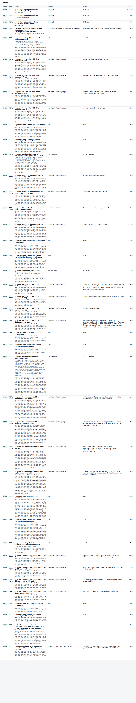

# REQ01 · TSP1 · FHIR enabled services: example implementation

> **Example, not normative.** This page shows how the [demo implementations](../../../05_Demo%20implementations/README.md) address this requirement. It is one possible approach, shared for discussion. It is not "the way it should be done", and passing the demo's checks does not certify that a product meets the requirement.

| | |
|---|---|
| **Requirement** | TSP1: *Requirements Specification SNOMED CT Implementation*, V1.0 (10.09.2026) |
| **Shown in** | Demo 1 · Terminology services (+ the request log in Demo 2 and Demo 3) |
| **Demo code and how to run it** | [`Demo implementations`](../Demo%20implementations/README.md) |

## Requirement

> The eHR shall provide terminology services conformant to the HL7 FHIR Terminology Service specification, implementing at minimum following operations against the SNOMED CT code system (http://snomed.info/sct).
>
> - $lookup
> - $validate-code
> - $expand
>
> Applicable RefSets:
>
> - Problems
> - Observation
> - Allergy & Intolerance
> - Vaccination
> - Procedures

## How the demo addresses it

- **Terminology server.** The demo eHR does not implement SNOMED CT logic itself. It uses a **local FHIR R4 terminology server**: [Snowstorm Lite 2.7.0](../Demo%20implementations/00-terminology-server/README.md) behind a small proxy (the "LTS").
- **Only standard FHIR requests.** Every SNOMED CT operation of the eHR is a standard FHIR request (`$lookup`, `$validate-code`, `$expand`, and `$translate` for S04/S05), made by the small client [`shared/fhir-ts-client.mjs`](../Demo%20implementations/shared/fhir-ts-client.mjs). Any FHIR R4 terminology server could replace Snowstorm Lite.
- **Request log.** The search and record screens of the eHR show the FHIR requests they made, with URL, HTTP status and response time. This makes the use of the three operations visible.
- **Scripted check.** [`conformance-check.mjs`](../Demo%20implementations/01-terminology-services/README.md) checks the three operations on the five care sets:
  - `/metadata` declares `CodeSystem/$lookup`, `ValueSet/$expand` and `ValueSet/$validate-code`;
  - for each care set: `$expand` of its binding, `$expand` with a filter in 4 languages, and `$validate-code` for a member (true) and for a concept from another hierarchy (false);
  - `$validate-code` of an inactive concept (false);
  - `$lookup` with the properties `parent`, `child`, `normalFormTerse` and `inactive`.
- **Result.** 74 checks PASS on 20260915. On 20260715 there were 73 PASS and 1 info.

| Care set (data element) | Binding used in the demo | `$expand` total (20260915) |
|---|---|---|
| Problems (`Condition.code`) | IPS 2.0.0 Problems: `< 404684003 OR < 243796009 OR < 272379006 OR << 160245001` | 137,706 |
| Allergy & Intolerance (`AllergyIntolerance.code`) | IPS 2.0.0 Allergies & Intolerances | 57,002 |
| Vaccination (`Immunization.vaccineCode`) | `^ 50831000172102` (Belgian vaccination subset) | 61 |
| Procedures (`Procedure.code`) | IPS 2.0.0 Procedures (with its exclusions) | 59,017 |
| Observation (`Observation.code`) | `< 363787002 \|Observable entity\|` (demo choice) | 11,097 |

## Screenshots



*The TSP1 checks of the conformance report (20260915): one row per FHIR request, with the request URL and the response time.*


*The request log at the bottom of the eHR screens (here the release impact analysis).*

## Requests (examples)

```http
GET [base]/metadata
GET [base]/CodeSystem/$lookup?system=http://snomed.info/sct&code=22298006&displayLanguage=nl-BE&property=parent&property=child&property=normalFormTerse&property=inactive
GET [base]/ValueSet/$expand?url=http://snomed.info/sct?fhir_vs=ecl/^ 50831000172102&filter=influenza&count=20&displayLanguage=nl-BE&activeOnly=true
GET [base]/ValueSet/$validate-code?url=http://snomed.info/sct?fhir_vs=ecl/^ 50831000172102&system=http://snomed.info/sct&code=1181000221105
```

The parameters are shown without URL encoding, for readability. `[base]` is the FHIR endpoint of the local terminology server, `http://localhost:8090/fhir` in the demo.

## Where to look in the code

- [`01-terminology-services/conformance-check.mjs`](../Demo%20implementations/01-terminology-services/conformance-check.mjs)
- [`shared/fhir-ts-client.mjs`](../Demo%20implementations/shared/fhir-ts-client.mjs)
- [`ehr-demo-app/config/bindings.json`](../Demo%20implementations/ehr-demo-app/config/bindings.json)
- **Without Node.js:** [`python/ts_check.py`](../Demo%20implementations/python/README.md) makes the same requests with the Python standard library only, and [`python/serve_demo2.py`](../Demo%20implementations/python/README.md) shows the same request log while serving Demo 2.

## Limitations and open points

- **Bindings.** No published Belgian value set was found for Problems, Allergy & Intolerance, Procedures and Observation, so the demo uses the SNOMED CT part of the IPS 2.0.0 value sets. The Belgian reference sets are used as context subsets. Vaccination uses the Belgian subset 50831000172102. Replace these with the official bindings of the Care Sets.
- **Inactive reference set members.** Snowstorm Lite returns inactive reference set members in `$expand` (flagged `inactive: true`), even with `activeOnly=true`. `$validate-code` on a reference set returns `result: true` together with `inactive: true` for them. The demo client removes them, and the eHR rejects them at data entry (S03). Other servers may behave differently: test this on the server you use.
- **Accept-Language.** Snowstorm Lite answers HTTP 500 to `Accept-Language: *`, which is the default of some HTTP clients. The demo client always sends an explicit language.
- **Another server.** Any FHIR R4 terminology server can take the place of the local one: set `LTS_BASE_URL` (eHR) or `--fhir` (Demo 1 scripts), with credentials from the environment if the server needs them. Running this check against that server shows what it supports.

---

*Screenshots taken on 22 September 2026 with the SNOMED CT Belgian Edition 20260915 in production, unless the file name says `before-upgrade`. The patients are fictitious. SNOMED CT content © SNOMED International; the Belgian Edition is maintained by the Belgian NRC and used under the SNOMED CT Affiliate Licence.*
