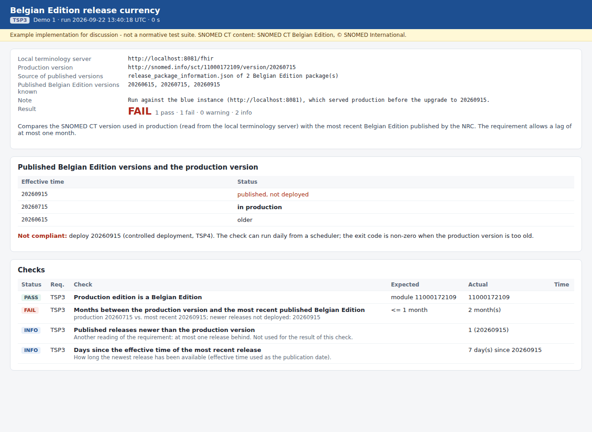
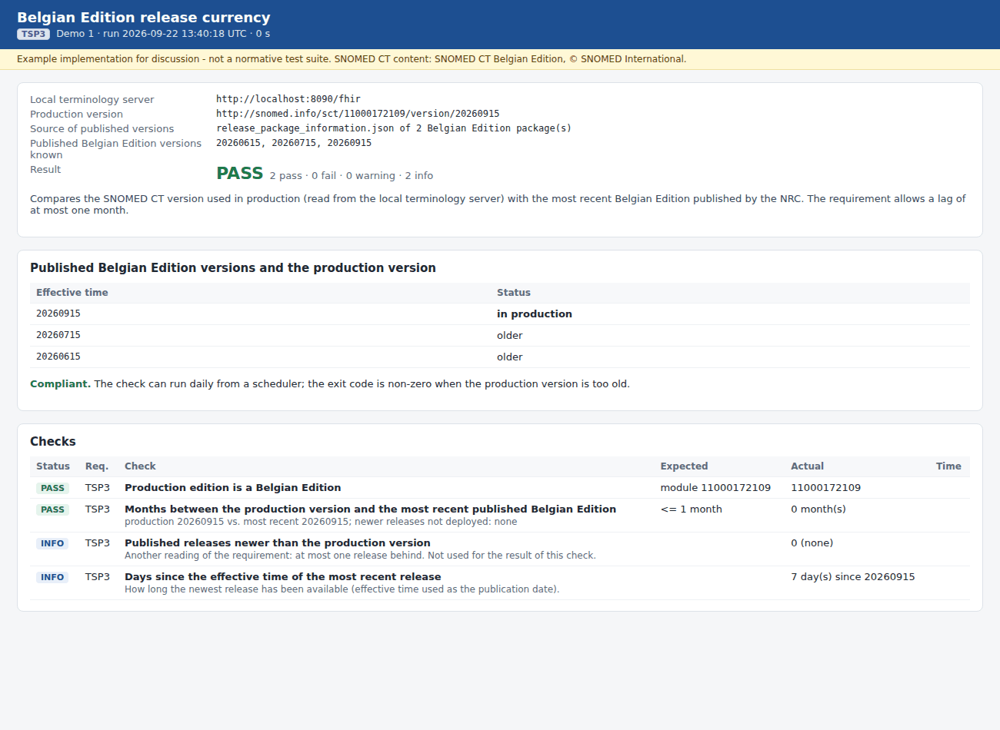

# REQ03 · TSP3 · Belgian Edition Release Currency: example implementation

> **Example, not normative.** This page shows how the [demo implementations](../Demo%20implementations/README.md) address this requirement. It is one possible approach, shared for discussion. It is not "the way it should be done", and passing the demo's checks does not certify that a product meets the requirement.

| | |
|---|---|
| **Requirement** | TSP3: *Requirements Specification SNOMED CT Implementation*, V1.0 (10.09.2026) |
| **Shown in** | Demo 1 · `release-currency-check.mjs` |
| **Demo code and how to run it** | [`Demo implementations`](../Demo%20implementations/README.md) |

## Requirement

> The SNOMED CT release used by the production solution shall not be more than one month behind the most recent Belgian Edition published by the BE NRC.

## How the demo addresses it

- **The production version** is read from the local terminology server (`GET [base]/CodeSystem?url=http://snomed.info/sct` → `version`).
- **The most recent published version** comes from one of three sources:
  - the `release_package_information.json` of the downloaded Belgian Edition packages (`effectiveTime` + `previousPublishedPackage`);
  - a FHIR terminology server that lists the published versions, such as the national terminology server (`--upstream`);
  - a manual value.
- **Scheduling.** The script is meant to run on a schedule (daily). Its exit code is non-zero when the lag exceeds `--max-lag-months` (default 1).
- **Recorded run:**
  - **Before the upgrade:** production 20260715, most recent 20260915 → 2 months → **FAIL**.
  - **After the controlled deployment (TSP4):** production 20260915 → 0 months → **PASS**.

## Screenshots



*Before the upgrade: 20260715 in production while 20260915 has been published.*



*After the controlled deployment of 20260915.*

## Requests (examples)

```http
GET [local LTS]/CodeSystem?url=http://snomed.info/sct          -> entry[0].resource.version = http://snomed.info/sct/11000172109/version/20260915
GET [upstream]/CodeSystem?url=http://snomed.info/sct            (optional: list of published versions on a national server)
```

The parameters are shown without URL encoding, for readability. `[base]` is the FHIR endpoint of the local terminology server, `http://localhost:8090/fhir` in the demo.

## Where to look in the code

- [`01-terminology-services/release-currency-check.mjs`](../Demo%20implementations/01-terminology-services/release-currency-check.mjs)
- **Without Node.js:** [`python/release_currency_check.py`](../Demo%20implementations/python/README.md) does the same comparison with the Python standard library only (`--upstream`, `--release-info` or `--latest`), and returns the same exit code.

## Limitations and open points

- **Interpretation point for the NRC.** The September 2026 package lists July 2026 as its previous package: there was no August release. On 22 September the July edition was **2 months** behind by effective time (the reading used by the check), only **1 release** behind, and behind a release that had been available for **7 days**. Under the effective-time reading, a supplier on the July edition was non-compliant on the day the September edition was published. The report shows the three measures. The requirement could say which one applies, and how much time a supplier has after a publication.
- **Upstream source not tested.** The `--upstream` option (FHIR `CodeSystem` search on a national server with a bearer token) was not tested against the Belgian national terminology server, which cannot be reached from the demo environment. No credentials are stored in the demo.

---

*Screenshots taken on 22 September 2026 with the SNOMED CT Belgian Edition 20260915 in production, unless the file name says `before-upgrade`. The patients are fictitious. SNOMED CT content © SNOMED International; the Belgian Edition is maintained by the Belgian NRC and used under the SNOMED CT Affiliate Licence.*
