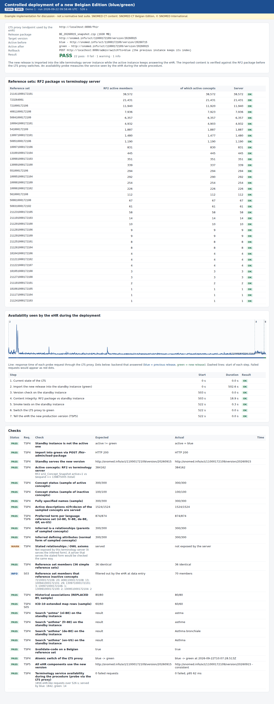
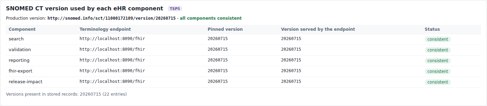

# REQ04 · TSP4 · Controlled SNOMED CT Release Deployment: example implementation

> **Example, not normative.** This page shows how the [demo implementations](../Demo%20implementations/README.md) address this requirement. It is one possible approach, shared for discussion. It is not "the way it should be done", and passing the demo's checks does not certify that a product meets the requirement.

| | |
|---|---|
| **Requirement** | TSP4: *Requirements Specification SNOMED CT Implementation*, V1.0 (10.09.2026) |
| **Shown in** | Demo 1 · `deploy-release.mjs` + `verify-integrity.mjs` + the LTS proxy |
| **Demo code and how to run it** | [`Demo implementations`](../Demo%20implementations/README.md) |

## Requirement

> The solution shall support the deployment of a new Belgian Edition of SNOMED CT while preserving the integrity and availability of the terminology service and dependent clinical functionality.
>
> Following deployment, the terminology service shall make the content of the deployed Belgian Edition available without loss or unintended modification of terminology content, including:
>
> - concepts and their active/inactive status;
> - descriptions and their properties;
> - stated and inferred relationships; and
> - reference sets and their members.
>
> Synchronization, import, processing and deployment of a new Belgian Edition shall not make terminology-dependent clinical functionality unavailable, except during an explicitly agreed maintenance window.

## How the demo addresses it

**Availability: blue/green deployment.**

- The eHR only knows one terminology endpoint: the [LTS proxy](../Demo%20implementations/00-terminology-server/README.md).
- Behind it, "blue" (20260715) serves production while the new release is imported into "green". The checks then run on green, and the proxy switches with a single assignment.
- Blue stays available for rollback.
- During the whole procedure an availability probe sent an eHR-like search through the proxy every 250 ms. Result: **1,856 requests in 526 s, 0 failed, p95 62 ms**; the slowest took 856 ms, at the start of the import. The upload and import took 502.6 s of that time.

**Integrity: the RF2 package is the reference.** [`verify-integrity.mjs`](../Demo%20implementations/01-terminology-services/verify-integrity.mjs) compares the package with the imported server *before* the switch. The proxy only switches when every check passes.

| Content (TSP4 wording) | Check in the recorded run | Result |
|---|---|---|
| concepts and their active/inactive status | active concept count RF2 vs `$expand << 138875005` (complete); status of 300 active + 100 inactive sampled concepts | 384,162 = 384,162; 300/300; 100/100 |
| descriptions and their properties | FSN, every active description (nl/fr/de/en), preferred term per language reference set of the sampled concepts | 300/300 FSN; 1,524/1,524 descriptions; 874/874 preferred terms |
| inferred relationships | parents and defining attributes, including concrete values (`normalFormTerse`) | 300/300 + 300/300 |
| stated relationships | not exposed by Snowstorm Lite (inferred form only) | **reported as a warning, not checked** |
| reference sets and their members | member count of every simple reference set (complete); REPLACED BY associations and ICD-10 map rows (samples) | 36/36; 80/80; 60/60 |

**Hand-over to the eHR (TSP5).** After the switch, the script calls the eHR hook `POST /api/admin/production-version`, so every component pins the new version. Until then, the proxy routes requests that still ask for the previous version to the previous instance (version-aware routing). This routing was added after the recorded run and tested separately.

## Screenshots



*The deployment report: reference sets RF2 vs server, the availability chart (the dots show which instance answered each probe request), the steps and all checks.*



*Before: every eHR component uses 20260715.*


*After the switch: every eHR component uses 20260915.*

## Requests (examples)

```http
POST [green]/fhir-admin/load-package          (multipart: file=<RF2 zip>, version-uri=http://snomed.info/sct/11000172109/version/20260915; Snowstorm Lite specific)
GET  [green]/fhir/CodeSystem?url=http://snomed.info/sct
GET  [green]/fhir/ValueSet/$expand?url=http://snomed.info/sct?fhir_vs=ecl/<< 138875005&count=1
GET  [green]/fhir/CodeSystem/$lookup?system=http://snomed.info/sct&code=…&property=parent&property=inactive&property=normalFormTerse
GET  [green]/fhir/ValueSet/$expand?url=http://snomed.info/sct?fhir_vs=refset/<refset>&count=1
POST [proxy]/admin/switch?to=green&expectVersion=http://snomed.info/sct/11000172109/version/20260915
```

The parameters are shown without URL encoding, for readability. `[base]` is the FHIR endpoint of the local terminology server, `http://localhost:8090/fhir` in the demo.

## Where to look in the code

- [`01-terminology-services/deploy-release.mjs`](../Demo%20implementations/01-terminology-services/deploy-release.mjs)
- [`01-terminology-services/verify-integrity.mjs`](../Demo%20implementations/01-terminology-services/verify-integrity.mjs)
- [`00-terminology-server/lts-proxy.mjs`](../Demo%20implementations/00-terminology-server/lts-proxy.mjs)

## Limitations and open points

- **Samples.** The concept, description and relationship checks use a seeded random sample. The counts (active concepts, reference set members) are complete.
- **Descriptions.** They are compared by language and term text, because Snowstorm Lite's `$lookup` does not return description IDs.
- **Stated relationships / OWL axioms** are not served by Snowstorm Lite, so they cannot be compared. A server that exposes the stated form should be checked the same way.
- **Known issue in the release.** The run reports that 70 members of Belgian simple reference sets refer to inactive concepts. The release notes of 20260915 list this as known issue ISRS-7703 (70 failures). It is shown as information, and the eHR never offers these concepts (S03).
- **Proxy.** The proxy is a minimal illustration without TLS or high availability. In production the same pattern is usually implemented in an existing gateway or load balancer.

---

*Screenshots taken on 22 September 2026 with the SNOMED CT Belgian Edition 20260915 in production, unless the file name says `before-upgrade`. The patients are fictitious. SNOMED CT content © SNOMED International; the Belgian Edition is maintained by the Belgian NRC and used under the SNOMED CT Affiliate Licence.*
