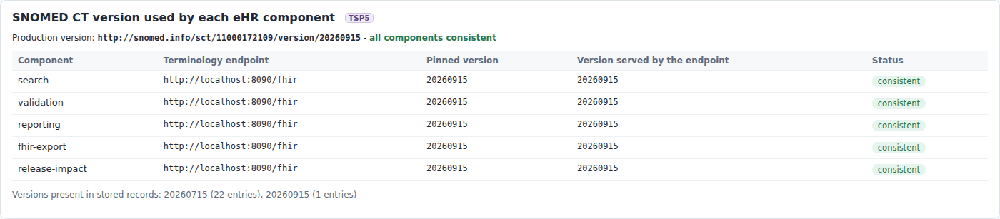
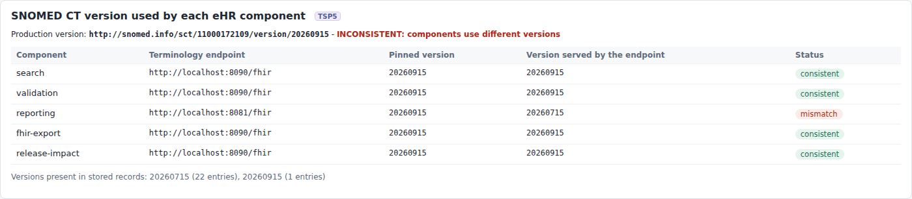
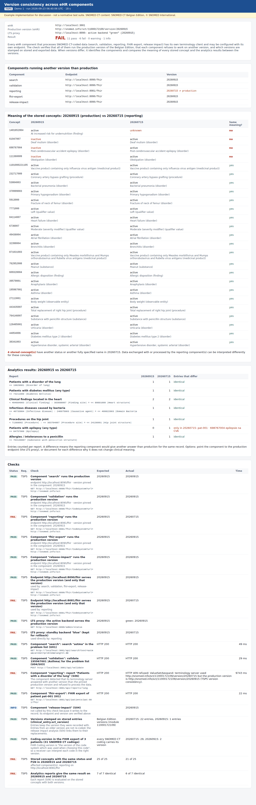

# REQ05 · TSP5 · Version Consistency: example implementation

> **Example, not normative.** This page shows how the [demo implementations](../Demo%20implementations/README.md) address this requirement. It is one possible approach, shared for discussion. It is not "the way it should be done", and passing the demo's checks does not certify that a product meets the requirement.

| | |
|---|---|
| **Requirement** | TSP5: *Requirements Specification SNOMED CT Implementation*, V1.0 (10.09.2026) |
| **Shown in** | Demo 1 · `version-consistency-check.mjs` + the eHR version panel |
| **Demo code and how to run it** | [`Demo implementations`](../Demo%20implementations/README.md) |

## Requirement

> The solution shall use the same production version of the Belgian Edition of SNOMED CT across all components and terminology-dependent services that exchange or process SNOMED CT-coded information.
>
> Where the solution uses different SNOMED CT versions concurrently, the supplier shall identify the affected components and versions and demonstrate that SNOMED CT-coded information can be exchanged and processed between them without loss or unintended change of clinical meaning.

## How the demo addresses it

- **Every component is pinned to the production version.** The eHR has one terminology client per component: search, validation, reporting, fhir-export and release-impact. Each client is pinned to the production version, and each component can be pointed to its own endpoint.
  - The client sends the version with every `$expand`, `$validate-code` and `$lookup` (`system-version`, `systemVersion` and `version` respectively).
  - It also checks the version the server reports back (`expansion.parameter[version]`). On a mismatch the component **refuses to process** the data (HTTP 409) instead of silently using another version.
- **Version panel.** `GET /api/version` and the version panel on the overview page list each component, its endpoint, its pinned version and the version the endpoint serves.
- **Version stamps on the data.** Every stored entry keeps the version it was recorded with (`clinical_entry.sct_version`), and the FHIR export carries it in `Coding.version`.
- **Handling of the version change (TSP4).** The deployment switches the proxy and then tells the eHR the new production version, so all components move together. In the short time between the two steps, the proxy sends requests that still ask for the previous version to the previous instance, so no component sees a mismatch.
- **[`version-consistency-check.mjs`](../Demo%20implementations/01-terminology-services/README.md)** verifies all of this independently. When versions differ, it identifies the components and compares the meaning of every stored concept (status and FSN) and the result of every report on both versions.
- **The mismatch run.** A second eHR instance was started whose reporting component still used 20260715. The check found:
  - the component refused to run;
  - 4 of the 25 stored concepts differ between the versions (3 inactivated in 20260915, 1 new in 20260915);
  - 1 of 7 reports differs ("epilepsy").

## Screenshots



*All components use 20260915; the record holds entries of both versions.*



*Second eHR instance: the reporting component still points to the July instance.*



*The check identifies the component and the versions, and compares meaning and report results on both versions.*

## Requests (examples)

```http
GET [base]/ValueSet/$expand?url=…&system-version=http://snomed.info/sct|http://snomed.info/sct/11000172109/version/20260915
    -> expansion.parameter[name=version].valueUri = http://snomed.info/sct|http://snomed.info/sct/11000172109/version/20260915
GET [base]/ValueSet/$validate-code?url=…&code=…&systemVersion=http://snomed.info/sct/11000172109/version/20260915
GET [base]/CodeSystem/$lookup?system=http://snomed.info/sct&code=…&version=http://snomed.info/sct/11000172109/version/20260915
```

The parameters are shown without URL encoding, for readability. `[base]` is the FHIR endpoint of the local terminology server, `http://localhost:8090/fhir` in the demo.

## Where to look in the code

- [`shared/fhir-ts-client.mjs`](../Demo%20implementations/shared/fhir-ts-client.mjs)
- [`ehr-demo-app/server.mjs`](../Demo%20implementations/ehr-demo-app/server.mjs)
- [`01-terminology-services/version-consistency-check.mjs`](../Demo%20implementations/01-terminology-services/version-consistency-check.mjs)

## Limitations and open points

- **Snowstorm Lite and `system-version`.** Snowstorm Lite holds one version and does not act on the `system-version` parameter of `$expand`, but it reports the version it used. The demo therefore relies on the reported version. With a multi-version server, the pin also selects the version.
- **Lexicon.** The lexicon used for query rewriting is derived from one edition too, and it must be rebuilt at each upgrade (see Demo 2).
- **Which data is compared.** The cross-version comparison covers the concepts stored in the record and the reports of the demo. A real assessment would cover every exchange and processing path of the solution.

---

*Screenshots taken on 22 September 2026 with the SNOMED CT Belgian Edition 20260915 in production, unless the file name says `before-upgrade`. The patients are fictitious. SNOMED CT content © SNOMED International; the Belgian Edition is maintained by the Belgian NRC and used under the SNOMED CT Affiliate Licence.*
