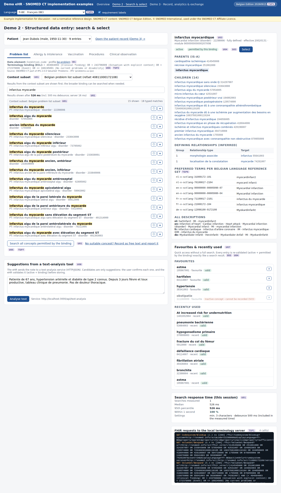
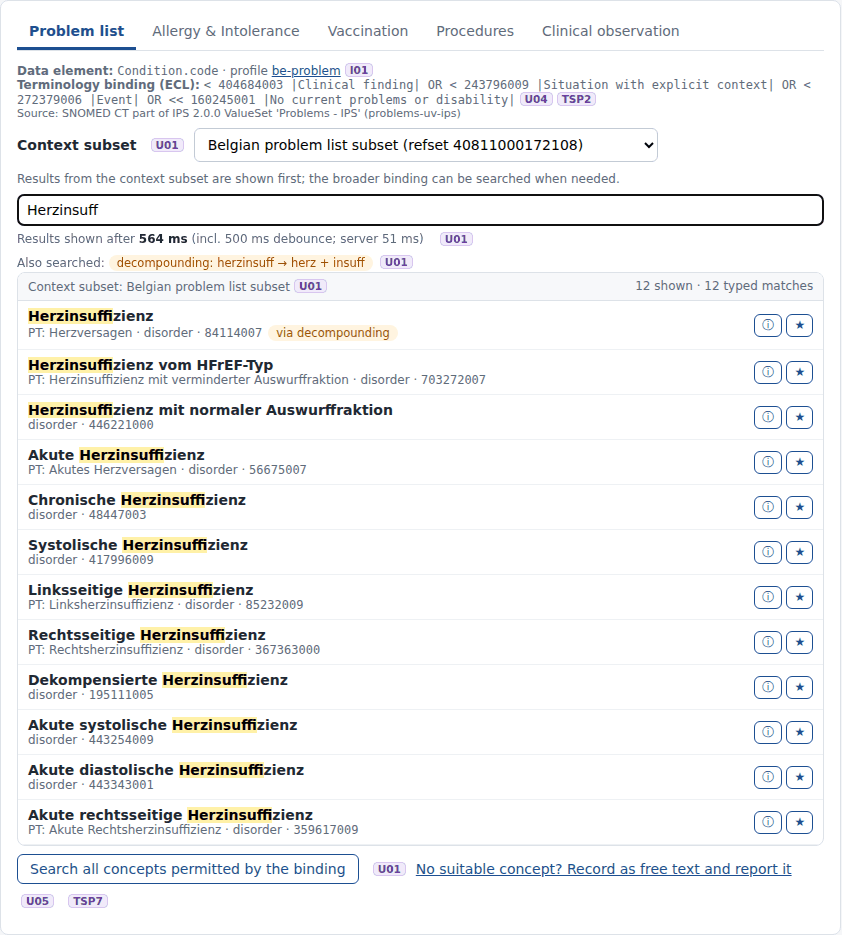
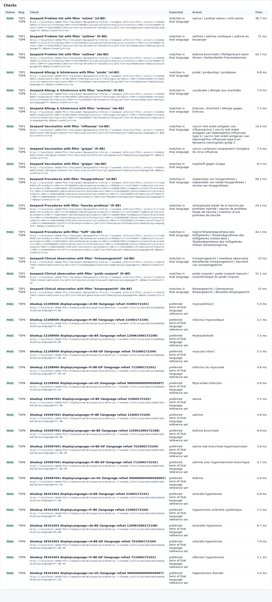

# REQ06 · TSP6 · Multilanguage accommodation: example implementation

> **Example, not normative.** This page shows how the [demo implementations](../Demo%20implementations/README.md) address this requirement. It is one possible approach, shared for discussion. It is not "the way it should be done", and passing the demo's checks does not certify that a product meets the requirement.

| | |
|---|---|
| **Requirement** | TSP6: *Requirements Specification SNOMED CT Implementation*, V1.0 (10.09.2026) |
| **Shown in** | Demo 2 (all screens) · Demo 1 (checks) |
| **Demo code and how to run it** | [`Demo implementations`](../Demo%20implementations/README.md) |

## Requirement

> The solution shall support presentation of SNOMED CT content in the appropriate language using the applicable Language Reference Sets of the Belgian Edition.
>
> The Belgian Edition currently provides Dutch, French and German language content.

## How the demo addresses it

- **Language reference sets.** The terminology server is configured with the Belgian language reference sets ([`application.properties`](../Demo%20implementations/00-terminology-server/application.properties)):
  - nl-BE 31000172101, fr-BE 21000172104, de-BE 120961000172108;
  - the GP reference sets nl-BE-GP 701000172104 and fr-BE-GP 711000172101;
  - en-US.
- **The user's language drives every request.** The user picks a language at the top of every screen. Every search, display and hierarchy request then sends `displayLanguage` (and `Accept-Language`), so the server returns the preferred term of that language reference set.
- **Search in the user's language.** Search matches descriptions of the user's language, and the term that matched is shown (U06). The query rewriting has a lexicon per language: plural/feminine rules for nl/fr/de/en, decompounding for nl/de.
- **The concept detail panel** shows the preferred term in every Belgian language reference set.
- **Scripted check.** [`conformance-check.mjs`](../Demo%20implementations/01-terminology-services/README.md) checks `$lookup` in the six language reference sets and searches in four languages. `verify-integrity.mjs` compares the preferred term per language reference set with the RF2 package (874/874).

## Screenshots



*The whole search screen in fr-BE: results, hierarchy, preferred terms per language reference set, text analysis.*



*Search in German (de-BE).*



*The TSP6 checks: $lookup of the same concepts in each Belgian language reference set.*

## Requests (examples)

```http
GET [base]/CodeSystem/$lookup?system=http://snomed.info/sct&code=22298006&displayLanguage=fr-BE     -> infarctus myocardique
GET [base]/CodeSystem/$lookup?system=http://snomed.info/sct&code=22298006&displayLanguage=nl-BE-GP  -> myocard infarct
GET [base]/ValueSet/$expand?url=…&filter=Herzinsuff&displayLanguage=de-BE
```

The parameters are shown without URL encoding, for readability. `[base]` is the FHIR endpoint of the local terminology server, `http://localhost:8090/fhir` in the demo.

## Where to look in the code

- [`00-terminology-server/application.properties`](../Demo%20implementations/00-terminology-server/application.properties)
- [`ehr-demo-app/lib/lexicon.mjs`](../Demo%20implementations/ehr-demo-app/lib/lexicon.mjs)
- [`ehr-demo-app/public/js/common.js`](../Demo%20implementations/ehr-demo-app/public/js/common.js)
- **Without Node.js:** [`python/ts_check.py`](../Demo%20implementations/python/README.md) checks the six language reference sets; `python/serve_demo2.py` has the same language selector, and `python3 ts_search.py --detail <code>` shows the preferred term of every reference set for one concept.

## Limitations and open points

- **Concepts without a translation yet.** Concepts that are new in a release may not have a Dutch or French term yet. For example 1401652004 *At increased risk for undernutrition* and 1380178003 *Epilepsy due to and following stroke* (the SAME AS target of an inactivated concept, see S04) have no nl/fr terms in 20260915. The server then falls back to the English preferred term. The demo shows the fallback term as it is. A real UI could mark it, and TSP7 lets the user report it (the demo queues such a report).
- **Content observation: missing synonym.** The nl-BE descriptions of 233604007 *pneumonie* do not include the common term *longontsteking*, while other concepts do use it (for example *longontsteking in anamnese*).
- **Content observation: misspelled preferred term.** The nl-BE preferred term of 764146007 is spelled *penicilinne*; the synonym *penicilline* is correct. This was used for the TSP7 example.

---

*Screenshots taken on 22 September 2026 with the SNOMED CT Belgian Edition 20260915 in production, unless the file name says `before-upgrade`. The patients are fictitious. SNOMED CT content © SNOMED International; the Belgian Edition is maintained by the Belgian NRC and used under the SNOMED CT Affiliate Licence.*
