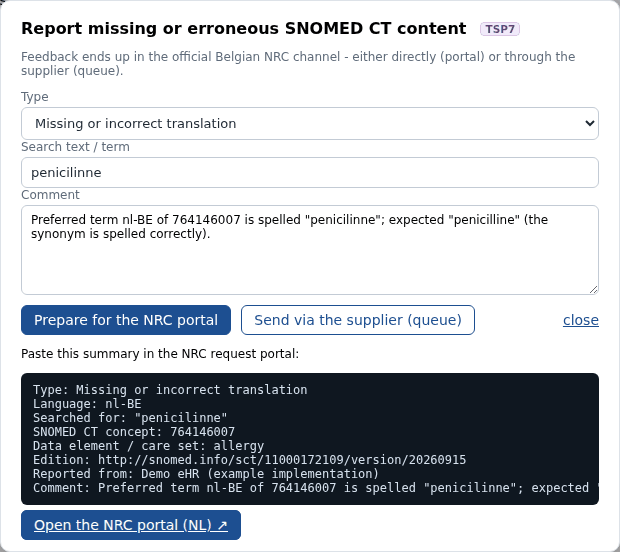
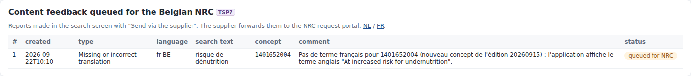
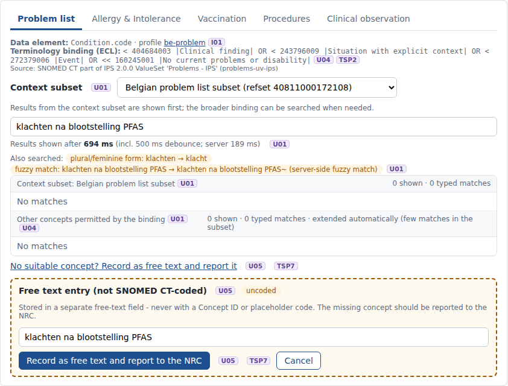

# REQ07 · TSP7 · Provide a reporting/feedback mechanism: example implementation

> **Example, not normative.** This page shows how the [demo implementations](../Demo%20implementations/README.md) address this requirement. It is one possible approach, shared for discussion. It is not "the way it should be done", and passing the demo's checks does not certify that a product meets the requirement.

| | |
|---|---|
| **Requirement** | TSP7: *Requirements Specification SNOMED CT Implementation*, V1.0 (10.09.2026) |
| **Shown in** | Demo 2 (feedback dialog) · Demo 3 (supplier queue) |
| **Demo code and how to run it** | [`Demo implementations`](../Demo%20implementations/README.md) |

## Requirement

> The solution shall provide an accessible mechanism for users to report suspected missing or erroneous SNOMED CT content, including concepts, descriptions, translations and mappings.
>
> The feedback shall ultimately be submitted through the official Belgian NRC feedback channel. The supplier may implement this by:
>
> - directing the user to the official Belgian NRC feedback channel; or
> - receiving the feedback within the solution and acting as an intermediary for its submission to the Belgian NRC.
>
> Link to the portal:
> https://apps.health.belgium.be/terminology-portal/snomed_ct_requests/nl
> https://apps.health.belgium.be/terminology-portal/snomed_ct_requests/fr

## How the demo addresses it

- **One dialog, reachable from the search screen.** It opens from every "no suitable concept" link and from the free-text entry (U05). It asks for the type of feedback: missing concept, missing or incorrect translation, erroneous concept or description, mapping, other.
- **Both options of the requirement are shown:**
  - **Direct.** "Prepare for the NRC portal" builds a summary with the type, the language, the search text, the Concept ID, the data element and the edition version. It then opens the NRC portal in the user's language (NL or FR link of the requirement), where the user pastes the summary.
  - **Via the supplier.** "Send via the supplier" stores the report in the `nrc_feedback` table. The supplier forwards the queue to the NRC. Demo 3 shows the queue.
- **Link with U05.** Recording free text always offers to report the missing concept.
- **Examples in the demo:**
  - the misspelled nl-BE preferred term *penicilinne* of 764146007 (portal);
  - the missing French term of 1401652004, a new concept in 20260915 (queue).

## Screenshots



*Feedback dialog with the summary prepared for the NRC portal.*



*Reports queued in the eHR for forwarding to the NRC (supplier as intermediary).*



*Free text entry: it is recorded and reported in one action (U05).*

## Requests (examples)

```http
(no terminology request: the feedback is stored in the eHR or passed to the NRC portal)
POST /api/feedback {"mode":"portal"|"queue","kind":"missing-translation","code":"764146007","searchText":"penicilinne","lang":"nl-BE",...}
```

The parameters are shown without URL encoding, for readability. `[base]` is the FHIR endpoint of the local terminology server, `http://localhost:8090/fhir` in the demo.

## Where to look in the code

- [`ehr-demo-app/lib/feedback.mjs`](../Demo%20implementations/ehr-demo-app/lib/feedback.mjs)
- [`ehr-demo-app/public/js/search-page.js`](../Demo%20implementations/ehr-demo-app/public/js/search-page.js)
- [`ehr-demo-app/public/js/record-page.js`](../Demo%20implementations/ehr-demo-app/public/js/record-page.js)
- **Without Node.js:** [`python/serve_demo2.py`](../Demo%20implementations/python/README.md) has the same feedback dialog, with both channels (portal summary and supplier queue), and stores the queued reports in the same table.

## Limitations and open points

- **No automatic submission.** The demo does not submit anything to the NRC. The portal link opens the page, and the user pastes the prepared summary. No API of the portal was used.
- **Two different channels named.** The release notes of the Belgian Edition 20260915 ask users to submit content feedback and requests through the SNOMED International Request Management Portal (https://rmp.ihtsdotools.org) and mention the Belgian Health Terminology Portal for batch requests. The requirement links to the terminology portal. The NRC may want to align the two so that suppliers know which channel to use.

---

*Screenshots taken on 22 September 2026 with the SNOMED CT Belgian Edition 20260915 in production, unless the file name says `before-upgrade`. The patients are fictitious. SNOMED CT content © SNOMED International; the Belgian Edition is maintained by the Belgian NRC and used under the SNOMED CT Affiliate Licence.*
