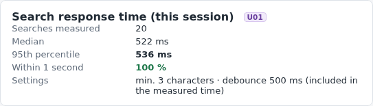
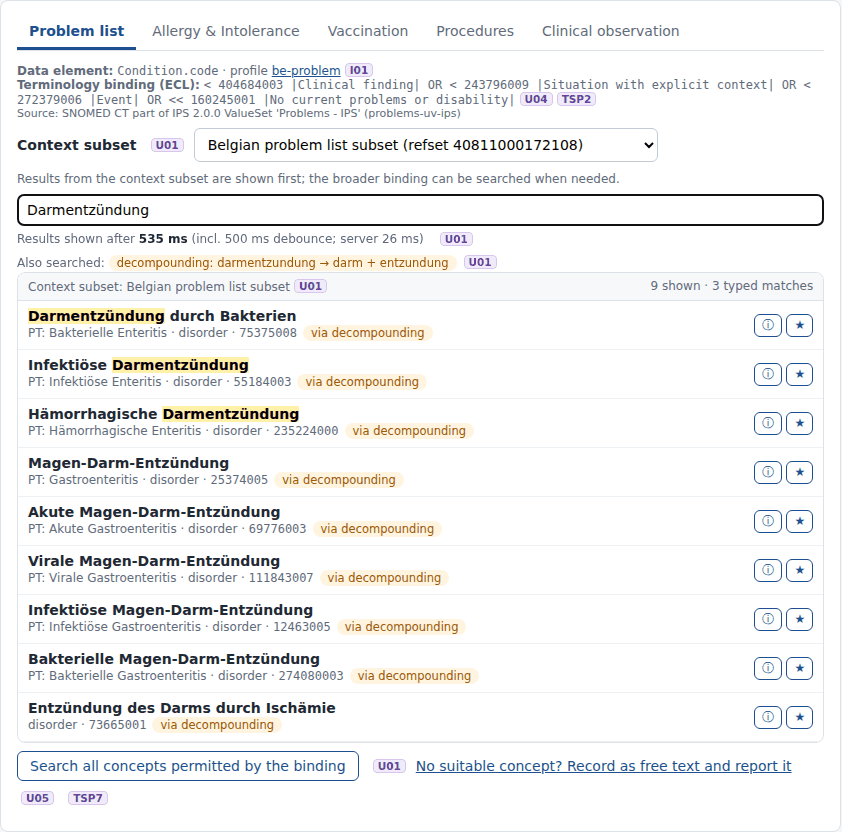
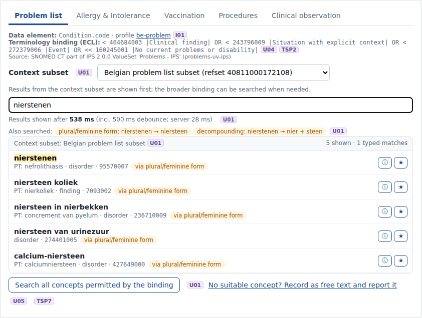
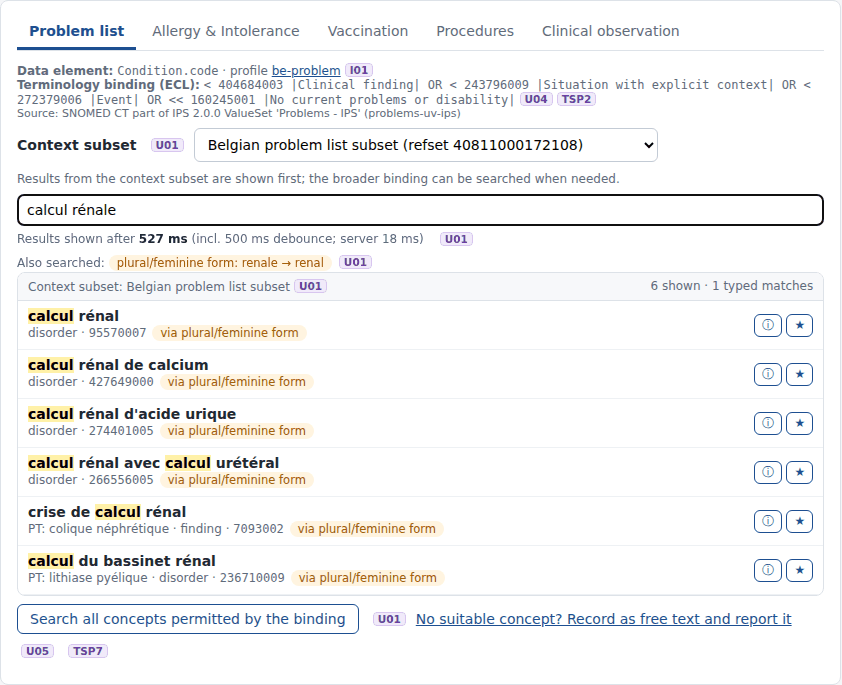
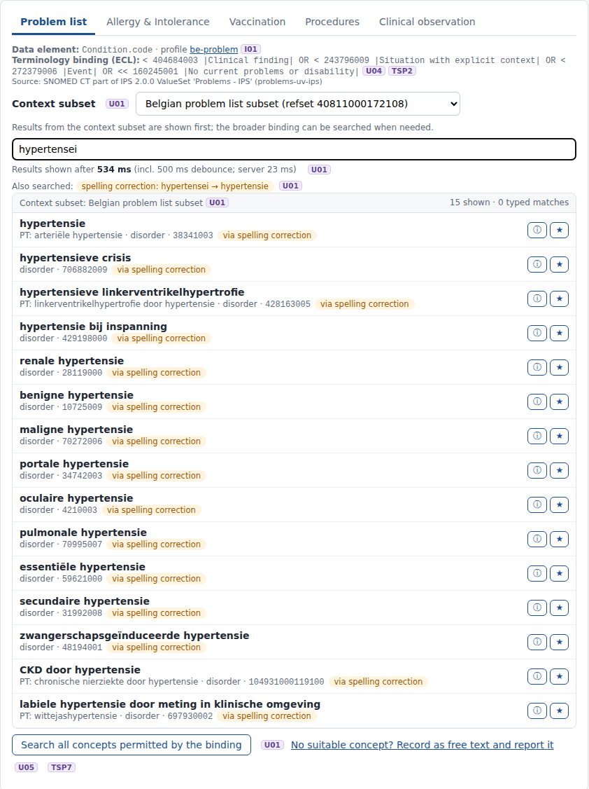
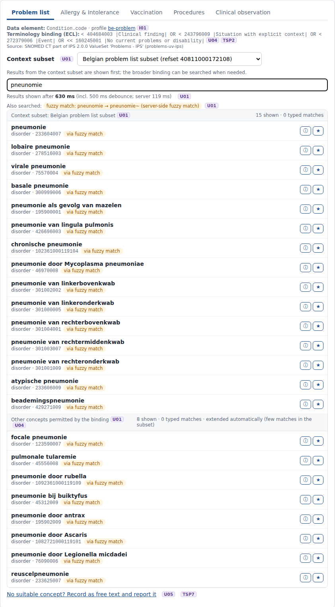
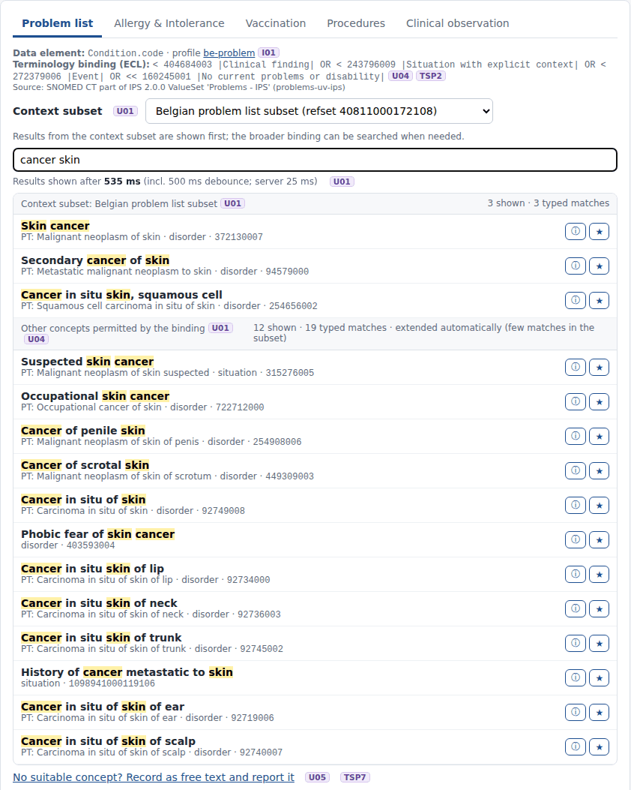
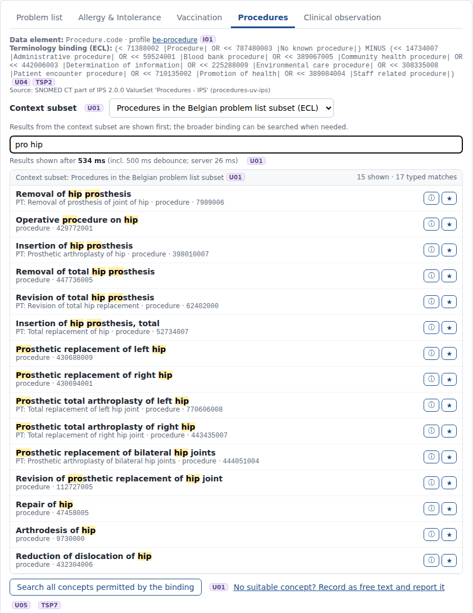
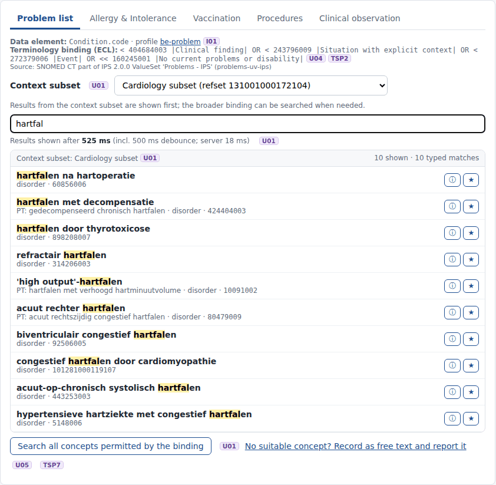

# REQ08 · U01 · Overview of set of basic search functionalities: example implementation

> **Example, not normative.** This page shows how the [demo implementations](../Demo%20implementations/README.md) address this requirement. It is one possible approach, shared for discussion. It is not "the way it should be done", and passing the demo's checks does not certify that a product meets the requirement.

| | |
|---|---|
| **Requirement** | U01: *Requirements Specification SNOMED CT Implementation*, V1.0 (10.09.2026) |
| **Shown in** | Demo 2 · Search & select |
| **Demo code and how to run it** | [`Demo implementations`](../Demo%20implementations/README.md) |

## Requirement

> This overview is a set of basic search functionalities designed to help users find the appropriate SNOMED CT code more quickly and efficiently, directly from within the eHR. The focus is on simplifying the search and data entry process, enabling both experienced and less experienced users to consistently identify relevant terms. The following requirements for the "guidance" functionality outline the minimum capabilities needed to ensure a user-friendly, performant, and effective search experience.
>
> | Summary | Description |
> |---|---|
> | Search response time | The solution shall display the initial results of a SNOMED CT concept search within 1 second of the search being initiated by the user interface for at least 95% of searches under normal operating conditions. Any configured debounce interval or other intentional delay between user input and execution of the search shall be included in the measured response time. |
> | Progressive matching | When a user enters text in a SNOMED CT-coded data element, the solution shall dynamically return matching SNOMED CT concepts based on their preferred or acceptable descriptions. Concepts returned for selection shall have at least one preferred or acceptable description that matches the entered search text according to the supported search behaviour. The search results shall be updated as the search text is modified, without requiring the user to explicitly submit the search. *Implementation guidance: implementations may apply a minimum-character threshold and/or debounce mechanism (…). Demonstration implementations use a minimum of three characters and approximately 500 ms debounce.* |
> | Variants of a concept description | The system must be able to understand variants of a term, such as the plural form and/or the feminine form, and minor spelling mistakes. |
> | Word segmentation (decompounding) | The system shall support word segmentation of compound search terms, where applicable, to enable retrieval of relevant SNOMED CT concepts based on the constituent words of a compound term. (…) without requiring the user to manually separate the compound term. |
> | Multi-prefix any-order search | The system shall support searches containing multiple search tokens, where each token may match a complete word or a prefix of a word in a SNOMED CT description, independently of the order in which the tokens are entered. (…) Searching for *Skin Cancer* and *Cancer Skin* will result in the same concepts qualifying as matches. Searching for *pro hip* can match *hip prosthesis* (…). |
> | Context specific reference sets | The solution shall use the terminology binding, reference set, or other SNOMED CT subset applicable to the clinical context to prioritise or restrict concept search results. Where the applicable context does not provide a suitable concept, the solution shall support extending the search to the broader SNOMED CT content available to the user, where permitted by the applicable terminology binding. The mechanism used to provide context-sensitive search results may be determined by the supplier. |

## How the demo addresses it

The search component is described in detail in [Demo 2](../Demo%20implementations/02-search-and-select/README.md). Per sub-requirement:

| Sub-requirement | How the demo does it | Screenshot |
|---|---|---|
| **Response time** | The browser measures from the last keystroke to the moment the results are rendered, **including the 500 ms debounce**, and shows median, p95 and the share within 1 s. Recorded session: 20 searches, median 522 ms, **p95 536 ms, 100 % within 1 s**. The eHR's own server time is shown with every search; it was mostly 12–70 ms in the recorded screenshots. | `u01-response-time` |
| **Progressive matching** | Search starts automatically after 3 characters and 500 ms without typing (`concept-picker.js`). Results come from `ValueSet/$expand` with a `filter`, so each result has a matching description of the language. The matched term is shown, with the preferred term under it. | all |
| **Variants: plural / feminine** | A per-language lexicon from RF2 (nl/fr/de/en) turns *nierstenen* into *niersteen* and *rénale* into *rénal*. The rewritten query is searched as well, and its results are labelled. | `u01-plural-nl`, `u01-feminine-fr` |
| **Variants: spelling mistakes** | One edit (Damerau-Levenshtein) against the lexicon: *hypertensei* → *hypertensie*. When nothing is found at all, the server's fuzzy match (`text~`, up to 2 edits): *pneunomie* → *pneumonie*. | `u01-typo-nl`, `u01-fuzzy-nl` |
| **Decompounding** | Dutch and German compounds are split into words of the edition, with linking elements (s, e, en, n, es): *femurfractuur* → *femur + fractuur* (2 typed matches → 11 results), *Darmentzündung* → *Darm + Entzündung*. | `u01-decompounding-nl`, `u01-decompounding-de` |
| **Multi-prefix, any order** | The terminology server's `filter` matches every word as a prefix, in any order. *skin cancer* and *cancer skin* give the same concepts; *pro hip* finds *hip prosthesis*. Ranking puts terms that contain every search word first. | `u01-any-order-en`, `u01-any-order-prefix-en` |
| **Context-specific reference sets** | Each data element has context subsets (the Belgian problem list subset by default, GP, 9 specialty subsets). The context tier is searched as `(binding) AND (^ subset)`. The search is extended to the whole binding automatically when the subset has fewer than 5 results, or with one click. Nothing outside the binding is ever offered (U04). | `u01-context-subset`, `u01-context-extended` |

## Screenshots



*Response time measured in the browser, including the debounce.*


*Decompounding (nl): femurfractuur.*



*Decompounding (de): Darmentzündung.*



*Plural form (nl): nierstenen → niersteen.*



*Feminine form (fr): calcul rénale → rénal.*



*Spelling mistake corrected with the lexicon: hypertensei → hypertensie.*



*Two spelling mistakes: fuzzy match on the server (pneunomie).*



*Any order: cancer skin = skin cancer.*



*Multi-prefix: pro hip → hip prosthesis (procedures).*



*Cardiology subset as context: specific heart failure concepts first.*


*Context subset without a match (bronchitis in cardiology): extended automatically to the binding.*

## Requests (examples)

```http
GET [base]/ValueSet/$expand?url=http://snomed.info/sct?fhir_vs=ecl/(<binding>) AND (^ 131001000172104)&filter=hartfal&count=15&displayLanguage=nl-BE&includeDesignations=true&activeOnly=true
GET [base]/ValueSet/$expand?url=http://snomed.info/sct?fhir_vs=ecl/(<binding>)&filter=femur fractuur&count=15&displayLanguage=nl-BE&includeDesignations=true&activeOnly=true
GET [base]/ValueSet/$expand?url=…&filter=pneunomie~&displayLanguage=nl-BE        (fuzzy fallback)
```

The parameters are shown without URL encoding, for readability. `[base]` is the FHIR endpoint of the local terminology server, `http://localhost:8090/fhir` in the demo.

## Where to look in the code

- [`ehr-demo-app/public/js/concept-picker.js`](../Demo%20implementations/ehr-demo-app/public/js/concept-picker.js)
- [`ehr-demo-app/lib/search-service.mjs`](../Demo%20implementations/ehr-demo-app/lib/search-service.mjs)
- [`ehr-demo-app/lib/lexicon.mjs`](../Demo%20implementations/ehr-demo-app/lib/lexicon.mjs)
- [`ehr-demo-app/config/bindings.json`](../Demo%20implementations/ehr-demo-app/config/bindings.json)
- **Without Node.js:** [`python/serve_demo2.py`](../Demo%20implementations/python/README.md) serves this same screen with the Python standard library only, including the query rewriting (`python3 build_lexicon.py <RF2 Snapshot>` builds the lexicon). The two were compared side by side: 16 queries returned the same rewrites, the same sections and the same concepts in the same order. `ts_search.py` is the command-line version.

## Limitations and open points

- **Measurement conditions.** The response time was measured on one machine, with the eHR, the terminology server and the browser running locally and one user. It says nothing about a production load.
- **Lexicon.** The lexicon rules are simple and deliberately conservative (a split or a correction is only used when all parts are words of the edition). They will miss cases, and they must be rebuilt for each edition.
- **Ranking.** Ranking is done by the eHR on the page returned by the server: typed matches, terms containing all search words, exact match, prefix match, shorter terms.
- **Content observation.** The cardiology subset 131001000172104 contains 13 subtypes of 84114007 *hartfalen* but not 84114007 itself. A cardiologist who types *hartfal* in that context only finds the general concept after extending the search. This may be intended; it shows why the extension to the full binding matters.

---

*Screenshots taken on 22 September 2026 with the SNOMED CT Belgian Edition 20260915 in production, unless the file name says `before-upgrade`. The patients are fictitious. SNOMED CT content © SNOMED International; the Belgian Edition is maintained by the Belgian NRC and used under the SNOMED CT Affiliate Licence.*
