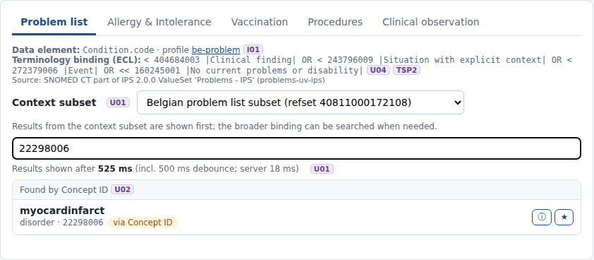
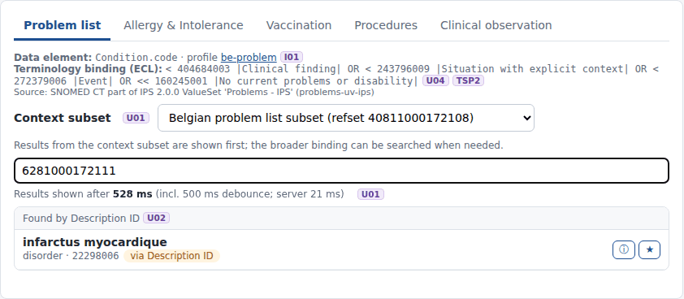
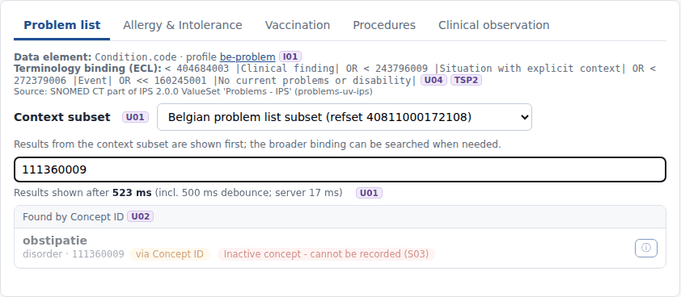

# REQ09 · U02 · The system will enable searches using Concept ID: example implementation

> **Example, not normative.** This page shows how the [demo implementations](../Demo%20implementations/README.md) address this requirement. It is one possible approach, shared for discussion. It is not "the way it should be done", and passing the demo's checks does not certify that a product meets the requirement.

| | |
|---|---|
| **Requirement** | U02: *Requirements Specification SNOMED CT Implementation*, V1.0 (10.09.2026) |
| **Shown in** | Demo 2 · Search & select |
| **Demo code and how to run it** | [`05_Demo implementations`](../Demo%20implementations/README.md) |

## Requirement

> The solution shall support searching for a SNOMED CT concept by its Concept ID. When a valid Concept ID is entered, the solution shall return the corresponding concept and display an appropriate description according to the language configuration applicable to the user.
>
> The solution should additionally support searching by Description ID. When a valid Description ID is entered, the solution shall return the SNOMED CT concept associated with that description.

## How the demo addresses it

- **Digits go to ID search.** Input that consists only of digits is treated as an identifier. It is not subject to the 3-character minimum.
- **The identifier is checked before any server call** ([`shared/sctid.mjs`](../Demo%20implementations/shared/sctid.mjs)): Verhoeff check digit, partition identifier (concept / description / relationship, short or long format) and, for long-format identifiers, the namespace (1000172 = Belgium).
- **Concept ID.** `CodeSystem/$lookup` returns the concept, and the display follows the user's language (22298006 → *myocardinfarct* in nl-BE).
- **Description ID.** An index Description ID → Concept ID is built from the RF2 descriptions of the edition (2.36 million active descriptions). The concept is then looked up as above. Example: 6281000172111, a Belgian-namespace French description, → 22298006, shown in fr-BE as *infarctus myocardique*.
- **Same validation as a text search.** The concept found by ID must be active (S03) and permitted by the binding of the data element (U04). Otherwise it is shown but cannot be selected, and the reason is given.

## Screenshots



*Concept ID 22298006 in nl-BE.*



*Description ID 6281000172111 (Belgian namespace, French description) in fr-BE.*


*A valid Concept ID outside the binding of the data element: shown, not selectable (U04).*



*An inactive Concept ID: shown, not selectable (S03).*

## Requests (examples)

```http
GET [base]/CodeSystem/$lookup?system=http://snomed.info/sct&code=22298006&displayLanguage=nl-BE&property=inactive
GET [base]/ValueSet/$validate-code?url=http://snomed.info/sct?fhir_vs=ecl/<binding>&system=http://snomed.info/sct&code=22298006
```

The parameters are shown without URL encoding, for readability. `[base]` is the FHIR endpoint of the local terminology server, `http://localhost:8090/fhir` in the demo.

## Where to look in the code

- [`shared/sctid.mjs`](../Demo%20implementations/shared/sctid.mjs)
- [`ehr-demo-app/lib/search-service.mjs`](../Demo%20implementations/ehr-demo-app/lib/search-service.mjs) (searchById)
- [`ehr-demo-app/lib/lexicon.mjs`](../Demo%20implementations/ehr-demo-app/lib/lexicon.mjs) (DescriptionIndex)
- **Without Node.js:** [`python/serve_demo2.py`](../Demo%20implementations/python/README.md) resolves Concept IDs and Description IDs the same way, using the same SCTID check ([`python/sctid.py`](../Demo%20implementations/python/sctid.py)) and a Description ID index built by `python/build_lexicon.py` (the cache file is interchangeable with the Node one).

## Limitations and open points

- **The entered description's own term is not shown.** For a Description ID, the demo shows the concept with the preferred term of the user's language, because Snowstorm Lite's `$lookup` does not return description IDs.
- **The index is edition-specific.** The Description ID index is built from the RF2 files of the production edition, and it must be rebuilt at each upgrade.

---

*Screenshots taken on 22 September 2026 with the SNOMED CT Belgian Edition 20260915 in production, unless the file name says `before-upgrade`. The patients are fictitious. SNOMED CT content © SNOMED International; the Belgian Edition is maintained by the Belgian NRC and used under the SNOMED CT Affiliate Licence.*
