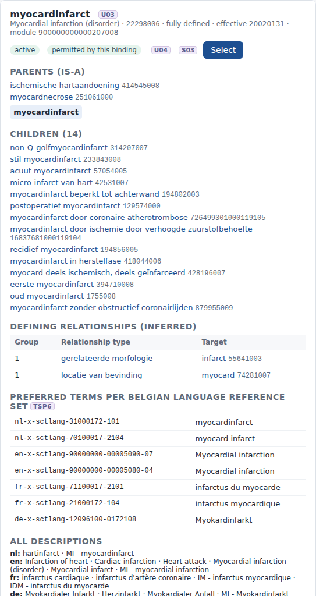

# REQ10 · U03 · Following the return of search results, the system will permit users to browse through nearby hierarchy: example implementation

> **Example, not normative.** This page shows how the [demo implementations](../Demo%20implementations/README.md) address this requirement. It is one possible approach, shared for discussion. It is not "the way it should be done", and passing the demo's checks does not certify that a product meets the requirement.

| | |
|---|---|
| **Requirement** | U03: *Requirements Specification SNOMED CT Implementation*, V1.0 (10.09.2026) |
| **Shown in** | Demo 2 · Search & select (concept details panel) |
| **Demo code and how to run it** | [`Demo implementations`](../Demo%20implementations/README.md) |

## Requirement

> The solution shall enable users to explore the SNOMED CT relationships of a concept selected from the search results.
>
> Users shall be able to navigate the hierarchical relationships of the selected concept, including its parent and child concepts, and to explore other relationships defined for the concept in SNOMED CT.
>
> For each relationship presented, the solution shall identify the relationship type and the related SNOMED CT concept and enable the user to navigate to that related concept.
>
> The supplier may determine how concept relationships are presented to the user, for example through hierarchical trees, concept diagrams, relationship lists, or other equivalent user-interface mechanisms.

## How the demo addresses it

- **The ⓘ button.** The ⓘ next to a search result opens the concept panel. One `$lookup` with the properties `parent`, `child`, `normalFormTerse` and `normalForm` returns everything needed.
- **Parents (is-a) and children.** Each one can be clicked to navigate to it. Related concepts that are not permitted by the binding of the data element are shown but marked as not selectable (U04).
- **Defining relationships (inferred).** They are shown as a list of group, relationship type and target, taken from the normal form. The type and the target can both be clicked.
- **Terms.** The panel also shows the preferred term in every Belgian language reference set (TSP6) and all descriptions.
- **Select.** The panel has a *Select* button, so a concept found by browsing can be recorded directly. It goes through the same validation as a search result.

## Screenshots



*Concept panel in nl-BE: parents, children, defining relationships, terms per language reference set.*


*The same panel in fr-BE (right-hand side).*

## Requests (examples)

```http
GET [base]/CodeSystem/$lookup?system=http://snomed.info/sct&code=401303003&displayLanguage=nl-BE&property=parent&property=child&property=inactive&property=sufficientlyDefined&property=normalFormTerse&property=normalForm&property=effectiveTime&property=moduleId
GET [base]/ValueSet/$expand?url=http://snomed.info/sct?fhir_vs=ecl/(<parents and children>) AND (<binding>)&displayLanguage=nl-BE     (which related concepts are selectable)
```

The parameters are shown without URL encoding, for readability. `[base]` is the FHIR endpoint of the local terminology server, `http://localhost:8090/fhir` in the demo.

## Where to look in the code

- [`ehr-demo-app/lib/search-service.mjs`](../Demo%20implementations/ehr-demo-app/lib/search-service.mjs) (conceptDetails, parseNormalForm)
- [`ehr-demo-app/public/js/search-page.js`](../Demo%20implementations/ehr-demo-app/public/js/search-page.js) (showDetails)
- **Without Node.js:** [`python/serve_demo2.py`](../Demo%20implementations/python/README.md) serves the same hierarchy panel; `python3 ts_search.py --detail <code>` prints the same information on the command line.

## Limitations and open points

- **Inferred form only.** The relationships shown are the inferred defining relationships from the normal form. Snowstorm Lite does not expose the stated form or non-defining relationships.
- **Long lists.** The panel lists up to 60 children. A tree or a concept diagram would be an equally valid presentation.

---

*Screenshots taken on 22 September 2026 with the SNOMED CT Belgian Edition 20260915 in production, unless the file name says `before-upgrade`. The patients are fictitious. SNOMED CT content © SNOMED International; the Belgian Edition is maintained by the Belgian NRC and used under the SNOMED CT Affiliate Licence.*
