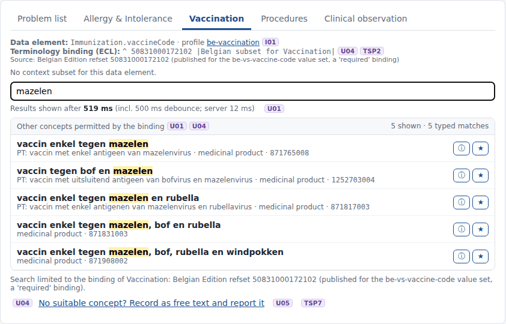
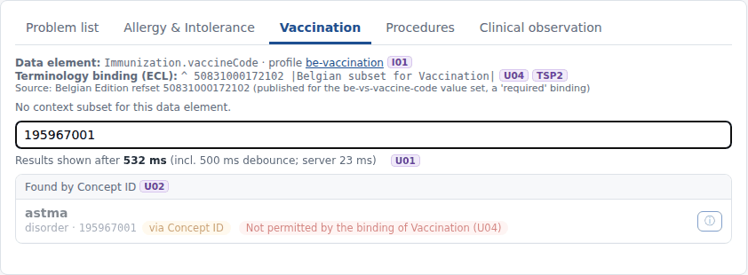
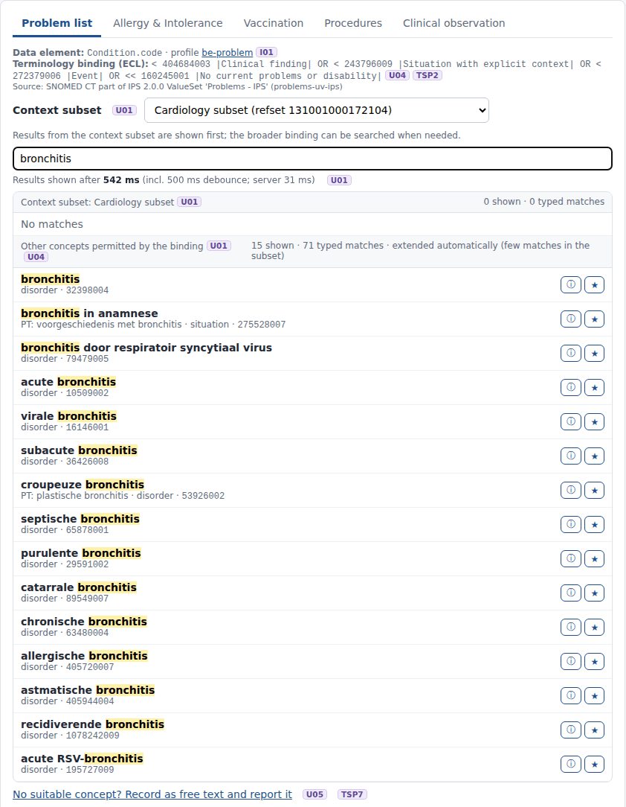

# REQ11 · U04 · Limit searching and selection to only those concepts from SNOMED CT that have been specifically bound to that data element: example implementation

> **Example, not normative.** This page shows how the [demo implementations](../Demo%20implementations/README.md) address this requirement. It is one possible approach, shared for discussion. It is not "the way it should be done", and passing the demo's checks does not certify that a product meets the requirement.

| | |
|---|---|
| **Requirement** | U04: *Requirements Specification SNOMED CT Implementation*, V1.0 (10.09.2026) |
| **Shown in** | Demo 2 · Search & select |
| **Demo code and how to run it** | [`Demo implementations`](../Demo%20implementations/README.md) |

## Requirement

> The solution shall restrict the SNOMED CT concepts available for search and selection to those permitted by the terminology binding associated with the relevant data element.
>
> The terminology binding may be defined by a SNOMED CT hierarchy or subhierarchy, reference set, value set, ECL constraint, or other explicitly defined set of SNOMED CT concepts.
>
> Concepts that do not satisfy the applicable terminology binding shall not be selectable for that data element.

## How the demo addresses it

- **One ECL binding per data element.** Each data element has one binding written in ECL ([`bindings.json`](../Demo%20implementations/ehr-demo-app/config/bindings.json)), and the screen shows it above the search field. Examples:
  - vaccination: `^ 50831000172102 |Belgian subset for Vaccination|`;
  - problems: the IPS 2.0.0 problems ECL.
- **Search only inside the binding.** Every search tier is `(binding)` or `(binding) AND (context subset)`. A concept outside the binding therefore never appears in the text results.
- **Other entry routes are checked too.** Concept ID, Description ID, favourites, recently used and text-analysis suggestions go through the same check (`$validate-code` against the binding). A concept outside the binding is shown with the reason and cannot be selected.
- **The server checks again before storing.** `POST /api/entries` repeats the check on the server, so a manipulated client cannot store a concept outside the binding.

## Screenshots



*Vaccination is bound to the Belgian subset: only vaccines of the subset are offered.*



*195967001 |Asthma| entered by ID in the vaccination field: not permitted by the binding.*



*Even when the search is extended beyond the context subset, it stays inside the binding.*

## Requests (examples)

```http
GET  [base]/ValueSet/$expand?url=http://snomed.info/sct?fhir_vs=ecl/^ 50831000172102&filter=mazelen&displayLanguage=nl-BE&activeOnly=true
GET  [base]/ValueSet/$validate-code?url=http://snomed.info/sct?fhir_vs=ecl/^ 50831000172102&system=http://snomed.info/sct&code=195967001   -> result=false
POST /api/entries   (eHR: validation repeated on the server before storing)
```

The parameters are shown without URL encoding, for readability. `[base]` is the FHIR endpoint of the local terminology server, `http://localhost:8090/fhir` in the demo.

## Where to look in the code

- [`ehr-demo-app/config/bindings.json`](../Demo%20implementations/ehr-demo-app/config/bindings.json)
- [`ehr-demo-app/lib/search-service.mjs`](../Demo%20implementations/ehr-demo-app/lib/search-service.mjs) (eclFor, validateSelection)
- [`ehr-demo-app/server.mjs`](../Demo%20implementations/ehr-demo-app/server.mjs) (POST /api/entries)
- **Without Node.js:** [`python/serve_demo2.py`](../Demo%20implementations/python/README.md) applies the same binding limit, and `python3 ts_search.py --validate <code>` does the same check on the command line.

## Limitations and open points

- **Demo bindings.** The bindings are examples: IPS 2.0.0 where no Belgian binding was found. Replace them with the official bindings of the Care Sets and the Belgian FHIR profiles.

---

*Screenshots taken on 22 September 2026 with the SNOMED CT Belgian Edition 20260915 in production, unless the file name says `before-upgrade`. The patients are fictitious. SNOMED CT content © SNOMED International; the Belgian Edition is maintained by the Belgian NRC and used under the SNOMED CT Affiliate Licence.*
