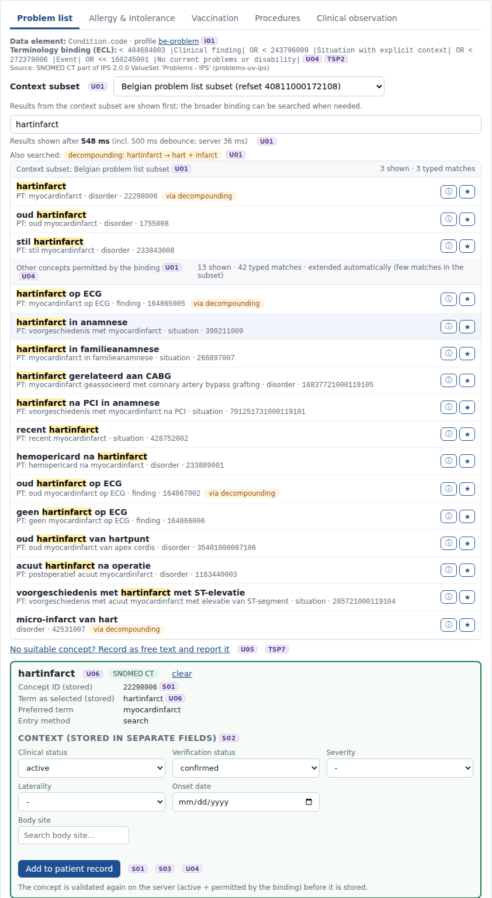

# REQ13 · U06 · Show user preferred display term for each SNOMED CT concept: example implementation

> **Example, not normative.** This page shows how the [demo implementations](../Demo%20implementations/README.md) address this requirement. It is one possible approach, shared for discussion. It is not "the way it should be done", and passing the demo's checks does not certify that a product meets the requirement.

| | |
|---|---|
| **Requirement** | U06: *Requirements Specification SNOMED CT Implementation*, V1.0 (10.09.2026) |
| **Shown in** | Demo 2 (selection) · Demo 3 (display, exchange) |
| **Demo code and how to run it** | [`05_Demo implementations`](../Demo%20implementations/README.md) |

## Requirement

> When a user selects a SNOMED CT concept from the search results, the solution shall display the selected value using the same term that was presented and selected by the user.
>
> The solution shall not automatically replace the selected term with another description of the same SNOMED CT concept during the current data-entry interaction.

## How the demo addresses it

- **The matched term is shown.** Each search result shows the description that matched the user's search, in the user's language. The preferred term is shown in smaller text below it.
- **The selected term is kept.** The selection box shows "Term as selected (stored)" with that term; the preferred term is only additional information. Example: *hartinfarct* is selected; the preferred term *myocardinfarct* is not substituted.
- **Storage.** The term is stored in `clinical_entry.sct_term_selected` (with `term_language`), next to the Concept ID (S01).
- **Display.** The patient record always shows the stored term, even after an upgrade: *epilepsie na CVA* stays as recorded although the concept was inactivated (S04).
- **Exchange.** The FHIR export uses the selected term for `Coding.display` and `CodeableConcept.text`.

## Screenshots



*The synonym "hartinfarct" is selected and kept as the term; the preferred term "myocardinfarct" is shown only as information.*


*The patient summary shows the terms as they were selected (e.g. "epilepsie na CVA").*

## Requests (examples)

```http
GET [base]/ValueSet/$expand?url=…&filter=hartinfarct&displayLanguage=nl-BE&includeDesignations=true
    -> the designation that matched ("hartinfarct") is shown; contains[].display ("myocardinfarct") is the preferred term
```

The parameters are shown without URL encoding, for readability. `[base]` is the FHIR endpoint of the local terminology server, `http://localhost:8090/fhir` in the demo.

## Where to look in the code

- [`ehr-demo-app/lib/search-service.mjs`](../Demo%20implementations/ehr-demo-app/lib/search-service.mjs) (bestMatchingDesignation)
- [`ehr-demo-app/public/js/search-page.js`](../Demo%20implementations/ehr-demo-app/public/js/search-page.js) (renderSelection)
- [`ehr-demo-app/lib/fhir-export.mjs`](../Demo%20implementations/ehr-demo-app/lib/fhir-export.mjs)
- **Without Node.js:** [`python/serve_demo2.py`](../Demo%20implementations/python/README.md) keeps and stores the term exactly as it was presented and selected, in the same columns.

## Limitations and open points

- **Fallback terms.** When no term exists in the user's language (a new concept that has not been translated yet), the term shown and stored is the English fallback returned by the server (see TSP6).

---

*Screenshots taken on 22 September 2026 with the SNOMED CT Belgian Edition 20260915 in production, unless the file name says `before-upgrade`. The patients are fictitious. SNOMED CT content © SNOMED International; the Belgian Edition is maintained by the Belgian NRC and used under the SNOMED CT Affiliate Licence.*
