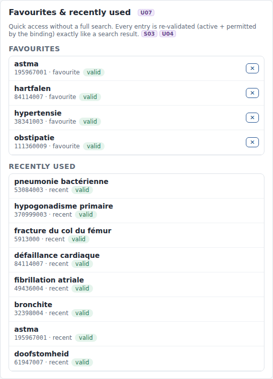
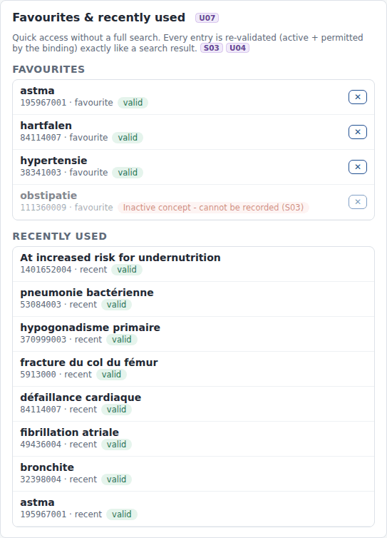

# REQ14 · U07 · The eHR system shall display the most relevant concepts: example implementation

> **Example, not normative.** This page shows how the [demo implementations](../Demo%20implementations/README.md) address this requirement. It is one possible approach, shared for discussion. It is not "the way it should be done", and passing the demo's checks does not certify that a product meets the requirement.

| | |
|---|---|
| **Requirement** | U07: *Requirements Specification SNOMED CT Implementation*, V1.0 (10.09.2026) |
| **Shown in** | Demo 2 · Search & select (favourites and recently used) |
| **Demo code and how to run it** | [`05_Demo implementations`](../Demo%20implementations/README.md) |

## Requirement

> The solution shall provide at least one mechanism that enables users to rapidly access commonly used, recently used, personalized, or contextually relevant SNOMED CT concepts without performing a full terminology search.
>
> Supported mechanisms may include:
>
> - user or practice favorites;
> - recently selected concepts;
> - context-specific suggested concepts;
> - personalized concept preferences; or
> - an equivalent mechanism based on the user's clinical context or previous usage.
>
> Concepts made available through such mechanisms shall be subject to the same validation rules as concepts retrieved through standard search, including active status and any terminology binding applicable to the data element.

## How the demo addresses it

- **Three mechanisms:**
  - **favourites** per user and data element (★ next to any search result);
  - **recently used** concepts;
  - **context subsets**, which bring the concepts of a specialty to the top (U01).
- **Re-validated on every display.** Each favourite and recent concept is checked against the **current** edition every time it is shown. The check is the same function as for a search result: `$validate-code` against the binding, and `$lookup` for the inactive status. Selecting one then goes through the same server-side validation again before it is stored.
- **Across an upgrade.** 111360009 *obstipatie* was a valid favourite with 20260715. After the upgrade to 20260915 it is inactive: it is still listed, marked "Inactive concept - cannot be recorded (S03)", and it can no longer be selected.

## Screenshots



*With 20260715: all favourites valid.*



*With 20260915: the inactivated favourite is blocked; recently used concepts are listed below.*

## Requests (examples)

```http
GET [base]/ValueSet/$validate-code?url=http://snomed.info/sct?fhir_vs=ecl/<binding>&system=http://snomed.info/sct&code=111360009&systemVersion=…   (per favourite / recent concept)
GET [base]/CodeSystem/$lookup?system=http://snomed.info/sct&code=111360009&property=inactive      (reason when not valid)
```

The parameters are shown without URL encoding, for readability. `[base]` is the FHIR endpoint of the local terminology server, `http://localhost:8090/fhir` in the demo.

## Where to look in the code

- [`ehr-demo-app/server.mjs`](../Demo%20implementations/ehr-demo-app/server.mjs) (favourites)
- [`ehr-demo-app/public/js/search-page.js`](../Demo%20implementations/ehr-demo-app/public/js/search-page.js) (renderFavourites)
- [`ehr-demo-app/lib/store.mjs`](../Demo%20implementations/ehr-demo-app/lib/store.mjs) (favourite, recent)
- **Without Node.js:** [`python/serve_demo2.py`](../Demo%20implementations/python/README.md) has the same favourites and recently-used panel, re-validated in the same way.

## Limitations and open points

- **Scope.** Favourites are stored per user and data element. Practice-level favourites and usage-based suggestions are not in the demo.

---

*Screenshots taken on 22 September 2026 with the SNOMED CT Belgian Edition 20260915 in production, unless the file name says `before-upgrade`. The patients are fictitious. SNOMED CT content © SNOMED International; the Belgian Edition is maintained by the Belgian NRC and used under the SNOMED CT Affiliate Licence.*
