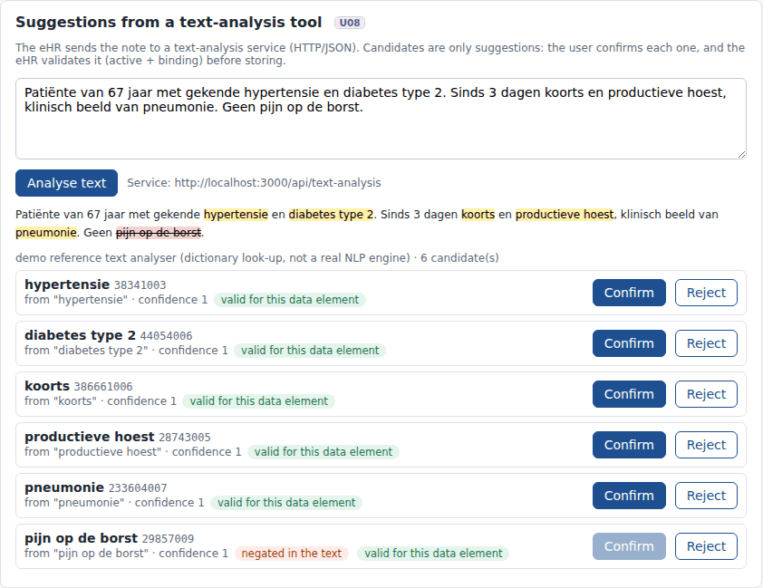
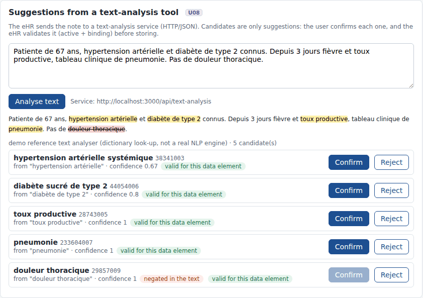

# REQ15 · U08 · The eHR is capable of integrating tools/solutions facilitating the search and capture of clinical data: example implementation

> **Example, not normative.** This page shows how the [demo implementations](../Demo%20implementations/README.md) address this requirement. It is one possible approach, shared for discussion. It is not "the way it should be done", and passing the demo's checks does not certify that a product meets the requirement.

| | |
|---|---|
| **Requirement** | U08: *Requirements Specification SNOMED CT Implementation*, V1.0 (10.09.2026) |
| **Shown in** | Demo 2 · Search & select (text-analysis panel) |
| **Demo code and how to run it** | [`05_Demo implementations`](../Demo%20implementations/README.md) |

## Requirement

> The eHR shall support integration with tools or services that analyse clinical information during data entry and return candidate SNOMED CT concepts for user selection and confirmation.
>
> Candidate concepts shall be presented as suggestions and shall not be recorded as coded clinical data without explicit user selection or confirmation.
>
> Before a suggested concept is recorded, the eHR shall apply the same validation requirements as for concepts selected through the standard data-entry mechanism, including validation of active status and any terminology binding applicable to the data element.
>
> The integration mechanism shall allow the Concept ID and an appropriate description of each suggested SNOMED CT concept to be provided to the user.

## How the demo addresses it

- **An HTTP/JSON contract.** The eHR sends the note to a text-analysis service, whose URL is configurable with `SUGGEST_SERVICE_URL`:

```
POST {SUGGEST_SERVICE_URL}   {"text": "...", "language": "nl-BE", "careSet": "problem"}
-> {"service": "...", "candidates": [{"start": 33, "end": 44, "text": "hypertensie", "conceptId": "38341003",
                                    "term": "hypertensie", "confidence": 1, "negated": false}]}
```

- **Any tool can sit behind the contract**: a hospital NLP pipeline, a commercial coding assistant, an LLM service. The demo ships a deliberately naive *reference analyser* (dictionary look-up on the terminology server) only to make the demo self-contained.
- **What the eHR does with the candidates:**
  - it highlights them in the text and lists each one with its Concept ID and term;
  - it runs the normal validation (active + binding of the data element);
  - it records nothing without an explicit **Confirm** by the user;
  - it cannot record a candidate that is negated in the text (*Geen pijn op de borst*).
- **Recording.** A confirmed suggestion is recorded through the same `POST /api/entries` validation, with `entry_method = suggestion`.

## Screenshots



*Suggestions for a Dutch note: each candidate needs Confirm; the negated finding cannot be confirmed.*



*The same in French.*

## Requests (examples)

```http
POST {SUGGEST_SERVICE_URL}    (the external tool)
GET  [base]/ValueSet/$validate-code?url=http://snomed.info/sct?fhir_vs=ecl/<binding>&system=http://snomed.info/sct&code=38341003   (validation of every candidate)
```

The parameters are shown without URL encoding, for readability. `[base]` is the FHIR endpoint of the local terminology server, `http://localhost:8090/fhir` in the demo.

## Where to look in the code

- [`ehr-demo-app/lib/nlp-suggest.mjs`](../Demo%20implementations/ehr-demo-app/lib/nlp-suggest.mjs) (contract, adapter, reference analyser)
- [`ehr-demo-app/public/js/search-page.js`](../Demo%20implementations/ehr-demo-app/public/js/search-page.js) (analyse)
- **Without Node.js:** [`python/serve_demo2.py`](../Demo%20implementations/python/README.md) implements the same HTTP/JSON contract and ships the same naive reference analyser; on the demo note both produce identical candidates, including the negation.

## Limitations and open points

- **Not an NLP engine.** The reference analyser only finds phrases that literally match a term, and negation is a simple cue-word rule. The point of the demo is the integration contract and the safeguards around it.
- **No sensitive data.** The demo sends the note to a local service. With an external service, data protection (processing agreement, pseudonymisation) is a separate topic.

---

*Screenshots taken on 22 September 2026 with the SNOMED CT Belgian Edition 20260915 in production, unless the file name says `before-upgrade`. The patients are fictitious. SNOMED CT content © SNOMED International; the Belgian Edition is maintained by the Belgian NRC and used under the SNOMED CT Affiliate Licence.*
