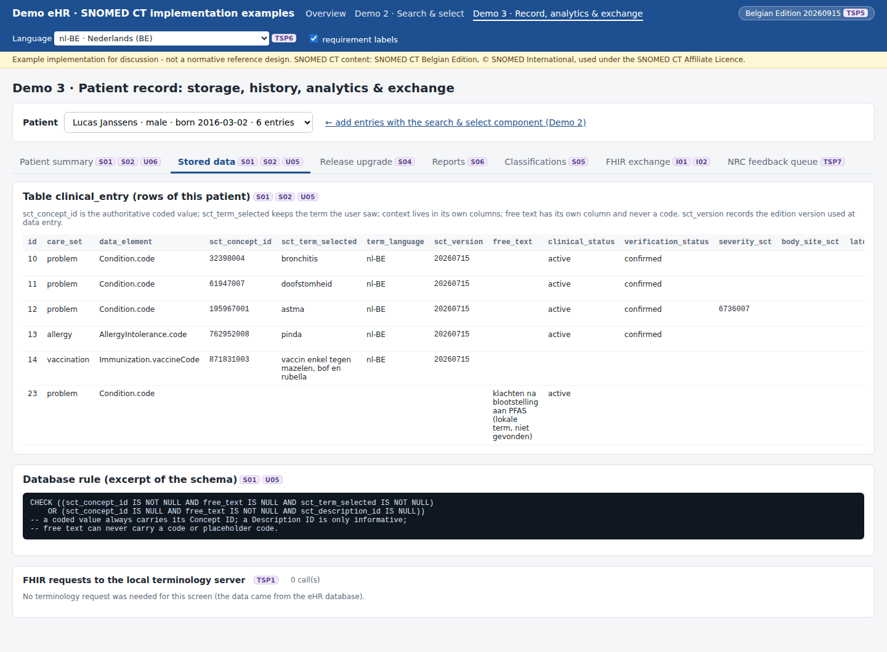

# REQ16 · S01 · The eHR must store SNOMED CT concept identifiers in the health records: example implementation

> **Example, not normative.** This page shows how the [demo implementations](../Demo%20implementations/README.md) address this requirement. It is one possible approach, shared for discussion. It is not "the way it should be done", and passing the demo's checks does not certify that a product meets the requirement.

| | |
|---|---|
| **Requirement** | S01: *Requirements Specification SNOMED CT Implementation*, V1.0 (10.09.2026) |
| **Shown in** | Demo 3 · Record (storage model) |
| **Demo code and how to run it** | [`05_Demo implementations`](../Demo%20implementations/README.md) |

## Requirement

> For every SNOMED CT-coded data element, the solution shall persist the SNOMED CT Concept ID representing the recorded clinical meaning; and the term displayed to or selected by the user at the time the data was recorded.
>
> The Concept ID shall remain the authoritative coded representation of the clinical meaning. A Description ID or free-text term shall not be stored as a substitute for the corresponding Concept ID and will be considered a critical failure.

## How the demo addresses it

- **What is stored** (table `clinical_entry`, [`store.mjs`](../Demo%20implementations/ehr-demo-app/lib/store.mjs)):
  - `sct_concept_id`, the authoritative value;
  - `sct_term_selected` and `term_language`, the term the user saw and selected;
  - `sct_version`, the edition version at data entry;
  - optionally `sct_description_id`, as information only.
- **A database rule enforces it.** A coded row must have a Concept ID and a selected term. Free text can never have a Concept ID or a Description ID:

```sql
CHECK ((sct_concept_id IS NOT NULL AND free_text IS NULL AND sct_term_selected IS NOT NULL)
    OR (sct_concept_id IS NULL AND free_text IS NOT NULL AND sct_description_id IS NULL))
```

- **Description IDs never replace Concept IDs.** A search by Description ID (U02) is resolved to the Concept ID before anything is stored.
- **Everything downstream uses the Concept ID.** Reports (S06), maps (S05), the release impact analysis (S04) and the FHIR export (I01) all use `sct_concept_id`. The term is used only for display.

## Screenshots



*The stored rows of one patient: Concept ID, selected term, language, version and context columns; free text in its own column.*


*The patient summary: selected term and Concept ID side by side.*

## Requests (examples)

```http
(storage; no terminology request)
POST /api/entries {"patientId":"pat-001","careSet":"problem","code":"38341003","term":"arteriële hypertensie","lang":"nl-BE","method":"search","context":{...}}
```

The parameters are shown without URL encoding, for readability. `[base]` is the FHIR endpoint of the local terminology server, `http://localhost:8090/fhir` in the demo.

## Where to look in the code

- [`ehr-demo-app/lib/store.mjs`](../Demo%20implementations/ehr-demo-app/lib/store.mjs)
- [`ehr-demo-app/server.mjs`](../Demo%20implementations/ehr-demo-app/server.mjs) (POST /api/entries)
- **Without Node.js:** [`python/serve_demo2.py`](../Demo%20implementations/python/README.md) writes to the same SQLite schema with the same rules, so the same database file can be opened by either server.

## Limitations and open points

- **Demo storage.** SQLite is used only to keep the demo self-contained. The point is the data model and the constraint, not the database product.

---

*Screenshots taken on 22 September 2026 with the SNOMED CT Belgian Edition 20260915 in production, unless the file name says `before-upgrade`. The patients are fictitious. SNOMED CT content © SNOMED International; the Belgian Edition is maintained by the Belgian NRC and used under the SNOMED CT Affiliate Licence.*
