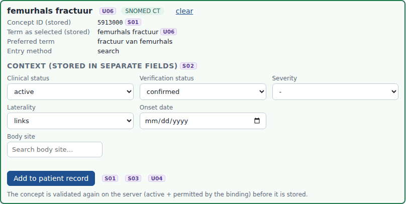
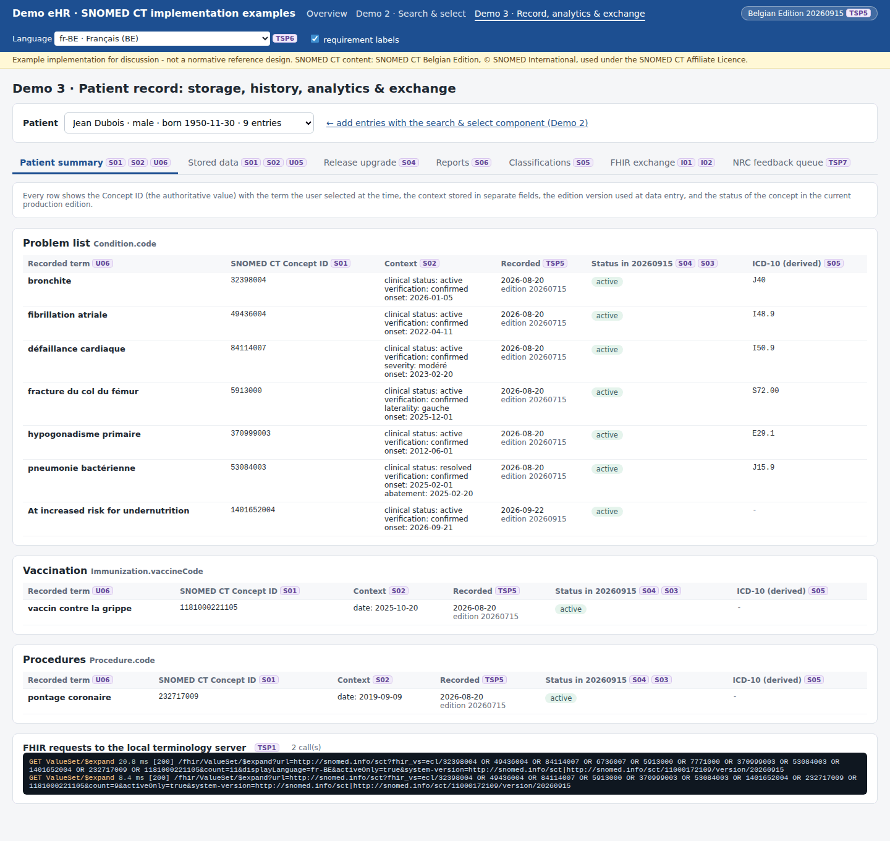

# REQ17 · S02 · Ensure that the context of each SNOMED CT concept identifier or expression is clearly represented: example implementation

> **Example, not normative.** This page shows how the [demo implementations](../Demo%20implementations/README.md) address this requirement. It is one possible approach, shared for discussion. It is not "the way it should be done", and passing the demo's checks does not certify that a product meets the requirement.

| | |
|---|---|
| **Requirement** | S02: *Requirements Specification SNOMED CT Implementation*, V1.0 (10.09.2026) |
| **Shown in** | Demo 2 (context fields at data entry) · Demo 3 (storage, display, FHIR) |
| **Demo code and how to run it** | [`05_Demo implementations`](../Demo%20implementations/README.md) |

## Requirement

> For each SNOMED CT-coded data element, the solution shall record a SNOMED CT concept, that represents the clinical meaning of the information being recorded.
>
> Qualifiers, status indicators, workflow states or other contextual attributes may supplement the recorded clinical concept but shall not be used as a substitute for the SNOMED CT concept representing that clinical meaning.
>
> The combination of the recorded SNOMED CT content and the applicable data-model elements shall allow the intended clinical meaning to be determined without relying on free-text interpretation.

## How the demo addresses it

- **Context is entered in separate fields** after a concept is selected (the fields depend on the data element): clinical status, verification status, severity, laterality, body site, onset or occurrence date, allergy type, criticality, reaction manifestation, value and unit.
- **Coded qualifiers come from their own value sets:**
  - severity and laterality: the be-vs-severity and be-vs-laterality codes;
  - body site: `<< 442083009`, with the Belgian body location subset as context;
  - reaction manifestation: the Belgian manifestation subset.
- **Stored in separate columns**, never folded into the concept or the term, for example `clinical_status = resolved`.
- **Displayed** in the patient summary in the user's language.
- **Exchanged in the FHIR elements designed for them:** `clinicalStatus`, `verificationStatus`, `severity`, `bodySite` with `be-ext-laterality`, `onsetDateTime`, `abatementDateTime`, `reaction.manifestation`, `criticality`, `be-ext-allergy-type`.
- **Laterality without a body site.** The Belgian laterality extension sits on `bodySite`. When a laterality was recorded without a body site (5913000 *fracture of neck of femur*, left), the export takes the body site from the concept's **finding site** (29627003), a defining relationship read from the terminology server. The laterality is therefore not lost.

## Screenshots



*Context fields shown after selecting a concept (laterality chosen).*



*The context of each entry in the patient summary (fr-BE).*


*The FHIR Condition: bodySite from the finding site, laterality in be-ext-laterality.*

## Requests (examples)

```http
GET [base]/CodeSystem/$lookup?system=http://snomed.info/sct&code=5913000&property=normalFormTerse     (finding site for the laterality-only case)
```

The parameters are shown without URL encoding, for readability. `[base]` is the FHIR endpoint of the local terminology server, `http://localhost:8090/fhir` in the demo.

## Where to look in the code

- [`ehr-demo-app/public/js/search-page.js`](../Demo%20implementations/ehr-demo-app/public/js/search-page.js) (renderSelection)
- [`ehr-demo-app/lib/store.mjs`](../Demo%20implementations/ehr-demo-app/lib/store.mjs)
- [`ehr-demo-app/lib/fhir-export.mjs`](../Demo%20implementations/ehr-demo-app/lib/fhir-export.mjs)
- [`ehr-demo-app/server.mjs`](../Demo%20implementations/ehr-demo-app/server.mjs) (bodySitesFromDefinition)
- **Without Node.js:** [`python/serve_demo2.py`](../Demo%20implementations/python/README.md) shows the same context fields and stores them in the same separate columns.

## Limitations and open points

- **Postcoordination.** The demo only uses precoordinated concepts plus data-model elements. SNOMED CT postcoordinated expressions are not stored.
- **Placeholder value sets.** The body site and laterality value sets of the Belgian profiles are still published as placeholders.

---

*Screenshots taken on 22 September 2026 with the SNOMED CT Belgian Edition 20260915 in production, unless the file name says `before-upgrade`. The patients are fictitious. SNOMED CT content © SNOMED International; the Belgian Edition is maintained by the Belgian NRC and used under the SNOMED CT Affiliate Licence.*
