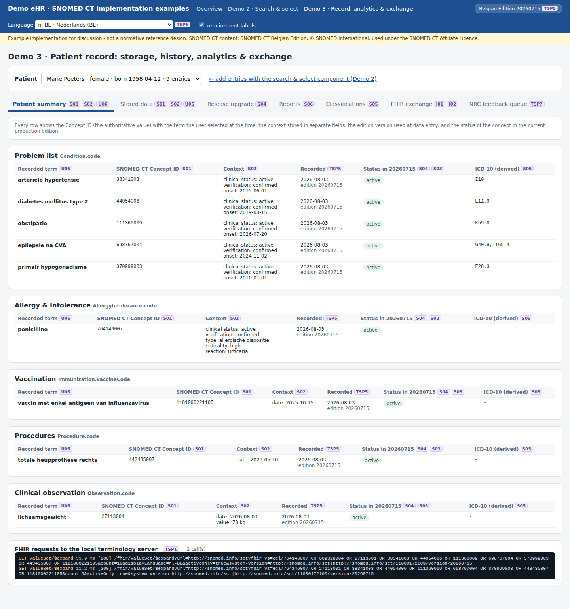
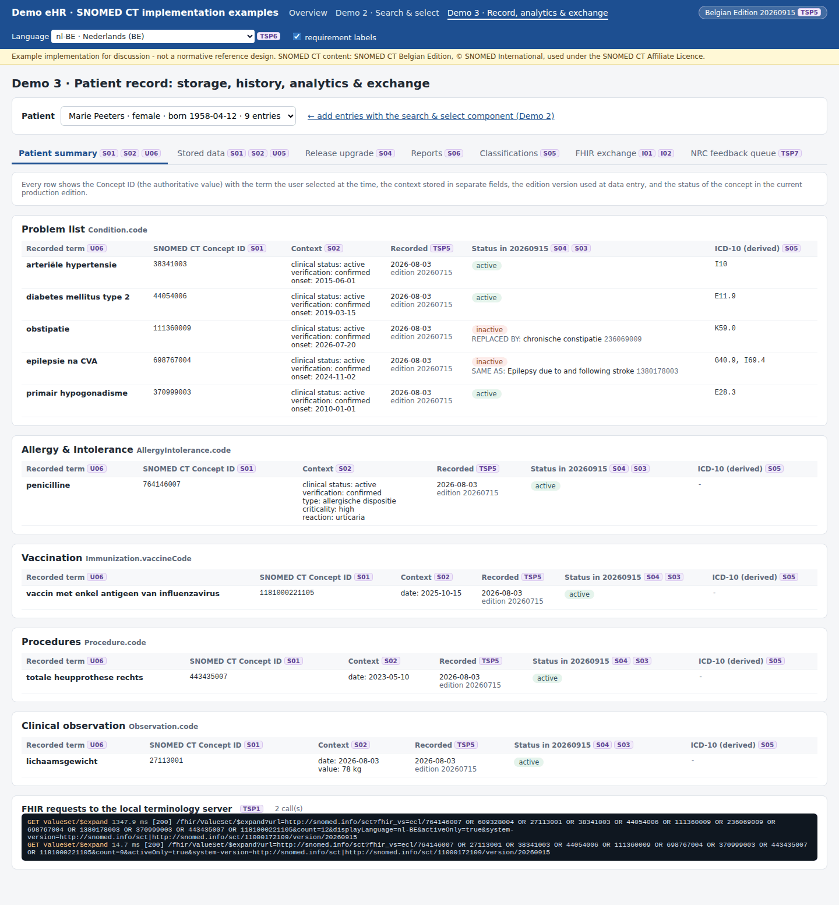
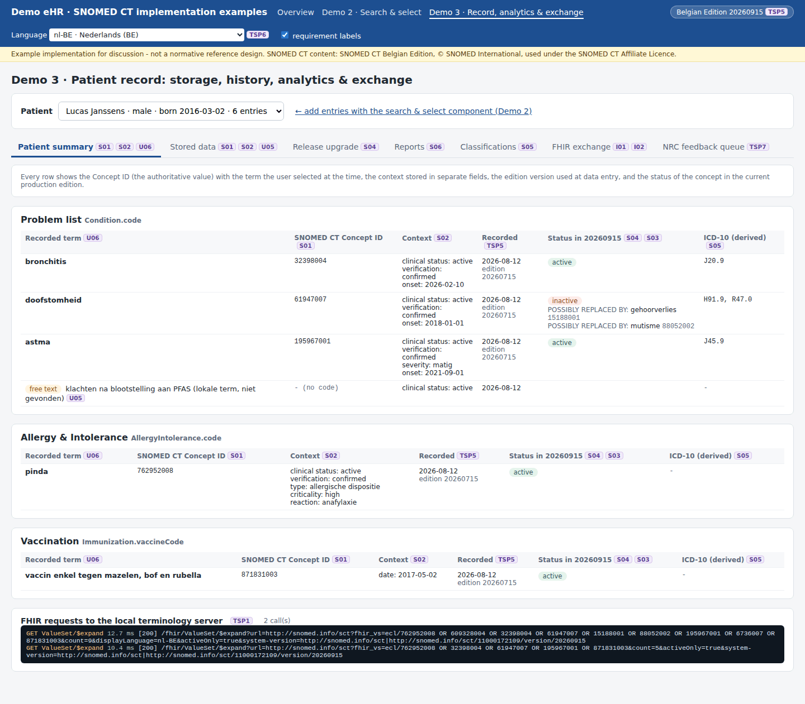

# REQ19 · S04 · Preservation of historically coded data: example implementation

> **Example, not normative.** This page shows how the [demo implementations](../Demo%20implementations/README.md) address this requirement. It is one possible approach, shared for discussion. It is not "the way it should be done", and passing the demo's checks does not certify that a product meets the requirement.

| | |
|---|---|
| **Requirement** | S04: *Requirements Specification SNOMED CT Implementation*, V1.0 (10.09.2026) |
| **Shown in** | Demo 3 · Record (release upgrade) — after the Demo 1 upgrade from 20260715 to 20260915 |
| **Demo code and how to run it** | [`05_Demo implementations`](../Demo%20implementations/README.md) |

## Requirement

> Where a SNOMED CT concept recorded in a patient record is subsequently inactivated in a later terminology release, the eHR shall retain the originally recorded SNOMED CT Concept ID as part of the clinical record.
>
> A terminology update shall not replace, overwrite or otherwise modify the originally recorded Concept ID solely because that concept has become inactive.
>
> Any association with an active replacement or successor concept shall be maintained separately from the originally recorded Concept ID and shall not alter the historical record.

## How the demo addresses it

**The scenario.**

- 22 coded entries were recorded while 20260715 was in production.
- Demo 1 then deployed 20260915 (TSP4).
- 3 of the recorded concepts are inactive in 20260915.

**The release impact analysis** ([`release-impact.mjs`](../Demo%20implementations/ehr-demo-app/lib/release-impact.mjs)):

1. It checks all stored Concept IDs against the new version with one `$expand` of an ECL list of IDs.
2. For each inactive concept, it reads the historical associations of the new release with `ConceptMap/$translate` on the implicit association maps (SAME AS, REPLACED BY, POSSIBLY REPLACED BY, POSSIBLY EQUIVALENT TO, PARTIALLY EQUIVALENT TO, ALTERNATIVE).
3. It stores them in the **separate** table `sct_historical_association`, with the version in which they were found.
4. `clinical_entry` is never updated. The screen shows the original rows next to the associations.

| Entry | Recorded with 20260715 (unchanged) | Association in 20260915 | Target |
|---|---|---|---|
| 3 | 111360009 *obstipatie* | REPLACED BY | 236069009 *chronische constipatie* |
| 4 | 698767004 *epilepsie na CVA* | SAME AS | 1380178003 *Epilepsy due to and following stroke* |
| 11 | 61947007 *doofstomheid* | POSSIBLY REPLACED BY | 15188001 *gehoorverlies*, 88052002 *mutisme* |

**Where the associations are used:**

- The patient summary shows the original term and Concept ID, with the status in the current edition and the proposed replacements.
- The **analytics** can include the legacy codes (ECL history supplement, S06).
- The **classification** follows the association when the old concept has no current map row (S05).
- The **FHIR export** keeps the original code with its original `Coding.version` (I01).

## Screenshots



*Before the upgrade (20260715): all concepts active.*


*Release impact analysis: associations stored separately; the original rows unchanged.*



*After the upgrade: original term and Concept ID kept, with the status and the proposed replacements.*



*POSSIBLY REPLACED BY with two candidates (clinical choice needed).*

## Requests (examples)

```http
GET [base]/ValueSet/$expand?url=http://snomed.info/sct?fhir_vs=ecl/111360009 OR 698767004 OR 61947007 OR …&activeOnly=true
GET [base]/ConceptMap/$translate?url=http://snomed.info/sct?fhir_cm=900000000000526001&system=http://snomed.info/sct&code=111360009     (REPLACED BY)
GET [base]/ConceptMap/$translate?url=http://snomed.info/sct?fhir_cm=1186921001&system=http://snomed.info/sct&code=61947007             (POSSIBLY REPLACED BY)
```

The parameters are shown without URL encoding, for readability. `[base]` is the FHIR endpoint of the local terminology server, `http://localhost:8090/fhir` in the demo.

## Where to look in the code

- [`ehr-demo-app/lib/release-impact.mjs`](../Demo%20implementations/ehr-demo-app/lib/release-impact.mjs)
- [`ehr-demo-app/lib/store.mjs`](../Demo%20implementations/ehr-demo-app/lib/store.mjs) (sct_historical_association)
- [`00-terminology-server/application.properties`](../Demo%20implementations/00-terminology-server/application.properties) (implicit maps 1186921001, 1186924009)

## Limitations and open points

- **Server configuration needed.** Snowstorm Lite exposes the POSSIBLY REPLACED BY (1186921001) and PARTIALLY EQUIVALENT TO (1186924009) associations only after they are added to its configuration, and the package is imported again. Without them, 61947007 would have had no replacement proposal.
- **No translation for a replacement.** The SAME AS target 1380178003 has no Dutch or French term in 20260915, so the proposal is shown in English (see TSP6).
- **Qualifier values are not checked.** The analysis checks the recorded concepts, not qualifier values such as body site or severity.
- **Proposals only.** The demo records nothing for the clinician. A real workflow would let the clinician confirm a replacement as a new entry.

---

*Screenshots taken on 22 September 2026 with the SNOMED CT Belgian Edition 20260915 in production, unless the file name says `before-upgrade`. The patients are fictitious. SNOMED CT content © SNOMED International; the Belgian Edition is maintained by the Belgian NRC and used under the SNOMED CT Affiliate Licence.*
