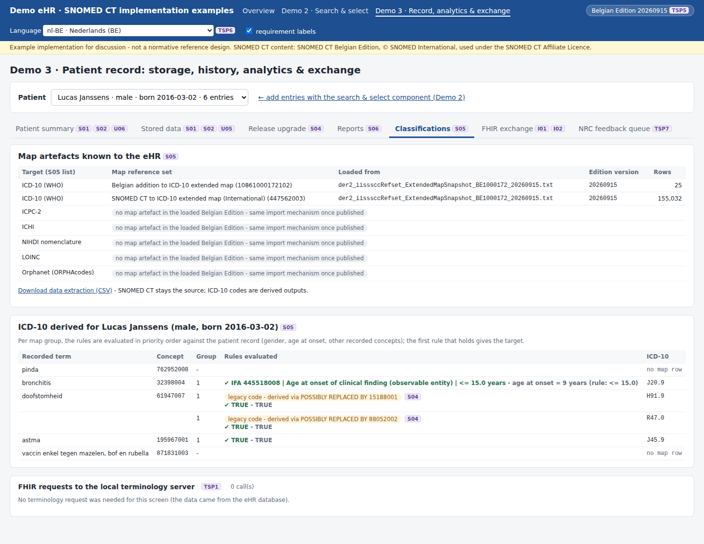
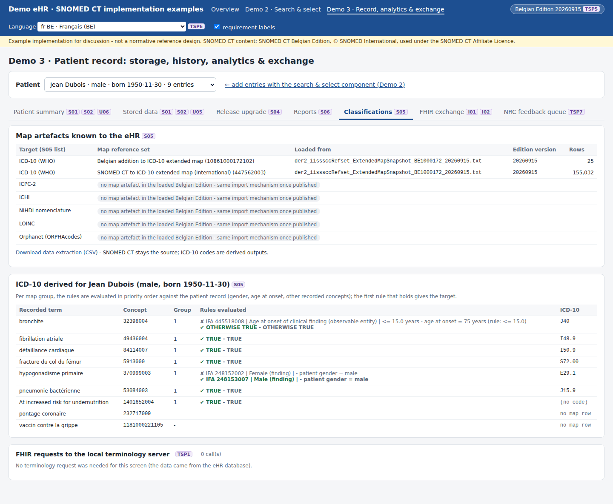
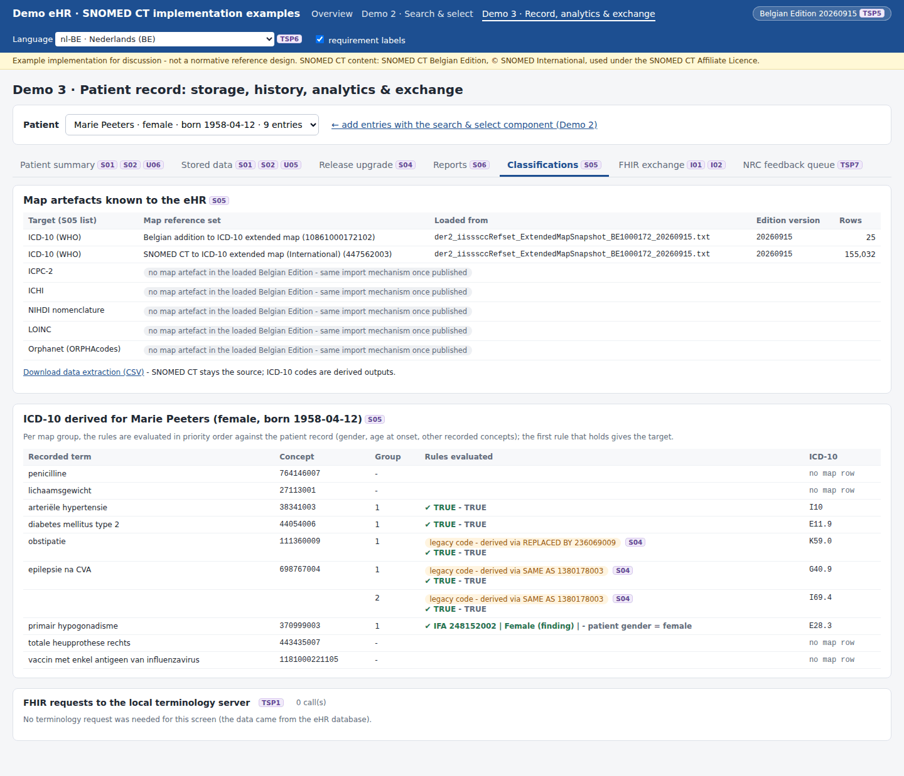

# REQ20 · S05 · Use maps from SNOMED CT to national and international classifications including legacy and current data: example implementation

> **Example, not normative.** This page shows how the [demo implementations](../Demo%20implementations/README.md) address this requirement. It is one possible approach, shared for discussion. It is not "the way it should be done", and passing the demo's checks does not certify that a product meets the requirement.

| | |
|---|---|
| **Requirement** | S05: *Requirements Specification SNOMED CT Implementation*, V1.0 (10.09.2026) |
| **Shown in** | Demo 3 · Record (classifications, data extraction) |
| **Demo code and how to run it** | [`05_Demo implementations`](../Demo%20implementations/README.md) |

## Requirement

> In order to enable clinical reuse, analysis and reporting of data, including legacy and current data, the solution shall support the import, storage and use of mappings between SNOMED CT and the following national and international classifications and terminologies, where these mappings are provided as part of the Belgian SNOMED CT Edition or otherwise officially made available for Belgian use:
>
> - ICD-10;
> - ICPC-2;
> - ICHI;
> - NIHDI nomenclature;
> - LOINC; and
> - Orphanet codes.
>
> For each supported mapping, the solution shall be able to derive the applicable target code or codes from a SNOMED CT concept in accordance with the mapping rules, metadata and conditions defined by the mapping artefact.
>
> The mapped results shall be available to the solution components that require them, including, where applicable, user display, generated documents, reporting and data extraction.
>
> The supplier shall document the supported version of each mapping artefact and the mechanism used to keep it aligned with the corresponding Belgian SNOMED CT Edition or other officially published Belgian source.

## How the demo addresses it

- **Import and storage.** The eHR imports the extended map rows (`der2_iisssccRefset_ExtendedMapSnapshot`) of the Belgian Edition into its own tables `map_member` and `map_artefact` ([`maps.mjs`](../Demo%20implementations/ehr-demo-app/lib/maps.mjs)):
  - the International ICD-10 map 447562003: 155,032 active rows in 20260915;
  - the Belgian addition 10861000172102: 25 rows.
- **Version and alignment.** `map_artefact` records the source file, the edition version and the import time. The import is repeated at every edition upgrade, as part of the deployment (`POST /api/admin/import-maps`).
- **Rules.** For each map group, the rules are evaluated in priority order against the patient record, and the first rule that holds gives the target:
  - `TRUE` and `OTHERWISE TRUE`;
  - the patient's gender (`IFA 248152002 | Female |`, `IFA 248153007 | Male |`);
  - the age at onset (`IFA 445518008 | Age at onset of clinical finding | <= 15.0 years`);
  - the presence of another concept in the record (`IFA <concept>`, checked with ECL `<<` on the terminology server).
- **Legacy data.** A concept that was inactivated after it was recorded has no row in the current map. It is classified through the historical association stored by S04, and the screen shows which association was followed.
- **Where the results are used:**
  - display in the patient summary;
  - the classification view with the rule trace;
  - the data extraction `GET /api/extract.csv` (SNOMED CT stays the source; the ICD-10 codes are derived, with the association used).
- **The other classifications** (ICPC-2, ICHI, NIHDI nomenclature, LOINC, Orphanet) are listed as "no map artefact in the loaded Belgian Edition". The same import applies once such a map is published as a reference set.

| Patient | Concept | Rule that holds | ICD-10 |
|---|---|---|---|
| Lucas, 9 years at onset | 32398004 bronchitis | `IFA 445518008 … <= 15.0 years` | J20.9 |
| Jean, 75 years at onset | 32398004 bronchite | `OTHERWISE TRUE` | J40 |
| Marie (female) | 370999003 primair hypogonadisme | `IFA 248152002 \| Female \|` | E28.3 |
| Jean (male) | 370999003 hypogonadisme primaire | `IFA 248153007 \| Male \|` | E29.1 |
| Marie (legacy) | 111360009 obstipatie | via REPLACED BY 236069009 | K59.0 |
| Lucas (legacy) | 61947007 doofstomheid | via POSSIBLY REPLACED BY 15188001 / 88052002 | H91.9 / R47.0 |

## Screenshots



*Age rule (child): J20.9. A legacy code classified through its POSSIBLY REPLACED BY associations.*



*Same concept for an adult: J40 (OTHERWISE TRUE). Gender rule: E29.1.*



*Legacy codes (inactivated after recording) classified through REPLACED BY / SAME AS.*

## Requests (examples)

```http
(the map is evaluated from the eHR's own copy of the map reference set; the terminology server is only asked for IFA <concept> rules)
GET [base]/ValueSet/$expand?url=http://snomed.info/sct?fhir_vs=ecl/(<< <concept of the rule>) AND (<concepts of the patient>)&count=1
```

The parameters are shown without URL encoding, for readability. `[base]` is the FHIR endpoint of the local terminology server, `http://localhost:8090/fhir` in the demo.

## Where to look in the code

- [`ehr-demo-app/lib/maps.mjs`](../Demo%20implementations/ehr-demo-app/lib/maps.mjs)
- [`ehr-demo-app/server.mjs`](../Demo%20implementations/ehr-demo-app/server.mjs) (classifyEntry, /api/extract.csv)

## Limitations and open points

- **Only ICD-10 in the edition.** No ICPC-2, ICHI, NIHDI, LOINC or Orphanet map was found in the Belgian Edition 20260915, so only ICD-10 is demonstrated.
- **Rule types.** Only the rule patterns found in the demo data are implemented (TRUE, OTHERWISE TRUE, IFA gender, IFA age, IFA concept). Map advice such as "MAP IS CONTEXT DEPENDENT" or "POSSIBLE REQUIREMENT FOR …" is not used.
- **Uncertain legacy targets.** A legacy code with several POSSIBLY REPLACED BY targets gives several candidate ICD-10 codes. A person has to choose.

---

*Screenshots taken on 22 September 2026 with the SNOMED CT Belgian Edition 20260915 in production, unless the file name says `before-upgrade`. The patients are fictitious. SNOMED CT content © SNOMED International; the Belgian Edition is maintained by the Belgian NRC and used under the SNOMED CT Affiliate Licence.*
