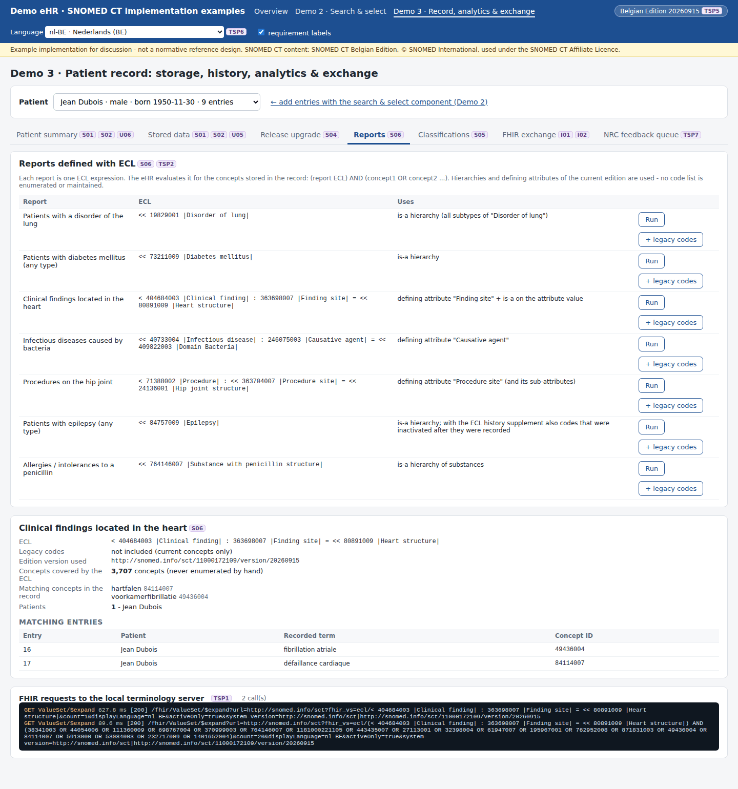
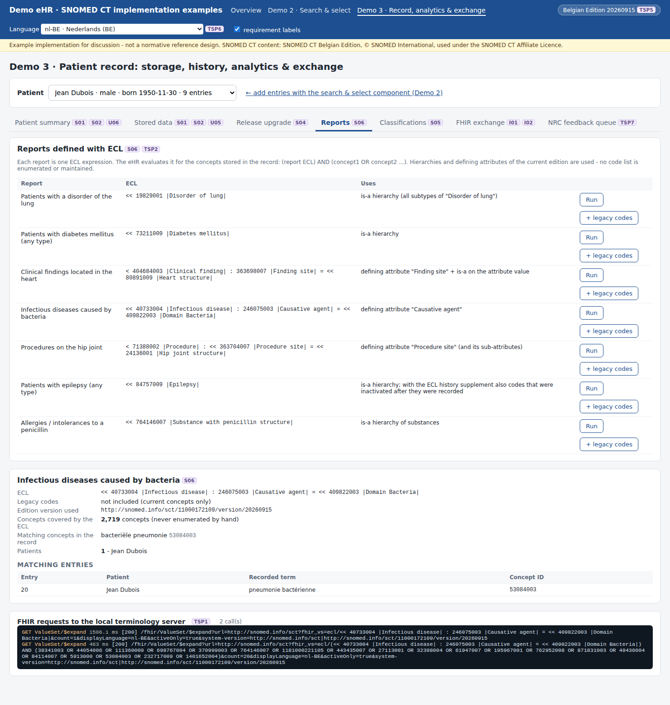
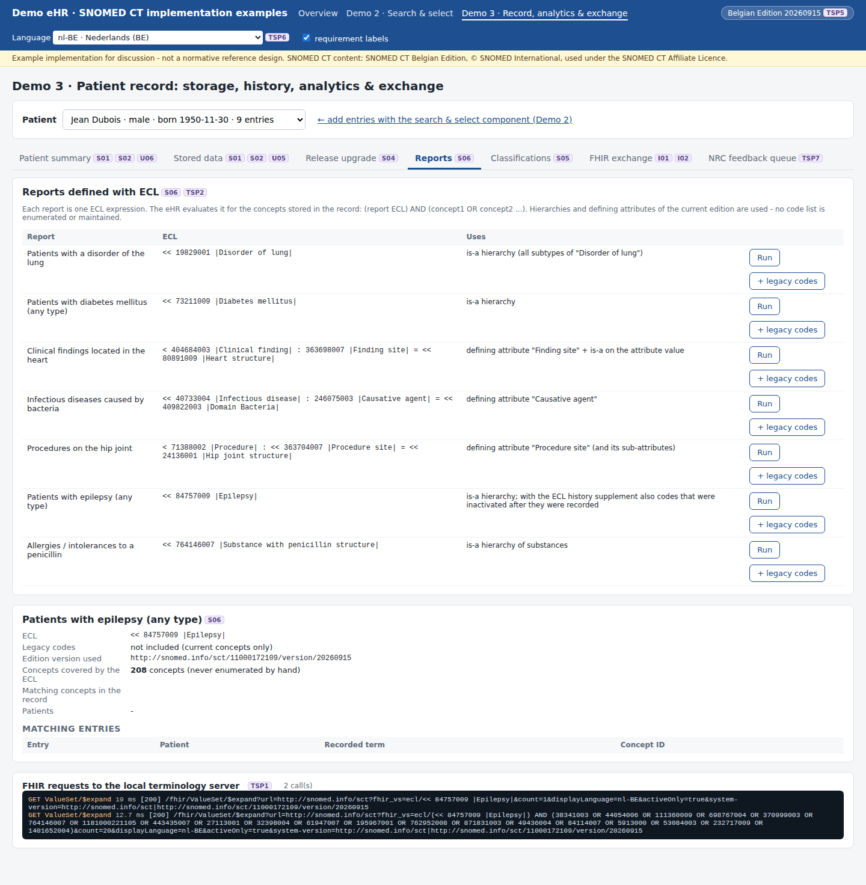
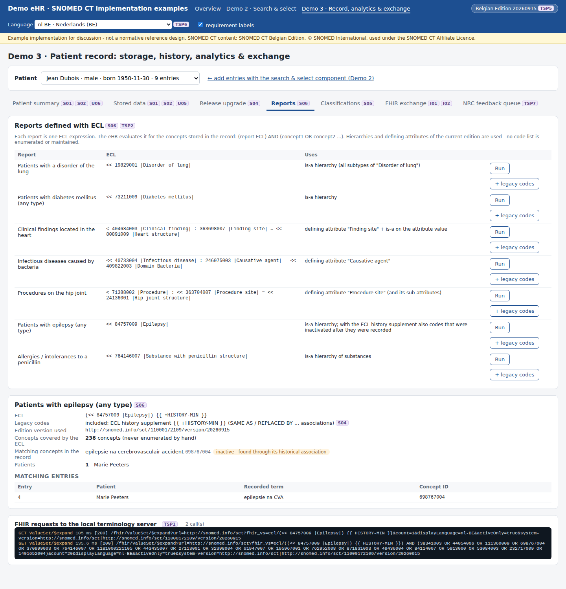

# REQ21 · S06 · Use SNOMED CT's defining relationships in the determination of the correct results or outcomes: example implementation

> **Example, not normative.** This page shows how the [demo implementations](../Demo%20implementations/README.md) address this requirement. It is one possible approach, shared for discussion. It is not "the way it should be done", and passing the demo's checks does not certify that a product meets the requirement.

| | |
|---|---|
| **Requirement** | S06: *Requirements Specification SNOMED CT Implementation*, V1.0 (10.09.2026) |
| **Shown in** | Demo 3 · Record (reports) |
| **Demo code and how to run it** | [`05_Demo implementations`](../Demo%20implementations/README.md) |

## Requirement

> Where reporting, data extraction or clinical decision support functionality evaluates SNOMED CT-coded data based on the meaning or grouping of concepts, the solution shall support evaluation using the SNOMED CT ontology rather than requiring all applicable concepts to be individually enumerated.
>
> Such evaluation shall support:
>
> - hierarchical is-a relationships; and
> - defining attribute relationships relevant to the concepts being evaluated.
>
> The results produced shall reflect the relationships present in the SNOMED CT edition and version applicable to the processed data.

## How the demo addresses it

- **Each report is one ECL expression** ([`reports.mjs`](../Demo%20implementations/ehr-demo-app/lib/reports.mjs)). The eHR asks the terminology server `(report ECL) AND (concepts stored in the record)`, so no code list is enumerated or maintained.
- **Is-a and defining attributes:**
  - is-a: disorder of lung `<< 19829001`, diabetes `<< 73211009`, epilepsy `<< 84757009`, penicillin allergy `<< 764146007`;
  - defining attributes: finding site = heart `< 404684003 : 363698007 = << 80891009`, causative agent = bacteria `<< 40733004 : 246075003 = << 409822003`, procedure site = hip joint `< 71388002 : << 363704007 = << 24136001`.
- **The version is visible.** The report shows the number of concepts the ECL covers in the production version, and the version used.
- **Legacy data.** With "+ legacy codes", the ECL 2.x history supplement `{{ +HISTORY-MIN }}` also matches concepts that were inactivated after they were recorded:
  - after the upgrade, *epilepsy* finds no patient with current concepts only;
  - with the supplement it finds Marie Peeters through 698767004 → SAME AS 1380178003;
  - the ECL then covers 238 concepts instead of 208.
- **Different versions give different answers.** TSP5 shows that a reporting component running another version gives another result for the same record.

## Screenshots



*Report on a defining attribute (finding site = heart structure).*



*Report on the causative agent (bacteria).*



*Epilepsy report on current concepts only: no match after the upgrade.*



*The same report with the history supplement: the legacy code is found through its SAME AS association.*

## Requests (examples)

```http
GET [base]/ValueSet/$expand?url=http://snomed.info/sct?fhir_vs=ecl/(< 404684003 : 363698007 = << 80891009) AND (38341003 OR 49436004 OR 84114007 OR …)&count=…
GET [base]/ValueSet/$expand?url=http://snomed.info/sct?fhir_vs=ecl/((<< 84757009) {{ +HISTORY-MIN }}) AND (…)&count=…
```

The parameters are shown without URL encoding, for readability. `[base]` is the FHIR endpoint of the local terminology server, `http://localhost:8090/fhir` in the demo.

## Where to look in the code

- [`ehr-demo-app/lib/reports.mjs`](../Demo%20implementations/ehr-demo-app/lib/reports.mjs)
- [`ehr-demo-app/public/js/record-page.js`](../Demo%20implementations/ehr-demo-app/public/js/record-page.js) (reports)

## Limitations and open points

- **Evaluation in the terminology server.** The demo evaluates the ECL on the terminology server, for the concepts of the record. A data warehouse could do the same with a transitive closure table built from the RF2 relationships of the same edition version.
- **ECL Core.** The ECL features that can be used depend on the server (Snowstorm Lite: "ECL Core", see TSP2).

---

*Screenshots taken on 22 September 2026 with the SNOMED CT Belgian Edition 20260915 in production, unless the file name says `before-upgrade`. The patients are fictitious. SNOMED CT content © SNOMED International; the Belgian Edition is maintained by the Belgian NRC and used under the SNOMED CT Affiliate Licence.*
